## I/O Systems

一个计算机中的两个主要任务是I/O和计算。大多数情况下，主要的任务I/O，计算或处理仅仅是附带的。例如，当浏览一个web页表或编辑一个文件时，我们感兴趣的时读或获取一些信息，而不是计算出某个答案。

操作系统在计算机I/O中的角色是管理并控制I/O操作和I/O设备。虽然在其他章节中已经进行了类似的讨论，但这里会完整地对I/O进程描述。由于硬件接口限制了操作系统的内部设施，因此会首先会描述I/O硬件的概念。下面会讨论操作系统提供的I/O服务以及这些服务在应用I/O接口中的体现。然后讨论操作系统是如何在硬件接口和应用接口间搭建桥梁的。我们也会讨论UNIX System v STREAMS机制，该机制允许一个应用自动组合驱动代码的处理流程。最后会讨论I/O的性能以及提升I/O性能下的操作系统设计原则。

### 12.1 Overview

操作系统设计者需要重点关注如何控制连接到计算机的设备。由于I/O设备的功能和速度各不相同(例如鼠标，硬盘，闪驱以及录音机器人)，需要使用多种方法进行控制。这些方法组成了内核的I/O子系统，并将内核从复杂的I/O设备管理中解脱出来。

I/O设备技术表现出两种相互矛盾的趋势。一方面软件和硬件接口的标准在增加，这种趋势将改进后的设备集成到现有的计算机和操作系统中；另一方面，I/O设备的种类也在增加。一些新的设备与老设备不尽相同，要将这些设备集成到我们的计算机和操作系统中会面临比较大的挑战。这个挑战涉及软件和硬件技术。基本的I/O硬件元素，如端口，总线和设备控制器等都可以容纳多种I/O设备。为了封装设备的细节和各种差异，操作系统的内核使用了设备驱动模块。设备驱动体提供了统一的到I/O子系统的设备访问界面，类似在应用和操作系统之间提供了标准接口的系统调用。

### 12.2 I/O Hardware

计算机会操作很多各种类型的设备。大多数属于通用类型的存储(硬盘，磁带)，传输设备(网络连接，蓝牙)以及人机界面设备(屏幕，键盘，鼠标，音响等)。其他设备则更加专业化，如与喷气机转向有关的设备。在这种飞机上，由人通过操纵杆和脚踏板输入飞行计算机，然后计算机会发送输出命令，使电动机将舵，襟翼和燃料移动到发动机。虽然I/O设备的类型多种多样，但我们仅需要很少的概念来理解设备是如何连接的，以及软件是如何控制硬件的。

设备通过电脑或空气发送信号来与计算机系统进行通信，通过连接点或端口(如，串口)来与机器进行通信。(术语PHY是OSI模型物理层的简写，也用于指端口，但在数据中心命名法中更常见。)如果设备共享一组通用的线路，这种连接称为总线。一个总线(如现今大多数计算机使用的PCI总线)是一种严格定义的协议，该协议指定了可以在这组线路上发送的一组消息。在电子层面，这些消息通过以规定的时序施加到线路上的电压(模式)进行传输。当设备A有一条与电缆与设备B相连，且设备B有一条电缆与设备C先连，设备C插入计算机的一个端口，这种组织方式成为菊花链。一个菊花链通常用于总线。

总线在计算机架构种被广泛使用，且不同的总线有不同的发送信号的方法，速度，吞吐量以及连接方式。图12.1展示了一个典型的PC总线结构。在图中，一个PCIe总线(通用PC系统总线)将处理器-内存子系统连接到了快速设备中，而扩展总线连接到相对较慢的设备，如键盘和串口和USB端口。在图中的最左下方，四个硬盘通过一个串行连接的SCSI(SAS)总线一起接入到SAS控制器中。PCIe是一种灵活的总线，可通过一个或多个“通道”发送数据，一个通道包含两个信号对，一对信号用于接收数据而另一对信号用于传输数据。因此每个通道包含四条线路，且每个通道使用全双工字节流，可以以8位(一个字节)的方式同时在两个方向上传输数据包。物理上，PCIe链路可能会包含1，2，4，8，12，16或32个通道，由"x"前缀表示。例如，一个使用8个通道的PCIe卡或连接器定义为x8。此外，PCIe已经出现了很多代，未来还会有更多的类型。因此，例如，一个"PCI gen3x8"的卡表示它使用3代PCIe并使用8个通道。这种设备的最大吞吐量为每秒8GB。PCIe的更多详情参见https://pcisig.com。


控制器是可以操作端口，总线或设备的电子器材的集合。一个串口控制器是一个简单的设备控制器，它是一个(或部分芯片)控制串口线路上的信号的芯片。相反，一个光纤通道(FC)总线控制器则没有那么简单。由于光纤通道协议比较复杂，且通常用于数据中心，而非PC。因此FC总线控制器通常是一个连接到计算机总线的独立电路板(或主机总线适配器(HBA))，通常会包括处理FC控制消息的处理器，微码和一些私有内存。一些设备会内置控制器。如果你看一下硬盘设备，就可以在一侧看到电路板，这个板就是硬盘控制器，它实现了硬盘侧用于某些连接的协议，例如SAS和SATA。硬盘控制器还有一些用于处理如坏扇区映射，预取，缓冲和缓存的微码和处理器。

#### 12.2.1 Memory-Mapped I/O

处理器是如何将命令和数据传递给控制器来完成一个I/O传输的？简单来说，控制器有一个或多个寄存器来处理数据和控制信号。处理器通过读取和写入这些寄存器中的位的模式来与控制器进行通信。通信中使用的一种方式是通过使用的特殊I/O指令将一个字节或一个字传递到一个I/O端口地址。I/O指令会触发总线选择合适的设备并将这些比特位转移进/出一个设备寄存器。或者，设备可以支持内存映射I/O，这种情况下，设备控制寄存器会映射到处理器的地址空间中。CPU使用标准数据传输指令，在设备控制寄存器映射的物理内存位置中进行读写，以此来执行I/O请求。

在过去，PC经常会通过I/O指令来控制一些设备或内存映射I/O来控制其他设备或内存映射I/O。图12.2展示了PC一般使用的I/O端口地址。图形控制器具有用于基本控制操作的I/O端口，但该控制器页具有用于保存屏幕内容的大内存映射区域。当一个线程可以通过将数据写入到内存映射区域的方式将数据输出到屏幕。控制器生成屏幕图形的内容取决于这段内存中的内容。这种技术很容易被使用，而且，将上百万个字节写入到图形内存要快于执行上百万个I/O指令。因此，随着事件，系统更加倾向于使用内存映射I/O。现在，大多数控制器都使用内存映射I/O来执行I/O。


I/O设备通常包括四个寄存器，称为状态，控制，入数据(data-in)和出数据(data-out)寄存器。

- 主机会读取入数据寄存器来获取输入
- 主机会写入出数据寄存器来发送输出
- 主机可以读取状态寄存器中的比特位。这些比特位指定了状态，如是否完成了当前的命令，是否能够从入数据寄存器中读取字节，以及是否产生了一个设备错误。
- 主机可以通过控制寄存器来启动一个命令或修改设备模式。例如，串口控制寄存器中的某个特定比特位用于在全双工和半双工通信之间进行选择，以及用于奇偶性校验的比特位，用于设置字长为7或8位的比特位，用于选择串口支持的速度的比特位。

数据寄存器通常为1到4个字节。一些控制器使用FIFO芯片扩展了控制器(超出数据寄存器能保留的数据大小)，使其能够保存多个字节的输入或输出。如果设备或主机无法接收芯片中的数据，FIFO芯片可能会出现短暂的数据峰值。

#### 12.2.2 Polling

一个完整的用于的在主机和控制器间交互的协议是比较复杂的，但基本的握手概念则比较简单。下面举例讲一下握手。假设使用2比特位来协调控制器和主机之间的生产者-消费者关系。控制器使用状态寄存器中的`busy`位来标识其状态。当控制器处于繁忙工作时会设置该`busy`位，而在能处理下一条指令时清除`busy`位。主机通过`command`寄存器中的`command-ready`位来实现这种功能，当控制器能够执行指令时会设置`command-ready`位。在这个例子中，当主机需要通过一个端口写入输出时，需要与控制器按照如下步骤进行握手协调。

1. 主机会重复检查`busy`位，直到该位被清除
2. 主机设置`command`寄存器中的`write`位，并写入一个字节到出数据寄存器
3. 主机设置`command-ready`位
4. 当控制器注意到`command-ready`位被置位，则设置`busy`位
5. 控制器读取`command`寄存器并看到`write`命令。它会读取出数据寄存器中的内容，并执行设备的I/O
6. 控制器清除`command-ready`位，清除状态寄存器中的`error`位来标识设备I/O成功，并通过清除`busy`位来表示I/O结束

每个字节都会重复上述流程。

在步骤1中，主机正忙于等待或轮询：这是个循环，一遍遍读取状态寄存器，直到`busy`位被清除。如果控制器和设备够快，这是个比较合适的方法。但如果等待时间比较长，主机应该切换到另一个任务。那么主机如何知道控制器何时会变得空闲？对于一些设备，主机必须快速做出响应，否则会发生数据丢失。例如，来自串口或来自键盘的数据流，如果控制器的缓冲过小，且主机在读取字节前等待的时间过长，可能会导致数据丢失。

在很多计算机架构中，需要3个CPU指令周期来轮询一个设备：读取设备寄存器，和提取出的状态位作逻辑与操作，如果不为0，则做其他处理。显然，基本的轮询操作已经足够满足要求。但当反复尝试却很少发现可以使用的设备，而此时还有其他未完成的(有用的)CPU任务时，轮询又显得效率低下。

这种情况下，应该让硬件控制器在设备可以处理服务时通知CPU，而不是请求CPU重复轮询完一个I/O。这种使设备能够通知CPU的机制称为中断。

#### 12.2.3 Interrupts

基本的中断机制的运行方式如下：CPU硬件有一个称为中断请求线的线路，在每次指令执行完后会感知到它。当CPU探测到一个控制器在中断请求线上发出一个信号时，CPU会保存状态并跳转到(位于内存中固定地址的)中断处理例程。中断处理器会确定产生中断的原因，执行必要的流程，状态存储，然后执行一个中断返回(`return from interrupt`)指令来使CPU返回到中断之前的执行状态。通俗来讲，设备控制器通过在中断请求线上发送一个信号来发出一个中断，CPU会捕获该中断并将其分发给中断处理器，然后中断处理器会处理并清除该中断 。图12.3概括了中断驱动的I/O周期。

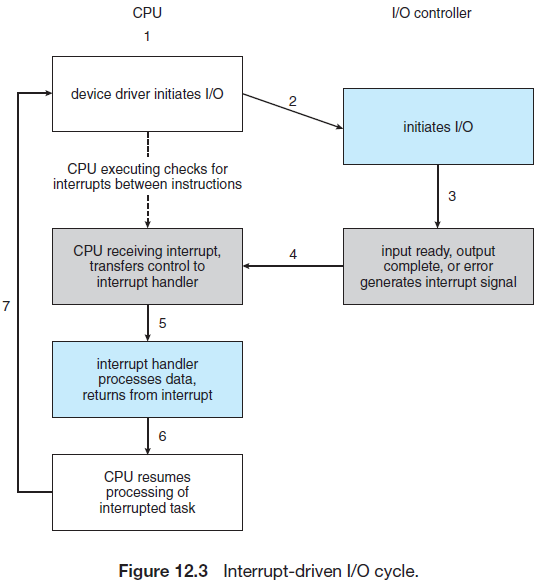

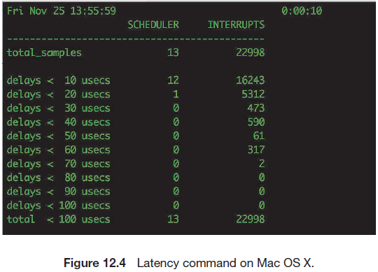

在本章中我们强调中断管理，即使是单用户的现代系统，每秒也可以管理数百个中断，而服务器每秒可处理数十万个中断。例如，图12.4为macOS上`latency`命令的输出，显示了台式计算机在十秒钟内执行了将近23,000次中断。

上述描述的基本的中断机制使得CPU能够在设备控制器就绪时处理异步时间。然而，在现代操作系统中，我们需要更加复杂的中断处理特性。

1. 我们需要能够在关键处理期间推迟中断处理的能力。
2. 我们需要一种更有效的方式将设备发出的中断分配给合适的中断处理器，而无需轮询所有设备来查看哪个设备发起的中断。
3. 我们需要多种级别的中断，这样操作系统可以区分高和低优先级中断，这样在同时有多个中断时可以按照紧急程度进行响应。
4. 我们需要一种能够直接引起操作系统注意的指令方法(与I/O请求分开)，例如分页错误，除以0等错误。后面我们将看到使用"traps"来完成这种任务。

在现代计算机硬件中，这些特性由CPU和中断控制硬件提供。

大多数CPU有两条中断请求线。一个是不可屏蔽中断，这种中断预留给如不可恢复的内存错误。第二种为可屏蔽中断，在CPU执行重要的且不能被中断的指令前可以关闭这种中断。可屏蔽的中断用于设备控制器请求服务。

中断机制会接收一个地址，该地址用于(从一个小的集合中)选择特定的中断处理例程。大多数架构下，该地址为表中的偏移量，称为中断向量。这种向量包含特定的中断处理器的地址。使用带向量的中断机制的目的是减少对单一中断处理器的需求(使用一个中断处理器时需要查找所有的中断源来决定哪个设备需要服务)。然而，实践中计算机的设备(也即中断处理器)比在中断向量中的地址元素还要多。一种解决办法是使用中断链，即中断向量中的每个元素指向中断处理器列表的首部。当发生一个中断时，会依次调用对应列表上的处理器，直到发现一个可以处理该请求的处理器。这种结构是使用大型中断表时的大内存开销和分配到单一中断处理器时的低效率之间的折衷。

图12.5展示了Intel 奔腾处理器的中断向量。从0到31的事件都是不可屏蔽的，用于显示各种错误情况(可能会导致协调崩溃)，分页错误(需要立即处理)，以及调试请求(停止普通操作并跳转到调试程序)。从32到255的事件都是可屏蔽的，用于如设备生成的中断。

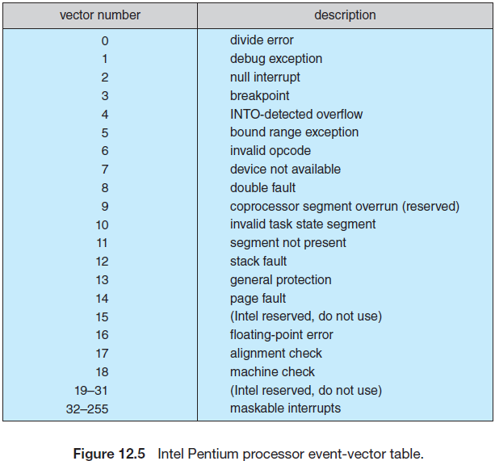

中断机制页实现了一个中断优先级系统。这些级别使得CPU能够在没有屏蔽所有中断的前提下推迟低优先级中断的处理，使得该优先级中断能够抢占低优先级中断的执行。

一个现代操作系统会使用多种方式与中断机制进行交互。在启动时，操作系统会通过探测硬件总线来确定目前有哪些设备并在中断向量中安装对应的中断处理器。在I/O期间，各种设备控制器会在准备服务时发出中断。这些中断表明输出已经结束或输入数据已经就绪，或已经探测到失败。中断机制也会用于处理多种异常，如除以0，访问被保护或不存在的内存地址，或尝试在用户模式下执行一个特权指令。触发中断的事件会有一个共同的属性：它们诱导操作系统执行紧急的、自包含的例程。

由于大多数情况下，中断处理受事件和资源限制，因此实现起来比较复杂，系统经常会将中断分为第一级中断处理器(FLIH)和第二级中断处理器(SLIH)。FLIH会执行上下文切换，状态存储和对需要处理的操作的排队，而单独调度的SLIH则会执行请求操作的处理。

操作系统使用中断也有好处。例如，很多操作系统会在虚拟内存中使用中断机制。一个分页错误就是一个异常，会发起一个中断。该中断会挂起当前进程并跳转到内核中的分页错误处理器。分页错误处理器会保存进程的状态，并将进程移动到等待队列，执行分页缓存管理，调度一个I/O操作来获取分页，然后调度另外一个进程来恢复执行，最后从中断中返回。

另一个例子是系统调用的实现。探测一个程序会使用库来发起系统调用，库例程会检查程序输入的参数，构造传递给内核且包含参数的数据结构，然后执行一个特殊的指令，称为软中断，或trap。该指令有一个标识所需内核服务的操作数。当一个进程执行trap指令时，中断硬件会保存用户代码的状态，切换到内核模式并分派给内核例程或实现了服务请求的线程。trap的相比硬件中段来说，其优先级比较低(由程序执行的一个系统调用没有比服务一个设备控制器要紧)。

中断也可以用于管理内核的控制流程。例如，考虑一个处理硬件读请求的过程。有一步需要将数据从内核空间拷贝到用户缓存。这种拷贝会花费一些时间且不紧急(不能阻塞其他高进程中断的处理)。另一步中会启动该硬盘下一个挂起的I/O。这一步需要高一些的优先级。如果硬盘需要高效率使用，我们需要在前一个I/O结束后立即启动下一个I/O。因此会使用一对中断处理器来实现完成硬盘读的内核代码。高优先级处理器会记录I/O状态，清除设备中断，启动下一个挂起的I/O，并让低优先级中断完成其工作。再往后，当CPU不使用高优先级工作时，会调度低优先级中断。对应的处理器会通过将数据从内核缓存拷贝到应用空间的方式完成用户级别的I/O，然后调用调度器将应用放置在ready队列中。

线程内核体系架构非常适合实现多个中断优先级，并在内核和应用例程中强制中断处理优先于后台处理。在Solaris中，中断处理器以内核线程的方式运行，并会给这些线程保留一个高优先级范围。这些用于中断处理器的优先级高于应用代码和内核的普通任务，并实现了中断处理器间的优先级关系。这些优先级会导致Solaris线程调度器在有高优先级中断处理器时抢占低优先级中断处理器，且线程实现使得多处理器硬件能够同时运行多个中断处理器。我们会在20章节描述Linux下的中断架构，21章中描述Windows10，以及在附录C中描述UNIX。

总之，现代操作系统使用中断处理异步事件并在内核的监管模式例程中捕获该事件。为了使最紧急的任务能够第一时间解决，现代计算机使用了中断优先级系统。设备控制器，硬件错误和系统调用都会产生中断，并触发内核例程。对于时间敏感的处理来说，中断还是比较笨重，为了提高系统性能，需要高效地处理中断。现在中断驱动I/O比轮询更加通用，轮询通常用于高吞吐量的I/O中。有时会同时使用这两种方案。一些设备驱动会在I/O速率低时使用中断，并在I/O速率上升到使用轮询更快更高效时切换到轮询。

#### 12.2.4 Direct Memory Access

对于一个执行大量传输的设备，如硬盘设备，使用通用处理器监视状态位以及每次只将一个字节的数据传输到控制器寄存器(该进程称为程序I/O，PIO)的方式会比较浪费。计算机使用一种称为直接内存访问(DMA)的特殊处理器来降低由于PIO造成的主存压力。为了初始化DMA传输，主机会将一个DMA命令块写入内存，该命令块包含一个指向传输源的指针，一个指向传输目的地的指针，以及一个计算传输字节的计数器。命令块可能更加复杂，包含不连续的源和目的地址的列表。这种分散-聚合方法允许通过一个DMA模块同时执行多条传输。CPU将该命令块的地址写入DMA控制器，然后继续进行其他工作。DMA控制器继续直接操作内存总线，在没有主CPU协助的情况下在总线上传输该地址。一个简单的DMA控制器已经成为从智能手机到大型机的所有现代计算机的一个标准组件。

注意目标地址位于内核地址空间中的方式是最简单的，如果位于用户空间，用户可以在传输时修改这块空间的内容，导致部分数据丢失。为了获取使用DMA传输到用户空间的为线程访问准备的数据，需要第二次拷贝操作，这次拷贝从内核内存到用户内存。这种两次缓存数据的方式比较低效。随着时间推移，操作系统已经使用内存映射(12.2.1章节)来在设备和用户地址空间之间直接执行I/O传输。

DMA控制器和设备控制器之间的握手通过一对称为DMA-请求和DMA-确认的线路完成。当有数据需要传输时，设备控制器将一个信号放到DMA-请求线路上。该信号会使得DMA占用内存总线，将期望的地址放到内存地址线路上，并在DMA-确认线路上发送一个信号。当设备控制器接收到DMA-确认信号，它将数据字传输到存储器，并删除DMA请求信号。

当整个传输结束后，DMA控制器会中断CPU，图12.6描述了该过程。当DMA控制器占用内存总线，CPU将暂时无法访问主存(虽然CPU仍然能访问缓存中的数据)。虽然这种周期性的挪用降低了CPU的运算，但会将传输数据的工作转移到DMA控制器，通常会提高整个系统的性能。一些计算机架构会允许DMA使用物理内存地址，但也提供了直接虚拟内存访问(DVMA)的方式，使用已经转换为物理地址的虚拟地址。DVMA能够在两个内存映射设备间执行传输，且不需要CPU和主存的接入。

*DMA不需要CPU参与，但会导致CPU无法访问内存，因此在DMA结束后需要通过中断通知CPU，以便CPU使用内存*

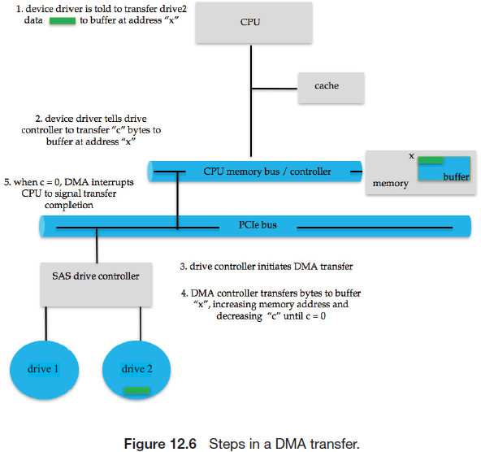

对于保护模式下的内核，操作系统通常会阻止进程直接发出设备命令。该准则可以保护数据不受访问控制的侵犯，还可以保护系统不受设备控制器错误使用的影响(这些问题可能会导致系统崩溃)。相反，操作系统会提供一些功能，使得有足够特权的进程能够访问底层硬件上的低级操作。对于没有内存保护的内核，进程可以直接访问设备控制器。由于可以避免内核通信，上下文切换和内核软件层，因此这种直接访问可以用于实现高性能。不幸的是，它干扰了系统的安全性和稳定性。通用的操作系统会保护内存和设备，这样能够使系统避免各种错误或恶意的应用程序。

#### 12.2.5 I/O Hardware Summary

虽然考虑到电子硬件设计时，硬件方面的I/O是非常复杂的，但上面提到的概念已经足够我们理解操作系统的很多I/O特性。下面回顾一下主要概念：

- 总线
- 控制器
- I/O端口及其寄存器
- 主机和设备控制器的握手
- 通过轮询或中断来执行握手
- 将大型传输的作业移交给DMA控制器

本章中已经给出了一个设备控制器和主机之间进行握手的一个简单例子。实际中，各种各样的可用设备给操作系统实现者带来了一个问题。每种设备都有其各自的特性，定义的控制位和与主机交互的协议等，这些都不尽相同。如何在不重写操作系统的前提下来适配这些设备？以及在设备大量变化时，操作系统如何给应用提供一个便利的，统一的I/O接口？下面将关注这些问题。

#### 12.3 Application I/O Interface

本章中，我们会设计一些技术和接口来让操作系统用一种标准的，通用的方式来对待I/O设备。例如，应用如何在不知道哪种硬盘的前提下打开硬盘上的文件，以及如何在不干扰操作系统的前提下将新的硬盘和其他设备添加到计算机？

就像其他复杂的软件工程问题，这里的方法设计抽象，封装和软件分层。具体地，我们可以通过定义一些通用类型来抽象出I/O设备的详细差别。通过一个标准的功能集(接口)来访问每个通用类型。封装了这些差异的内核模块称为设备驱动，其内部是根据特定设备定制的，但提供了一个标准接口。图12.7描述了内核的I/O相关部分是如何在软件层中的构造。

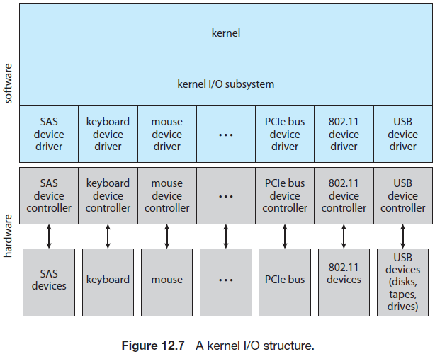

设备驱动的目的是从内核的I/O子系统中隐藏设备控制器之间的差异，I/O子系统会使用一些通用的类来封装设备的行为，对应用程序隐藏硬件的差异。这样使得I/O子系统独立于硬件，并简化了操作系统设计者的工作。设计一个新设备只需要与现有主机控制器接口(如SATA)兼容，或通过编写设备驱动给操作系统提供一个新硬件接口。这样，我们就可以为计算机添加新的外设，而无需等待厂商开发相应的支持代码。

对设备硬件制造商不幸的是，每个操作系统都有其各自的设备驱动接口。一个给定的设备可能需要提供多个设备驱动，例如Windows，Linux，AIX和macOS。设备在多个维度都不尽相同，见图12.8

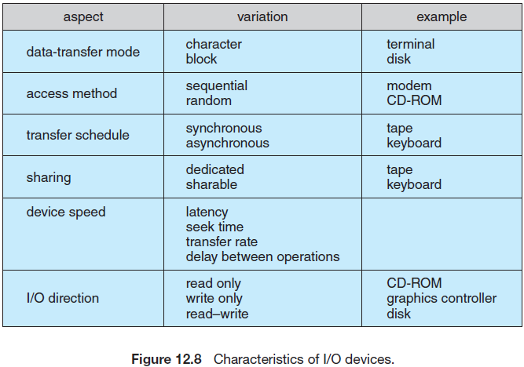

- 字符流或块。一个字符流设备会一个字节一个字节地进行传输，而一个块设备会以一块字节为单位进行传输
- 顺序或随机访问。顺序的设备会以设备规定的固定顺序传输数据，而随机访问设备则可以指示设备查找任何可用数据的存储位置。
- 同步或异步。同步设备与系统的其他功能协调，使用可预测的响应时间执行数据传输，与系统的其他方面进行协调。而异步设备则展现出不规则或不可预测的响应时间，且不会与其他计算机事件协调。
- 共享或专用。一个共享设备可以同时被多个进程或线程使用；而专用设备则不能
- 读写，只读，只写。一些设备会执行输入和输出，但其他设备则只支持一个方向的数据传输。一些允许数据在写后进行修改，但其他则仅允许一次写操作，且后续只读。

为了应用的访问，操作系统屏蔽了很多这类差异，且将设备分为几种常规类型，由此产生的设备访问方式被认为是有用且广泛适用的。虽然不同的操作系统的系统调用会有所不同，但设备种类则非常标准。主要的访问规则包括块I/O，字符流I/O，内存映射文件访问和网络套接字。操作系统也提供了一些特殊的系统调用来访问一些额外的设备，如时钟和定时器。一些操作系统为图形显示，视频，和音频设备提供了一个系统调用集。

大都数操作系统都会有一个允许应用将任意命令透明地传递给设备驱动的逃逸(或后门)。在UNIX上，这种系统调用为`ioctl()`(用于I/O控制)。`ioctl()`系统调用允许一个应用访问任何功能，这些功能能够被任何驱动实现，而无需创造一个新的系统调用。`ioctl()`系统调用有三个参数。第一个是将应用连接到驱动的设备描述符，指出驱动管理的一个硬件设备。第二个参数是一个整型，用于选择驱动中实现的某个命令。第三个是一个指向内存中任意数据接口的指针，允许应用和设备交互任何需要的控制消息或数据。

UNIX和Linux的设备标识符是一个"主和次"设备号的元组。主号表示设备类型，次号表示设备的实例。例如，考虑系统上的SSD设备。如果发使用命令：

```
% ls -l /dev/sda*
```

输出如下：

```
brw-rw---- 1 root disk 8, 0 Mar 16 09:18 /dev/sda
brw-rw---- 1 root disk 8, 1 Mar 16 09:18 /dev/sda1
brw-rw---- 1 root disk 8, 2 Mar 16 09:18 /dev/sda2
brw-rw---- 1 root disk 8, 3 Mar 16 09:18 /dev/sda3
```

输出显示有8个主设备号。操作系统使用该信息将I/O请求路由到合适的设备驱动。次号为0，1，2，3，表示设备的实例，用来为请求选择准确的设备。

#### 12.3.1 Block and Character Devices

块设备接口用于满足访问硬盘和其他面向块的设备的各方面需求。设备需要理解一些诸如`read()`和`write()`的命令。如果是一个随机访问设备，它还需要一个`seek()`命令来指定下一个传输的块。应用通常会通过文件系统来访问一个设备。我们可以看到`read()`，`write()`和`seek()`可以满足块存储设备的基本行为，这样使应用程序与设备之间的底层差异隔离开来。

如同数据库管理系统，操作系统本身也是一种特殊的应用，可能会倾向以简单的线性块数组访问块设备。这种访问模式有时被称为裸I/O(raw I/O)。如果应用有自身的缓存，那么使用文件系统会导致冗余的缓冲。同样地，如果一个应用提供了自身的块锁或域锁，那么在最差情况下，所有的操作系统的锁定服务都将是冗余且矛盾的。为了避免这种冲突，裸设备或将设备控制直接传达给应用，而不会经过操作系统。不幸的是，这种设备不能使用操作系统的所有服务。一种常见的折衷方案是操作系统允许操作禁用缓冲和锁定的文件，在UNIX中，称为直接I/O。

内存映射文件访问可以位于块设备驱动之上。除了提供读写操作，内存映射接口也提供了通过主存的字节数组访问硬盘存储的途径。将文件映射到内存的系统调用会返回包含文件副本的虚拟内存地址。仅当需要满足对内存镜像的访问时，才会执行实际的数据传输。由于传输使用与按需分页虚拟内存访问相同的机制处理，因此内存映射I/O的效率比较高。对编程人员来说，内存映射也很方便，访问一个内存映射的文件正如读取或写入内存一样简单。提供了虚拟内存的操作系统通常会使用内核服务的映射接口。例如，为了执行一个程序，操作系统将可执行文件映射到内存，并将控制传递到可执行文件中的入口地址。内核访问硬盘的交换空间时通常也会用到映射接口。

键盘是一种使用字符流接口访问的设备。应用可以使用该接口中的基本系统调用来`get()`或`put()`一个字符。在这个接口之上，可以构建提供一次访问一行的库，并提供缓冲和编辑服务(例如，当一个用户类型为退格，会从输入流中移除一个字符)。这种访问方式可以为一些“自发”生成输入数据的输入设备提供便利，如键盘、鼠标和调制解调器，即应用程序不一定能预测输入的时间。这种访问方式可以为输出设备提供便利，如打印机和音响板等，它符合线性字节流的概念。

#### 12.3.2 Network Devices

因为网络I/O的性能和寻址特性与磁盘I/O有很大的不同，大多数操作系统提供了一个与硬盘使用的`read()`–`write()`–`seek()`接口不同的网络I/O接口。有一种适用于很多操作系统的接口，包括UNIX和Windows，即网络套接字接口。

想想墙上的电源插座：所有的电器都可以插入使用。以此类推，一个应用可以使用套接字接口中的系统调用创建套接字，将本地套接字连接到远端地址(将此应用程序插入另一个应用程序创建的套接字中)，监听所有插入到本地套接字的远端应用，从连接上发送和接口报文。为了实现网络服务器，套接字接口也提供了管理套接字的函数`select()`。对`select()`的调用会返回可以接收报文的套接字或有空间可以发送报文的套接字。`select()`的使用消除了网络I/O所需的轮询和繁忙等待。这些功能封装了网络的基本行为，可以更方便地创建使用任意底层网络硬件和协议栈的分布式应用。

还有其他实现进程间通信和网络通信的方式。例如，Windows提供了一个到网卡的接口，以及到网络协议第二个接口。UNIX作为网络技术的试验场有着悠久的历史，我们可以找到半双工管道，全双工FIFO，全双工STREAMS，消息队列和套接字等。C.9章节给出了UNIX网络的信息。

#### 12.3.3 Clocks and Timers

大多数计算机都有硬件时钟和定时器，它们提供了3个功能：

- 给出当前时间
- 给出已经经过的时间
- 设定一个在时间T触发操作X的定时器

操作系统大量使用了这些功能，特别是时间密集型应用。不幸的是，实现这些功能的系统调用并不能跨系统使用。

衡量经过的时间并触发某种操作的硬件称为可编程间隔定时器。可是将其设置为等待一定时间，然后会产生一个中断。这种操作可以执行一次或多次来周期性产生中断。使用这种机制生成中断的的调度器会在其时间片之后抢占某个进程。硬盘I/O子系统使用定时器来周期性地将脏缓存刷新到硬盘，网络子系统使用定时器来取消由于网络拥塞或失败造成的过慢的操作。操作系统也会用户进程提供了定时器接口，操作系统可以通过仿真虚拟定时器来支持多于硬件定时器的定时器请求。为了达到这种目标，内核(或定时器设备驱动)维护了一个其例程或用户请求需要的中断列表，按照最早时间排序。它将定时器设置为最早时间(*即使用列表的第一个元素*)，当定时器中断时，内核会通知请求者并使用下一个最早时间重载定时器。

计算机中的时钟硬件用于各种用途。现代PC包含一个高性能时间定时器(HPET)，它以10兆赫兹内的速率运行。这种PC上有一些比较器，当HPET中的时间与比较器的时间匹配时，可以触发一次或多次比较器。当触发器产生一个中断时，操作系统的时钟管理例程会判断定时器的用途以及后续的动作。触发器的精度受到计时器分辨率以及维护虚拟时钟的开销的限制。再者，如果使用定时器刻度来维护系统的日历，则系统时钟可能会发送漂移。可以使用协议来修正时钟漂移，如NTP，网络时间协议，使用复杂的延迟计算来使计算机的时钟几乎精确到原子钟水平。大多数计算机中，硬件时钟由高精度计数器构成。一些计算机中，可以从设备寄存器中读取计数器的值，这种情况下，可以将该计数器看作一个高分辨率时钟。虽然这种时钟不会产生中断，但它提供了精确测量时间间隔的途径。

#### 12.3.4 Nonblocking and Asynchronous I/O

系统调用的另外一个方面与阻塞和非阻塞有关。当一个应用发起一个阻塞的系统调用时，正在被调用的线程会被挂起，并从操作系统的运行队列转移到等待队列。在系统调用结束后，该进程会移回到运行队列，使之继续运行。当该线程恢复运行后，它会接收到系统调用返回的数值。I/O设备执行的物理操作通常是异步的，它们会花费可变的且不可预测的时间。然而，由于阻塞应用代码要比非阻塞应用代码简单，因此操作系统为应用接口提供了阻塞的系统调用。

一些用户级别的进程会需要非阻塞I/O。例如，一个用户界面可以同时接收键盘和鼠标的输入，并在屏幕上处理和显示数据。另一个例子是，视频应用可以同时从硬盘中的文件读取帧，并解压缩并在显示器上显示输出。

一个应用程序编写人员可以使用多线程应用来与I/O操作并行。一些线程可以执行阻塞的系统调用，而其线程则继续执行。一些操作系统提供了非阻塞I/O系统调用，一个非阻塞的调用不会暂停线程的执行。相反，它会很快返回一个表示已经传输多少字节的数值。

一个替代非阻塞系统调用的方法是使用异步系统调用。一个异步调用会立即返回，不会等待I/O结束。线程会继续执行代码。当未来某个时间I/O结束后会通过某种方式通知线程，如通过在线程的地址空间中设置某些变量或通过触发一个信号或一个软中断或一个在线程的线性控制流之外执行的回调例程。非阻塞和异步系统调用之间的区别是，非阻塞的`read()`会返回可用的数据信息，即与请求的数据的数目相同，少于请求请求的数据或没有数据。而一个异步的`read()`请求将会传输全部数据，且在未来的某个时间点完成。图12.9显示了这两种I/O方法。

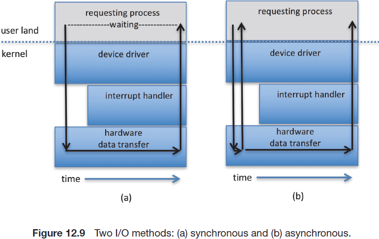

现代操作系统中会发生异步活动，虽然这些活动很少会暴露给用户或应用，但是在操作系统操作中会涉及到很多。以二级存储设备和网络I/O为例，默认情况下，当一个应用发起一个网络发送请求或存储设备写请求时，操作系统会注意到该请求，缓存I/O，并返回给应用。当为了提高整体系统的性能(*如合并发送*)，当可以处理请求时，操作系统会完成该请求的处理。如果系统在这个短暂的时间内发生了故障，则由于会丢失"正在途中"的请求。因此，操作系统通常会限制多久会缓存一个请求。例如，一些版本的UNIX会每30秒刷新一次辅助存储缓冲区，或每个请求会在其请求后的30秒内被刷新。系统提供了一种允许应用刷新一些缓存(如二级存储缓存)的方法，这样就能够强制将数据刷新到二级存储中，而不必等待缓存刷新间隔。内核维护着应用的数据一致性，在向设备发出I/O请求之前会从其缓冲区读取数据，确保能够将尚未写入的数据返回给请求方。注意对同一文件执行I/O的多线程可能不会得到一致的数据，具体取决于内核如何实现其I/O。这种情况下，线程可能会使用锁协议。一些I/O请求需要立即执行，因此I/O系统调用通常可以标明一个给定的请求，或将I/O指定到特定的设备，这种操作应该同步执行。

一个比较好的非阻塞的例子是使用`select()`系统调用来选择网络套接字。该系统调用使用一个参数来指定最大的等待时间，如果设置为0，会使用一个线程轮询网络活动(不会被阻塞)。由于`select()`只能检查一个I/O是否可用，因此使用`select()`会引入额外的开销。当需要数据传输时,`select()`后面必须跟上如`read()`或`write()`之类的命令。在Mach上，该方法的一个变种是使用阻塞的多次读调用。它在一个系统调用中指定了多个服务的读请求，并在其中一个结束后返回。

#### 12.3.5 Vectored I/O

一些操作系统通过应用接口提供了其他主要的I/O方式。向量I/O允许一个系统调用执行多个与位置相关的I/O操作。例如，UNIX的`readv`系统调用接收一个多缓存向量，能够将数据源读入该向量或将数据从向量中写入目的地。多次单独的调用系统会产生相同的数据传输，但这种分散-聚合方式有多种用途。

可以通过一个系统调用传输多个单独的缓存，避免上下文切换和系统调用开销。如果没有向量I/O，数据需要以正确的顺序传递到一个大的缓存，然后一起发送出去，这种效率比较低。此外，一些版本的分散-聚合提供了原子性，保证所有的I/O能够在没有中断的请求下完成(避免在其他线程操作这些缓存的请求下损坏数据)。如果可以，编程人员可以使用分散-聚合I/O特性来增加吞吐量并降低系统开销。

### 12.4 Kernel I/O Subsystem

内核提供了很多与I/O相关的服务。一些服务，如调度，缓冲，缓存，池，设备预留，和错误处理等，这些都由内核I/O子系统提供，并内置在硬件和设备驱动中。I/O子系统也用于防护错误的进程和恶意用户。

#### 12.4.1 I/O Scheduling

调度一系列的I/O意味着需要确定这些I/O的正确顺序。按照发出系统调用的应用进行排序并不是个好的选择。调度可以提升整体系统的性能，可以在进程之间公平地共享设备访问，以及减低完成I/O的平均等待时间。下面描述一个简单的例子，假设硬盘臂位于硬盘的开始地方，有三个程序对硬盘发出了阻塞读调用。应用1请求位于硬盘末端的块，应用2请求位于硬盘开始的块，应用3请求位于硬盘中间的块。操作系统可以通过将服务应用的顺序变为2，3，1，以此来降低硬盘臂移动的距离。这种重新排列服务的顺序是I/O调度的本质。

操作系统可以通过为每一个设备维护一个等待队列来实现调度。当一个应用发起一个块I/O系统调度时，该请求会被放到对应设备的队列中。I/O调度器会重新排列队列的顺序来提升整体系统的效率和应用的平均响应时间。操作系统可能尝试公平调度，这样不会导致某个应用的服务时间过少，或者可能会给延迟敏感请求分配优先级服务。例如，来自虚拟内存子系统的请求可能会比应用的优先级高。11.2章节描述了一些硬盘I/O的调度算法。

当一个内核支持异步I/O时，它必须能够同时跟踪多个I/O请求。为了实现这个目标，操作系统可能会将等待队列附着到设备状态表上。内核会管理包含这种每个表项对应一个I/O设备的表，见图12.10。每个表项指定一个设备的类型，地址和状态(非运转，空闲或繁忙)。如果在接收到请求时设备正处于繁忙状态，请求的状态和其他参数会被保存在该设备的表项中。


调度I/O操作时I/O子系统提升计算机效率的方法之一。另一种方法是使用主存的存储空间或通过通过缓冲，缓存和池访问存储器体系。

#### 12.4.2 Buffering

buffer是两个设备之间或设备和应用之间用于存储被传输的数据的区域。缓冲的存在有三种原因，一是生产者和消费者之间的数据流存在速度不匹配。例如，假设通过Internet接收一个文件并存储在SSD中，网络速度可能会比驱动慢好几千倍。因此会在主存中创建一个buffer来积累来自网络的字节。当接收到一整个buffer的数据时，可以使用一个命令将其写入驱动。由于驱动写入不是即时的，且网络接口需要一个地方来存放额外的接收到的数据，因此会使用两个buffer。当网络填满第一个buffer，此时会请求驱动写入。然后网络会开始填充第二个缓存，此时第一个buffer已经被写入存储。当网络填满第二个buffer后，第一个驱动器的写入应该已经完成，这样网络可以在驱动写入第二个buffer时候切换到第一个buffer。这种双缓冲隔断了生产者到消费者的数据，从而放宽了两者之间的时间要求。图12.11描述了这种隔断，其中列出了典型计算机硬件和接口在设备速度上的巨大差异。

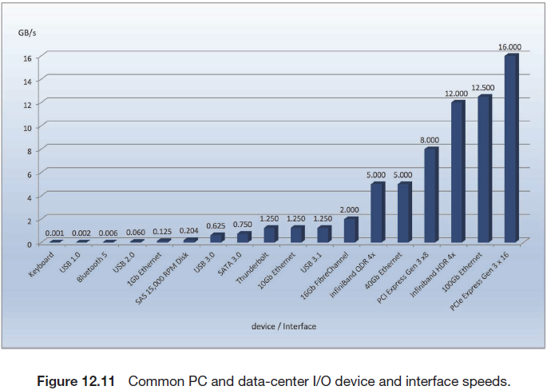

第二种缓冲的用途是适配具有不同数据传输大小的设备。这种差异在计算机网络中非常普遍，使用buffer来分片和重组消息。在发送端，一个大的消息会被分片为小的网络报文。这些报文发送到网络上，接收端会将其放到重组buffer中来组成一个源数据的镜像。

第三种缓冲的用途是支持应用程序I/O的复制语义。使用一个例子来澄清"复制语义"的意义。假设一个应用有一个buffer的数据需要写入硬盘。该应用会调用`write()`系统调用，提供一个执行buffer的指针和一个指定写入字节数的整数。在系统调用返回后，如果应用修改了buffer中的内容，会发生什么呢？使用拷贝语义，会保证写入硬盘的数据的版本与应用使用系统调用时的版本相同， 独立于任何后续应用程序的缓冲区的更改。操作系统保证`write()`系统调用的拷贝语义的一种简单办法是在控制返回给应用前将应用数据拷贝到内核buffer中。后续会从内核buffer写入硬盘，这样后续对应用buffer修改就不会造成任何影响。内核buffer和应用数据空间之间的数据拷贝在操作系统中非常普遍，尽管由于清理语义，这个操作带来了开销。通过灵活使用虚拟内存映射和写时拷贝分页保护，可以使过程更加高效。

#### 12.4.3 Caching

cache是一个保存数据拷贝的高速内存区域。访问缓存的拷贝要比访问原始数据更加有效。例如，当前运行的进程的之类保存在硬盘中，缓存在物理内存中，并拷贝到CPU的辅助和主cache中。buffer和cache的区别是，一个buffer可能仅保存一个数据项的现有副本，而一个cache则在高速存储中保存了位于其他位置的数据项的副本。

缓存和缓冲是不同的功能，但有时同一块内存区域可以用于这两种功能。例如为了预留拷贝语义以及使硬盘能够高效地进行调度，操作系统会在主存中使用buffer来保存硬盘数据。这类buffer也被用作cache来提升应用间共享的文件的I/O效率，或提升写入或重读的速度。当内核接收到一个文件I/O请求，内核首先会访问buffer cache来检查文件的这部分区域是否已经在主存中。如果是，就可以避免或推迟一次硬盘I/O。当然，写入的数据会在buffer cache中停留几秒，这样可以使用大数据量传输来提升写调度的效率。这种通过延迟提升I/O效率的策略将在访问远端文件的上下文种进行讨论，见19.8字节。

#### 12.4.4 Spooling and Device Reservation

spool(假脱机)是一种保存一个设备输出的buffer，如打印机这种无法接受交错数据流的设备。虽然打印机同一时间只能处理一个任务，但可能有多个应用需要同时打印其输出，且多个输出不会交错。操作系统会通过截取打印机的所有输出来解决这种问题。每个应用程序的输出都被假脱机到一个单独的辅助存储文件中。当一个应用结束打印后，假脱机系统会对对应的假脱机文件进行排序以输出到打印机。假脱机系统每次会从队列中拷贝一个假脱机文件。在一些操作系统上，系统守护进程会管理假脱机，而在其他操作系统上，则由内核线程进行管理。在其他情况下，操作系统会提供一个控制接口来让用户或系统管理员显示该队列，在这些任务被打印前移除不需要的任务，在打印机工作时暂停打印等。

一些设备，如磁带驱动器和打印机，它们无法有效地多路复用多个并发应用程序的I/O请求。假脱机是一种操作系统可以协调并发输出的方式。另一种处理并发设备访问的方法是提供明确的协调工具。一些操作系统(包括VMS)(通过使一个进程能够分配空闲的设备，并在不需要时释放该设备的方式)提供了提供对独占设备访问的支持。其他操作系统强制限制这种设备每次只能处理一个打开的文件。很多操作系统提供了使进程能够协调独占访问的功能。例如，Windows提供了等待设备对象可用的系统调用。`OpenFile()`系统调用还有一个参数用于声明允许其他并发进程的访问类型。在这些系统上，应用需要注意防止死锁。

#### 12.4.5 Error Handling

使用受保护内存的操作系统可以抵御多种类型的硬件和程序错误，因此，每个机械故障通常不会造成系统故障。设备和I/O传输失败的方式有很多种，有可能是短暂的(例如网络负载高)，或者永久的(如硬盘控制器失灵)。操作系统通常可以有效地补偿瞬态故障。例如，一个硬盘读失败会导致重新进行读操作，一个网络发送失败会导致重新进行发送(如果协议允许)，不幸的是，如果一个重要的组件出现了永久性错误，那么操作系统不可能对其进行恢复。

通常会规定，I/O系统调用会返回一个表示调用状态的比特位信息，表示调用成功或失败。在UNIX操作系统中，会使用一个名为errno的整型变量来返回错误码(一百多个错误码中的一个)，用来指出通常失败的原因(例如参数超范围，错误的指针，或文件没有打开)。相反，一些硬件可能会提供更详细的错误信息，虽然现在很多操作系统并不会将这些信息传递给应用。例如，SCSI协议报告的SCSI设备的故障有三个详细级别：识别错误性质的检测关键字，如硬件错误或非法请求；一个指示错误类型的额外的检测码，如错误的命令参数或自检失败；以及一个给出更多详细信息的附加的检测码限定，如命令参数错误或硬件子系统自检失败。再者，很多SCSI设备会为错误日志信息维护内存分页，主机可以请求这类信息，但很少会请求。

#### 12.4.6 I/O Protection

错误与错误防护密切相关。一个用户进程可能会意外或主动地通过发起非法的I/O之类来干扰正常的系统操作。我们可以通过多种机制来防止系统中产生这种干扰。

为了防止用户执行非法的I/O，我们将所有的I/O指令定义为特权指令。这样，用户不能直接发起I/O指令，必须通过操作系统才能执行。为了执行I/O，用户程序执行系统调用来请求操作系统代表其执行I/O(图12.12)。操作系统会以监控模式执行，并校验请求的有效性，如果有效，则执行请求的I/O。操作系统后续会将结果返回给用户。

此外，任何内存映射和I/O端口内存位置必须使用内存防护系统来防止用户的访问。注意，内核不能简单地阻止所有用户进程。例如，大多数图形游戏或视频编辑和回放软件需要直接访问使用内存映射的图形控制器内存来加速图形性能。这种情况下，内核可能会提供锁机制来允许一次将一个图形内存段(表示屏幕上的一个窗口)分配给一个进程。

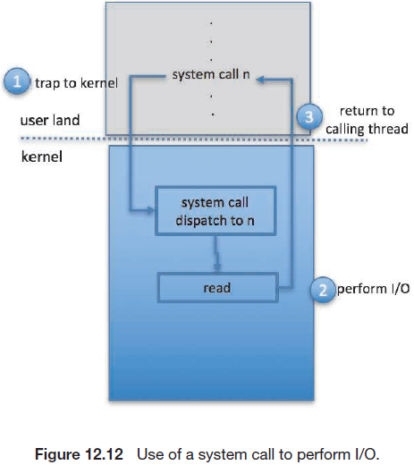

#### 12.4.7 Kernel Data Structures

内核需要提供各种内核数据结构来保存I/O组件使用的状态信息，如14.1章节描述的打开文件表结构。内核会使用很多类似的结构来跟踪网络连接，字符设备通信，以及其他I/O活动。

Unix提供了文件系统来访问多种实体，如用户文件，裸设备和进程地址空间。虽然这类实体都提供了`read()`操作，但语义不同。例如当读取一个用户文件时，内核需要在决定执行硬盘I/O之前探测buffer cache。为了读取一个裸磁盘，内核需要保证请求的大小为多个硬盘扇区大小并在在扇形边界上对齐。为了读取一个进程镜像，只需要从内存中复制数据。UNIX使用面向对象的技术在一个同一结构中封装了这些差异。图12.13展示了打开文件记录的操作，包含一个调度表，其中包含指向适当例程的指针，具体取决于文件的类型。

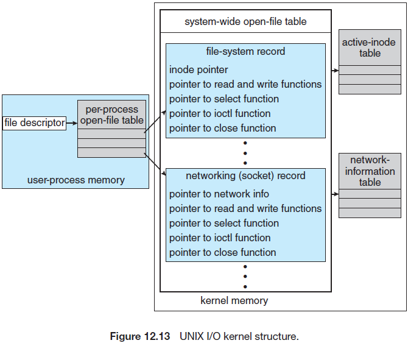

一些操作系统会广泛地使用面向对象的方法。例如，Windows的I/O实现中使用了消息传递。I/O请求会转换为消息，通过内核发送到I/O管理器，然后发送到设备驱动，每个过程都可能修改消息内容。对于输出，该消息包含了需要写的数据；对于输入，该消息包含了一个接收数据的buffer。与使用共享数据结构的过程技术相比，消息传递会增加开销 ，但它简化了结构以及I/O系统的设计，并增加了灵活性。

#### 12.4.8 Power Management --ignore

#### 12.4.9 Kernel I/O Subsystem Summary

总之，I/O子系统协调了大量用于应用程序和内核其他部分的服务集。I/O子系统会监督这些程序：

- 文件和设备的命名空间管理
- 文件和设备的访问控制
- 操作控制(如，调制解调器不能使用`seek()`)
- 文件系统空间分配
- 设备分配
- 缓冲，缓存和假死机
- I/O调度
- 设备状态监控，错误管理和失败恢复
- 设备驱动的配置和初始化
- I/O设备的电源管理

I/O子系统的上层通过设备驱动提供的统一接口来访问设备。

#### 12.5 Transforming I/O Requests to Hardware Operations

我们早先讨论了设备驱动和设备控制器之间的握手，但没有解释操作系统是如何将一个应用请求连接到网络线路上或指定的硬盘扇区。例如，考虑一个从硬盘读文件的操作。应用使用文件名指向数据。在一个硬盘中，文件系统通过将文件名映射到文件系统目录的方式来获取该文件的分配到的空间。例如，FAT的MS-DOS(今天仍在使用的一种相对简单的操作和文件系统，一种通用的交换格式)，它将名字映射为一个指示文件访问表中的一个表项的数字，该表项可以告诉分配给该文件的硬盘块。在UNIX中，文件名会映射到一个inode号，对应的inode包含空间分配的信息。但文件名如何与硬盘控制器进行联系(使用硬件端口地址还是内存映射控制器寄存器)？

一种是上面描述的FAT的MS-DOS使用的方法。第一个部分是MS-DOS的文件名，冒号前面是标识特定硬件设备的字符串。例如，C: 是主硬盘上的每个文件的第一个部分。C:表示内置到操作系统中的主硬盘；C:通过一个设备表映射到特定的端口地址。由于使用了冒号进行分割，将设备命名空间和文件系统命名空间进行了分割。这种分割使得操作系统能够很容易地将额外的功能与每个设备进行关联。例如，操作系统可以很容易地对任何文件执行假死机来将文件写入打印机。

如果设备命名空间包含在常规文件系统命名空间中，例如UNIX，会动态提供普通文件系统命名服务。如果文件系统给所有文件名称提供了所有权和接入控制，那么设备也会具有所有者和访问控制。由于文件会被存储到设备中，这类接口会在两个层面上提供对I/O系统的访问。用于访问设备本身的名字或访问存储在设备中的文件。

UNIX在普通文件系统命名空间中体现了设备名称。与使用冒号作为分割的MS-DOS FAT文件名称不同，一个UNIX路径名称没有明显的设备分割。实际上，路径名称中没有包含设备名称的部分。UNIX使用mount表将路径名称的前缀与特定设备名称关联。为了解析一个路径名称，UNIX会查找mount表中的名称来找出最长匹配的前缀；mount表中的对应名称即是设备名称。这种设备名称在文件系统名称空间中也具有名称格式。当UNIX在文件系统目录结构中查找这种名字时，它不会找到inode号，而是<主，次>设备号。主设备号标识了处理该设备I/O的设备驱动。传递给该设备驱动的次设备号用来在设备表中进行索引。对应的设备表中的表项给出了端口地址或设备控制器的内存映射地址。

现代操作系统从路径的多阶段的(位于请求和物理设备控制器之间的)查找表中获得了极大的灵活性。这种在应用程序和驱动程序之间传递请求的机制是通用的。因此，我们可以在计算机上引入新的设备和驱动，而无需重新编译内核。实际上，一些操作系统能够在需要时加载设备驱动。在启动时，系统会首先探测硬件总线来决定该设备类型。然后立即或在接收到第一个I/O请求时加载必须要的驱动。启动之后添加的设备会通过错误检测(例如，没有通过相关的中断处理器生成的中断)来提示内核检查设备的详细信息，并动态加载适当的设备驱动程序。当然，动态加载(和卸载)要比静态加载复杂，需要更复杂的内核算法，设备结构锁，错误处理等等。

下面会描述一个阻塞读请求的生命周期，如图12.14。该图指出一个I/O操作需要很多步骤并花费大量CPU周期。

1. 一个进程调用阻塞`read()`读取一个之前已经打开的文件的文件描述符。
2. 内核的系统调用代码检查入参正确性。如果输入时buffer cache中的数据已经就绪，会将这些数据返回给进程，I/O请求结束
3. 否则，需要执行物理I/O。进程会从运行队列中移除并放到设备的等待队列中，此时会调度I/O请求。最终，I/O子系统会将请求发送到设备驱动。取决于操作系统的类型，请求可能会通过子例程调用或内核消息进行发送。
4. 设备驱动会分配内核buffer空间来接收数据并调度I/O。最终，请求通过写入设备控制寄存器的方式将命令发送到设备控制器。
5. 设备控制器会操作设备硬件来执行数据传输。
6. 驱动可能会轮询状态和数据，或启动DMA将数据传输到内核内存。假设DMA控制器负责管理数据的传输，当传输结束后会发出一个中断。
7. 正确的中断处理器会通过中断向量表接收中断，并存储任何必要的数据，给设备驱动发送新信号并从中断返回。
8. 设备驱动接收到信号后，会确定哪个I/O请求已经结束，确定请求的状态，并给内核I/O子系统发送信号通知其请求已经完成。
9. 内核会将数据和返回码传递给请求进程的地址空间并将进程从等待队列移回ready队列中。
10. 将进程移回ready队列会取阻塞进程。当调度器将进程分配到CPU，进程会在系统调用结束后恢复运行。

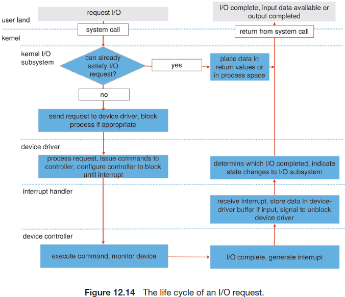

### 12.6 STREAMS

UNIX System V(以及很多后续的UNIX发行版)有一个有趣的机制，称为STREAMS，使一个应用能够动态组装驱动代码的流程。一个流是设备驱动和用户层进程之间的全双工连接。包含一个流首部，作为用户进程的接口，一个控制设备的驱动末端，以及流首部和驱动末端之间的零个或多个流模块。每个模块包含一对队列，一个读队列和一个写队列。在队列之间使用消息传递传输数据。图12.15展示了这种流结构。


模块提供了流处理的功能，使用`ioctl()`系统调用将这些模块的功能应用到这条流上。例如，一个进程可以通过一个流打开一个USB设备，并使用一个模块来处理输入编辑。由于消息是在相邻模块的队列之间进行交换的，一个模块中的队列可能会溢出到相邻的队列。为了防止发生这种情况，一个队列可能会需要支持流控制。如果没有流控制，一个队列会接收所有的消息并立即将其发生到相邻模块的队列中(中间无缓冲)。支持流控制的队列会缓冲消息且不会在没有buffer空间时接收消息。这个过程涉及相邻模块的队列中的控制消息的交互。

一个用户进程会使用`write()`或`putmsg()`系统调用来将数据写入设备。`write()`系统调用会将raw数据源写入流，而`putmsg()`允许用户进程指定特定的消息。不管用户进程使用什么系统调用，流首部会将数据拷贝到消息中并将其传递到下一个模块的队列中。这种消息拷贝会一直持续到消息被复制到驱动程序端和设备。类似地，用户进程使用`read()`或`getmsg()`系统调用从流首部读取数据。如果使用了`read()`，则流首部会从其相邻的队列获取消息并将普通数据(非结构化字节流)返回给进程。如果使用`getmsg()`，则会将消息返回给进程。

STREAMS I/O是异步的，除非用户进程与流头通信。当写入流时，用户进程会被阻塞(假设下一个队列会使用流控制)，直到没有空间拷贝消息。类似地，用户进程在从流中读取时会被阻塞，直到有可用的数据。

正如上面提到的，驱动端(类似流首部和模块)有一个读和写对列。然而，驱动端必须响应中断，如当网络上有可以读取的帧时触发的中断。与流首部不同，当其无法将消息拷贝下一个队列时会被阻塞，驱动端必须处理所有进来的数据。驱动必须支持流控制。然而，如果设备buffer满了，设备通常会采取丢弃进来的消息的方式。考虑当一个网卡的输入buffer满时，网卡必须简单地队列后续消息，直到有足够的buffer来保存进来的消息。

使用STREAMS的好处是它提供了一种模块化和用于编写设备驱动程序和网络协议的增量方法的框架。不同的模块可能会使用到模块，进而被不同的设备使用。例如，Ethernet网卡和802.11网卡都可能会使用到网络模块。更进一步，STREAMS不会将字符设备I/O看作一个非结构化字节流，它支持消息边界，以及在不同模块通信时支持控制信息。大多数版本的UNIX支持STREAMS，且倾向于使用这种办法编写协议和设备驱动。例如，System V UNIX和Solaris使用STREAMS实现套接字机制。

### 12.7 Performance

I/O时系统性能的主要因素之一。它对CPU执行设备驱动程序代码有很高的要求，以及在进程阻塞和非阻塞时公平高效地调度CPU。导致的上下文切换回给CPU和其硬件缓存带来压力。I/O也会在内核的中断处理机制中暴露出其低效性。此外当数据在控制器和物理内存间进行拷贝以及在内核buffer和应用数据空间进行拷贝时，I/O负载降低了内存总线的利用率。优雅地进行这类拷贝需要考虑到计算机的架构。

虽然现代计算机每秒可以处理上千个中断，但中断是一个相对昂贵的任务。每个中断会导致系统执行一次状态变更来执行中断处理器，然后恢复状态。如果在繁忙等待中花费的周期数不太多，那么可编程的I/O比中断驱动的I/O更高效。I/O结束后通常会去阻塞一个进程，导致一次上下文切换。

网络流量也会导致高上下文切换率。例如，远程从一个机器登陆到另一个机器，每次在本地的字符输入都会传输到远端机器。当在本地机器上输入一个字符时，会产生一次键盘中断，该字符会通过中断处理器传递到设备驱动，内核，最后传递到用户进程。用户进程会发起网络I/O系统调用来将该字符传递到远端机器。然后，字符会流转到本地内核，通过网络层组建网络报文，到达网络设备驱动。网络设备驱动将报文传递给网络控制器，然后会发送字符并产生一个中断。该中断会传递回内核，结束网络I/O系统调用。

当远端系统网络硬件接收到该报文后会生成一个中断。字符会通过网络协议解包并赋予适当的网络守护程序。网络守护程序会指出涉及的远端登陆会话并将报文传递给该会话的合适的子守护程序。整个流程中会有上下文切换和黄台切换(图12.16)。通常接收端会将该字符回显给发送端，该方法会加倍整个工作。

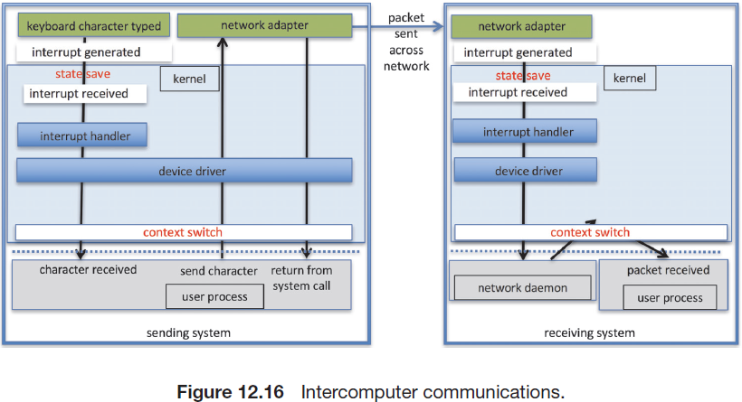

一些系统会使用前后端进程分割终端I/O来降低主CPU上的终端负担。例如，一个终端集中器可以将上百个远端终端的流量复用到一个大型计算机的端口上。一个I/O通道是一个在大型机和其他高端系统中专用的，具有特殊用途的CPU。通道的作用是将I/O任务从主CPU上卸载。即通道会保持数据畅通无阻，而主CPU则用户处理数据。类似小型计算机中的设备控制器和DMA控制器，一个管道可以处理更通用，更复杂的程序，因此通道可以用于一些特殊的工作负载。

我们可以引入一些原则来提升I/O效率：

- 降低上下文切换数目
- 降低数据在设备和应用传输时，拷贝进内存的次数。
- 使用大型传输，智能控制器和轮询（如果繁忙等待可以最小化)来降低终端频率。
- 通过使用可支持DMA的控制器或通道来减轻CPU的简单数据复制负担，从而提高并发性。
- 将处理移入硬件，来允许操作在设备控制器中同步进行(使用CPU和总线操作)。
- 由于任何一个区域的过载都会导致其他区域的闲置，因此需要均衡CPU，内存子系统，总线和I/O性能，

I/O设备的复杂度差异很大。例如，鼠标比较简单，鼠标的移动和按键都会转换成数字，该信号来自硬件，通过鼠标设备驱动传递给应用。相反，Windows硬盘设备驱动则比较复杂。它不是独立管理的，也会使用RAID阵列(11.8章节)。为了实现这种目的，会将一个应用的读或写请求转换为一组协调的磁盘I/O操作。此外，它还实现了复杂的错误处理和数据恢复算法，并使用很多步骤来优化硬盘性能。

I/O的功能应该在哪里实现，设备硬件，设备驱动还是应用软件？有时，我们观察到如图12.17所示的进度。

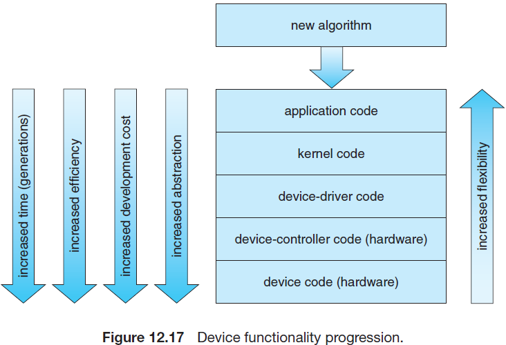

- 由于应用代码比较灵活且应用的错误不可能导致系统崩溃，因此，一开始我们会在应用层面实现实验性的I/O算法。然后，为了开发应用层代码，我们需要避免重启或早每次代码变更后重载设备驱动。然而，由于上下文切换的开销和应用无法使用内核数据结构的优势和内核功能(如高效的内核消息，线程和锁)，因此一个应用层的实现可能是不够的。例如，FUSE系统接口允许编写文件系统并运行在用户模式。
- 当一个应用层的算法被证明是有价值时，我们可能需要在内核中重新实现，这种方式可以提高性能，但由于操作系统内核是一个庞大的，复杂的软件系统，因此开发会更具挑战性。更进一步，一个内核实现必须经过完整的调试来避免数据损坏和系统崩溃
- 可以通过特定的硬件(设备或控制器)实现来获得最高的性能。但使用硬件的实现会比较复杂，后续的提升和缺陷修复也比较昂贵，增加了(以月为单位计算的)开发时间，以及降低了灵活性。例如，硬件RAID控制器可能无法为内核提供任何手段来影响各个块的读取和写入的顺序或位置，即使内核有关于能够提升I/O性能的负载的特殊信息

随着时间的推移，就像运算一样，I/O设备也已经增加了速度。非易失性存储设备越来越受欢迎，并且可用的设备种类也越来越多。NVM设备的速度从高变得更高，而下一代设备已接近DRAM的速度。这些发展正在增加I/O子系统和操作系统算法的压力，以利用现在可用的读/写速度。图12.18展示了CPU和存储的两个维度：I/O操作的容量和延迟。图中使用网络延迟来揭示网络导致的I/O的性能“税”。

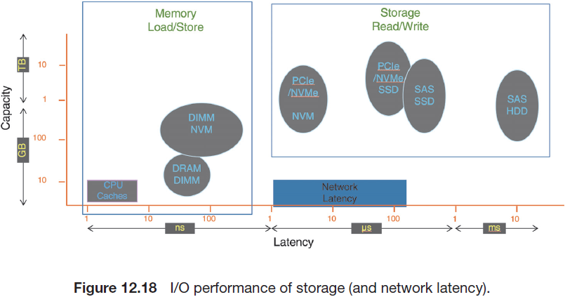


