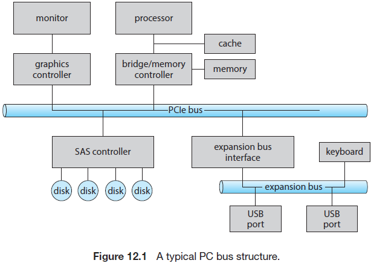
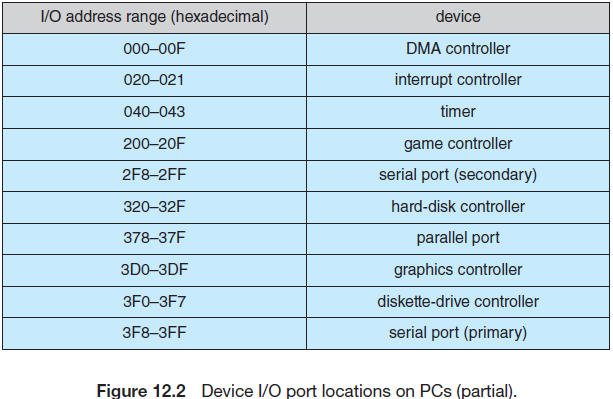

## I/O Systems

一个计算机中的两个主要任务是I/O和计算。大多数情况下，主要的任务I/O，计算或处理仅仅是附带的。例如，当浏览一个web页表或编辑一个文件时，我们感兴趣的时读或获取一些信息，而不是计算出某个答案。

操作系统在计算机I/O中的角色是管理并控制I/O操作和I/O设备。虽然在其他章节中已经进行了类似的讨论，但这里会完整地对I/O进程描述。由于硬件接口限制了操作系统的内部设施，因此会首先会描述I/O硬件的概念。下面会讨论操作系统提供的I/O服务以及这些服务在应用I/O接口中的体现。然后讨论操作系统是如何在硬件接口和应用接口间搭建桥梁的。我们也会讨论UNIX System v STREAMS机制，该机制允许一个应用自动组合驱动代码的处理流程。最后会讨论I/O的性能以及提升I/O性能下的操作系统设计原则。

### 12.1 Overview

操作系统设计者需要重点关注如何控制连接到计算机的设备。由于I/O设备的功能和速度各不相同(例如鼠标，硬盘，闪驱以及录音机器人)，需要使用多种方法进行控制。这些方法组成了内核的I/O子系统，并将内核从复杂的I/O设备管理中解脱出来。

I/O设备技术表现出两种相互矛盾的趋势。一方面软件和硬件接口的标准在增加，这种趋势将改进后的设备集成到现有的计算机和操作系统中；另一方面，I/O设备的种类也在增加。一些新的设备与老设备不尽相同，要将这些设备集成到我们的计算机和操作系统中会面临比较大的挑战。这个挑战涉及软件和硬件技术。基本的I/O硬件元素，如端口，总线和设备控制器等都可以容纳多种I/O设备。为了封装设备的细节和各种差异，操作系统的内核使用了设备驱动模块。设备驱动体提供了统一的到I/O子系统的设备访问界面，类似在应用和操作系统之间提供了标准接口的系统调用。

### 12.2 I/O Hardware

计算机会操作很多各种类型的设备。大多数属于通用类型的存储(硬盘，磁带)，传输设备(网络连接，蓝牙)以及人机界面设备(屏幕，键盘，鼠标，音响等)。其他设备则更加专业化，如与喷气机转向有关的设备。在这种飞机上，由人通过操纵杆和脚踏板输入飞行计算机，然后计算机会发送输出命令，使电动机将舵，襟翼和燃料移动到发动机。虽然I/O设备的类型多种多样，但我们仅需要很少的概念来理解设备是如何连接的，以及软件是如何控制硬件的。

设备通过电脑或空气发送信号来与计算机系统进行通信，通过连接点或端口(如，串口)来与机器进行通信。(术语PHY是OSI模型物理层的简写，也用于指端口，但在数据中心命名法中更常见。)如果设备共享一组通用的电线，这种连接称为总线。一个总线(如现今大多数计算机使用的PCI总线)是一种严格定义的协议，该协议指定了可以在这组电线上发送的一组消息。在电子层面，这些消息通过以规定的时序施加到电线上的电压(模式)进行传输。当设备A有一条与电缆与设备B相连，且设备B有一条电缆与设备C先连，设备C插入计算机的一个端口，这种组织方式成为菊花链。一个菊花链通常用于总线。

总线在计算机架构种被广泛使用，且不同的总线有不同的发送信号的方法，速度，吞吐量以及连接方式。图12.1展示了一个典型的PC总线结构。在图中，一个PCIe总线(通用PC系统总线)将处理器-内存子系统连接到了快速设备中，而扩展总线连接到相对较慢的设备，如键盘和串口和USB端口。在图中的最左下方，四个硬盘通过一个串行连接的SCSI(SAS)总线一起接入到SAS控制器中。PCIe是一种灵活的总线，可通过一个或多个“通道”发送数据，一个通道包含两个信号对，一对信号用于接收数据而另一对信号用于传输数据。因此每个通道包含四条电线，且每个通道使用全双工字节流，可以以8位(一个字节)的方式同时在两个方向上传输数据包。物理上，PCIe链路可能会包含1，2，4，8，12，16或32个通道，由"x"前缀表示。例如，一个使用8个通道的PCIe卡或连接器定义为x8。此外，PCIe已经出现了很多代，未来还会有更多的类型。因此，例如，一个"PCI gen3x8"的卡表示它使用3代PCIe并使用8个通道。这种设备的最大吞吐量为每秒8GB。PCIe的更多详情参见https://pcisig.com。

控制器是可以操作端口，总线或设备的电子器材的集合。一个串口控制器是一个简单的设备控制器，它是一个(或部分芯片)控制串口线路上的信号的芯片。相反，一个光纤通道(FC)总线控制器则没有那么简单。由于光纤通道协议比较复杂，且通常用于数据中心，而非PC。因此FC总线控制器通常是一个连接到计算机总线的独立电路板(或主机总线适配器(HBA))，通常会包括处理FC控制消息的处理器，微码和一些私有内存。一些设备会内置控制器。如果你看一下硬盘设备，就可以在一侧看到电路板，这个板就是硬盘控制器，它实现了硬盘侧用于某些连接的协议，例如SAS和SATA。硬盘控制器还有一些用于处理如坏扇区映射，预取，缓冲和缓存的微码和处理器。

#### 12.2.1 Memory-Mapped I/O

处理器是如何将命令和数据传递给控制器来完成一个I/O传输的？简单来说，控制器有一个或多个寄存器来处理数据和控制信号。处理器通过读取和写入这些寄存器中的位的模式来与控制器进行通信。通信中使用的一种方式是通过使用的特殊I/O指令将一个字节或一个字传递到一个I/O端口地址。I/O指令会触发总线选择合适的设备并将这些比特位转移进/出一个设备寄存器。或者，设备可以支持内存映射I/O，这种情况下，设备控制寄存器会映射到处理器的地址空间中。CPU使用标准数据传输指令，在设备控制寄存器映射的物理内存位置中进行读写，以此来执行I/O请求。

在过去，PC经常会通过I/O指令来控制一些设备或内存映射I/O来控制其他设备或内存映射I/O。图12.2展示了PC一般使用的I/O端口地址。图形控制器具有用于基本控制操作的I/O端口，但该控制器页具有用于保存屏幕内容的大内存映射区域。当一个线程可以通过将数据写入到内存映射区域的方式将数据输出到屏幕。控制器生成屏幕图形的内容取决于这段内存中的内容。这种技术很容易被使用，而且，将上百万个字节写入到图形内存要快于执行上百万个I/O指令。因此，随着事件，系统更加倾向于使用内存映射I/O。现在，大多数控制器都使用内存映射I/O来执行I/O。

I/O设备通常包括四个寄存器，称为状态，控制，入数据(data-in)和出数据(data-out)寄存器。

- 主机会读取入数据寄存器来获取输入
- 主机会写入出数据寄存器来发送输出
- 主机可以读取状态寄存器中的比特位。这些比特位指定了状态，如是否完成了当前的命令，是否能够从入数据寄存器中读取字节，以及是否产生了一个设备错误。
- 主机可以通过控制寄存器来启动一个命令或修改设备模式。例如，串口控制寄存器中的某个特定比特位用于在全双工和半双工通信之间进行选择，以及用于奇偶性校验的比特位，用于设置字长为7或8位的比特位，用于选择串口支持的速度的比特位。

数据寄存器通常为1到4个字节。一些控制器使用FIFO芯片扩展了控制器(超出数据寄存器能保留的数据大小)，使其能够保存多个字节的输入或输出。如果设备或主机无法接收芯片中的数据，FIFO芯片可能会出现短暂的数据峰值。

#### 12.2.2 Polling

一个完整的用于的在主机和控制器间交互的协议是比较复杂的，但基本的握手概念则比较简单。下面举例讲一下握手。假设使用2比特位来协调控制器和主机之间的生产者-消费者关系。控制器使用状态寄存器中的`busy`位来标识其状态。当控制器处于繁忙工作时会设置该`busy`位，而在能处理下一条指令时清除`busy`位。主机通过`command`寄存器中的`command-ready`位来实现这种功能，当控制器能够执行指令时会设置`command-ready`位。在这个例子中，当主机需要通过一个端口写入输出时，需要与控制器按照如下步骤进行握手协调。

1. 主机会重复检查`busy`位，直到该位被清除
2. 主机设置`command`寄存器中的`write`位，并写入一个字节到出数据寄存器
3. 主机设置`command-ready`位
4. 当控制器注意到`command-ready`位被置位，则设置`busy`位
5. 控制器读取`command`寄存器并看到`write`命令。它会读取出数据寄存器中的内容，并执行设备的I/O
6. 控制器清除`command-ready`位，清除状态寄存器中的`error`位来标识设备I/O成功，并通过清除`busy`位来表示I/O结束

每个字节都会重复上述流程。

在步骤1中，主机正忙于等待或轮询：这是个循环，一遍遍读取状态寄存器，直到`busy`位被清除。如果控制器和设备够快，这是个比较合适的方法。但如果等待时间可能比较长，主机应该切换到另一个任务。那么，主机如何知道控制器何时会变得空闲？对于一些设备，主机必须快速做出响应，否则会发生数据丢失。例如，来自串口或来自键盘的数据流，如果控制器的缓冲过小，且主机在读取字节前等待的时间过长，可能会导致数据丢失。

在很多计算机架构中，需要3个CPU指令周期来轮询一个设备：读取设备寄存器，和提取出的状态位作逻辑与操作，如果不为0，则做其他处理。显然，基本的轮询操作已经足够满足要求。但当反复尝试却很少发现可以使用的设备，而此时还有其他未完成的(有用的)CPU任务时，轮询又显得效率低下。

这种情况下，应该让硬件控制器在设备可以处理服务时通知CPU，而不是请求CPU重复轮询完一个I/O。这种使设备能够通知CPU的机制称为中断。

#### 12.2.3 Interrupts

基本的中断机制的运行方式如下：CPU硬件有一个称为中断请求线的电线，在每次执行完指令后会感知到它。当CPU探测到一个控制器在中断请求线上发出一个信号时，CPU会保存状态并跳转到(位于内存中固定地址的)中断处理例程。中断处理器会确定产生中断的原因，执行必要的流程，状态存储，然后执行一个中断返回(`return from interrupt`)指令来使CPU返回到中断之前的执行状态。通俗来讲，设备控制器通过在中断请求线上发送一个信号来发出一个中断，CPU会捕获该中断并将其分发给中断处理器，然后中断处理器会处理并清除该中断 。图12.3概括了中断驱动的I/O周期。

在本章中我们强调中断管理，即使是单用户的现代系统，每秒也可以管理数百个中断，而服务器每秒可处理数十万个中断。例如，图12.4为macOS上`latency`命令的输出，显示了台式计算机在十秒钟内执行了将近23,000次中断。

上述描述的基本的中断机制使得CPU能够在设备控制器就绪时处理异步时间。然而，在现代操作系统中，我们需要更加复杂的中断处理特性。

1. 我们需要能够在关键处理期间推迟中断处理的能力。
2. 我们需要一种更有效的方式将设备发出的中断分配给合适的中断处理器，而无需轮询所有设备来查看哪个设备发起的中断。
3. 我们需要多种级别的中断，这样操作系统可以区分高和低优先级中断，这样在同时有多个中断时可以按照紧急程度进行响应。
4. 我们需要一种直接引起操作系统注意的指令方法(与I/O请求分开)，例如分页错误，除以0等错误。后面我们将看到使用"traps"来完成这种任务。

在现代计算机硬件中，这些特性由CPU和中断控制硬件提供。

大多数CPU有两条中断请求线。一个是不可屏蔽中断，这种中断预留给如不可恢复的内存错误。第二种中断时可屏蔽中断，在CPU执行重要的且不能被中断的指令前可以被关闭。可屏蔽的中断用于设备控制器请求服务。

中断机制会接收一个地址，该地址用于(从一个小的集合中)选择特定的中断处理例程。大多数架构下，该地址为表中的偏移量，称为中断向量。这种向量包含特定的中断处理器的地址。使用带向量的中断机制的目的是减少对单一中断处理器的需求(使用一个中断处理器时需要查找所有的中断源来决定哪个设备需要服务)。然而，实践中，计算机的设备(也即中断处理器)比在中断向量中的地址元素还要多。一种解决办法是使用中断链，即中断向量中的每个元素指向中断处理器列表的首部。当发生一个中断时，会依次调用对应列表上的处理器，直到发现一个可以处理该请求的处理器。这种结构是使用大型中断表时的大内存开销和分配到单一中断处理器时的低效率之间的折衷。

图12.5展示了Intel 奔腾处理器的中断向量。从0到31的事件都是不可屏蔽的，用于显示各种错误情况(可能会导致协调崩溃)，分页错误(需要立即处理)，以及调试请求(停止普通操作并跳转到调试程序)。从32到255的事件都是可屏蔽的，用于如设备生成的中断。

中断机制页实现了一个中断优先级系统。这些级别使得CPU能够在没有屏蔽所有中断的前提下推迟低优先级中断的处理，使得该优先级中断能够抢占低优先级中断的执行。

一个现代操作系统会使用多种方式与中断机制进行交互。在启动时，操作系统会通过探测硬件总线来确定目前有哪些设备并在中断向量中安装对应的中断处理器。在I/O期间，各种设备控制器会在准备服务时发出中断。这些中断表明输出已经结束或输入数据已经就绪，或已经探测到失败。中断机制也会用于处理多种异常，如除以0，访问被保护或不存在的内存地址，或尝试在用户模式下执行一个特权指令。触发中断的事件会有一个共同的属性：它们诱导操作系统执行紧急的、自包含的例程。

由于大多数情况下，中断处理受事件和资源限制，因此实现起来比较复杂，系统经常会将中断分为第一级中断处理器(FLIH)和第二级中断处理器(SLIH)。FLIH会执行上下文切换，状态存储和对需要处理的操作的排队，而单独调度的SLIH则会执行请求操作的处理。

操作系统使用中断也有好处。例如，很多操作系统会在虚拟内存中使用中断机制。一个分页错误就是一个异常，会发起一个中断。该中断会挂起当前进程并跳转到内核中的分页错误处理器。分页错误处理器会保存进程的状态，并将进程移动到等待队列，执行分页缓存管理，调度一个I/O操作来获取分页，然后调度另外一个进程来恢复执行，最后从中断中返回。

另一个例子是系统调用的实现。探测一个程序会使用库来发起系统调用，库例程会检查程序输入的参数，构造传递给内核且包含参数的数据结构，然后执行一个特殊的指令，称为软中断，或trap。该指令有一个标识所需内核服务的操作数。当一个进程执行trap指令时，中断硬件会保存用户代码的状态，切换到内核模式并分派给内核例程或实现了服务请求的线程。trap的相比硬件中段来说，其优先级比较低(由程序执行的一个系统调用没有比服务一个设备控制器要紧)。

中断也可以用于管理内核的控制流程。例如，考虑一个处理硬件读请求的过程。有一步需要将数据从内核空间拷贝到用户缓存。这种拷贝会花费一些时间且不紧急(不能阻塞其他高进程中断的处理)。另一步中会启动该硬盘下一个挂起的I/O。这一步需要高一些的优先级。如果硬盘需要高效率使用，我们需要在前一个I/O结束后立即启动下一个I/O。因此会使用一对中断处理器来实现完成硬盘读的内核代码。高优先级处理器会记录I/O状态，清除设备中断，启动下一个挂起的I/O，并让低优先级中断完成其工作。再往后，当CPU不使用高优先级工作时，会调度低优先级中断。对应的处理器会通过将数据从内核缓存拷贝到应用空间的方式完成用户级别的I/O，然后调用调度器将应用放置在ready队列中。

线程内核体系架构非常适合实现多个中断优先级，并在内核和应用例程中强制中断处理优先于后台处理。在Solaris中，中断处理器以内核线程的方式运行，并会给这些线程保留一个高优先级范围。这些用于中断处理器的优先级高于应用代码和内核的普通任务，并实现了中断处理器间的优先级关系。这些优先级会导致Solaris线程调度器在有高优先级中断处理器时抢占低优先级中断处理器，且线程实现使得多处理器硬件能够同时运行多个中断处理器。我们会在20章节描述Linux下的中断架构，21章中描述Windows10，以及在附录C中描述UNIX。

总之，现代操作系统使用中断处理异步事件并在内核的监管模式例程中捕获该事件。为了使最紧急的任务能够第一时间解决，现代计算机使用了中断优先级系统。设备控制器，硬件错误和系统调用都会产生中断，并触发内核例程。对于时间敏感的处理来说，中断还是比较笨重，为了提高系统性能，需要高效地处理中断。现在中断驱动I/O比轮询更加通用，轮询通常用于高吞吐量的I/O中。有时会同时使用这两种方案。一些设备驱动会在I/O速率低时使用中断，并在I/O速率上升到使用轮询更快更高效时切换到轮询。

#### 12.2.4 Direct Memory Access

