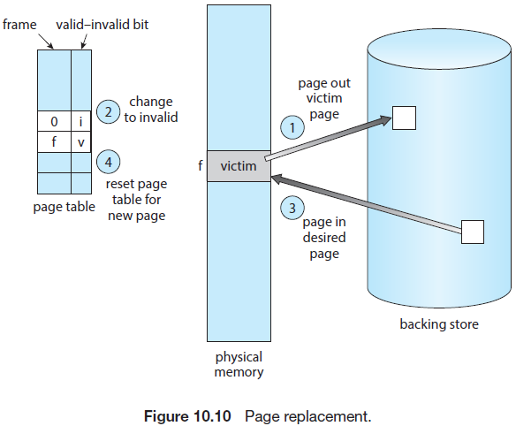
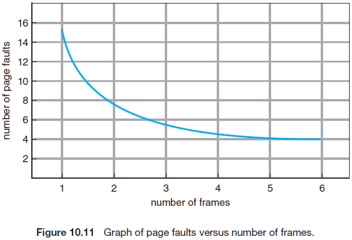
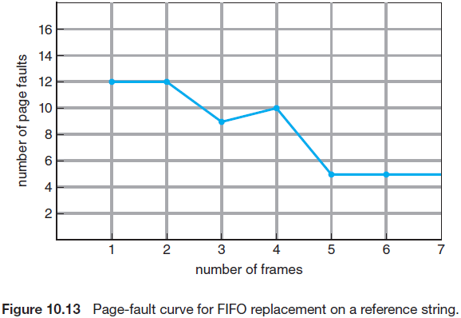
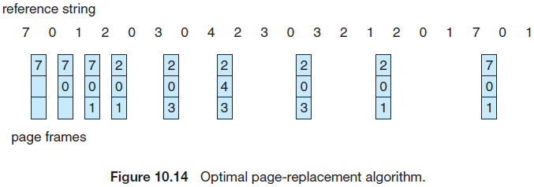
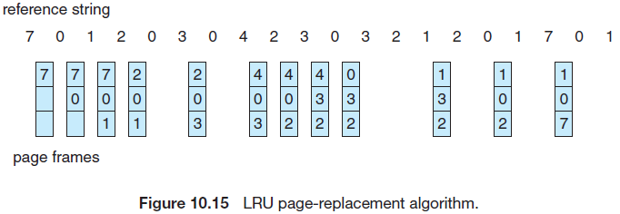

[TOC]

## Virtual Memory

在第9章中，我们讨论了计算机系统中内存管理的各种策略。所有这些策略的目的都相同：通过允许内存中的多个进程同时运行来允许多道程序。然而，程序在运行前倾向于要求整个进程都在内存中。

虚拟内存运行的进程必须被全部载入到内存。该方案的一个主要好处是程序可以大于物理内存。虚拟内存将物理内存抽象位一个无限大的统一的存储列表，将程序员所看到的逻辑内存与物理内存分开。这种技术将编程人员从内存存储限制的担忧中解脱。虚拟内存也允许进程共享文件和库，以及实现共享内存。此外，它还提供了进程创建的高效机制。虚拟内存不容易被实现，且如果使用不当，可能会大大降低性能。本章中，我们会详细讲解虚拟内存，它是怎么实现的，以及实现的复杂性和价值。

### 10.1 Background

第9章提出的内存管理算法是必要的，因为被执行的指令必须存在于内存中。第一种实现该需求的方法是将整个逻辑地址放到物理内存中。动态链接可以帮助放宽这一限制，但通常需要特殊的预防措施并需要程序员进行额外的工作。

将需要执行的指令放在物理内存中看起来既必要又合理，但也很不幸，它按照物理内存的大小限制了程序的大小。实际上，对真实程序的测验表明，在大多数场景下，并不需要运行整个程序。例如，考虑如下几点：

- 程序经常需要使用代码来处理不常见的错误场景。由于这种错误很少，因此在实际中这种代码几乎不会被执行
- 经常会为数组，列表和表分配大于其实际需要的内存。一个数组可能声明了100*100个元素，即使它很少会大于10\*10个元素
- 程序很少使用到的特定选项或特性。例如，美国政府计算机上平衡预算的例行程序已经很多年没有使用过了。

即使需要运行整个程序，也可能不会同一时间全部运行。

能够执行仅一部分在内存中的程序将带来很多好处：

- 一个程序不再受可用的理内存的限制。用户可以使用无限大的虚拟地址空间来编写程序，简化编码任务
- 由于每个程序仅会使用少量物理内存，这样可以同时运行更多的程序员，相应地增加了CPU利用率和吞吐量，但没有增加响应时间或周转时间。
- 只需较少的I/O就可将部分程序加载或交换到内存中，这样每个程序会运行地更快。

这样，当一个程序不需要完全载入内存时，对系统和用户都有利。

虚拟内存涉及将开发者感知的逻辑内存与物理内存的分割。这种分割允许在仅有少量物理地址可用的情况下给编程人员提供无限大的虚拟地址(图10.1)。虚拟地址使得编程更加容易，因此编程人员不用再担心是否有足够的物理内存，而更关注编程中需要解决的问题。


一个进程的虚拟地址空间指进程如何存储在内存中的逻辑（或虚拟）视图。通常该视图中，一个进程从特定的逻辑地址开始，即，地址0，并以连续内存的形式存在，见图10.2。回想第9章，实际物理内存由页帧构成，且分配给进程的物理页帧可能不是连续的，其具体形式取决于内存管理单元(MMU)如何将逻辑地址与物理页帧进行映射。

注意，在图10.2中，我们允许堆随着动态内存分配向上增长。类似地，我们允许栈随着函数调用向下增长。堆和栈之间的空白属于虚拟地址空间的一部分，当堆或栈增长时会请求实际的物理页。虚拟地址空间中的空白称为稀疏地址空间。使用稀疏地址空间是有利的，该空白可以在(程序执行期间)堆或栈增长或期望动态地链接库(或其他共享对象)时被填充。


除了将逻辑内存与物理内存进行分割，虚拟内存允许两个或多个进程间通过内存分页共享文件和内存，这种方式有如下优点：

- 系统库，如标准C库可以被多个进程通过将共享对象映射到虚拟地址空间的方式共享。虽然每个进程会将该库认为是其虚拟地址空间的一部分，但该库实际的物理分页是在多个进程间共享的(见图10.3)。通常，一个库会以只读方式映射到每个链接该库的进程的空间中。
- 类似地，进程可以共享内存。回想第3章节中，两个或多个进程可以使用共享内存通信。虚拟内存允许一个进程创建一段与其他进程共享的内存。共享该内存的进程会将该内存视为其虚拟空间的一部分，但实际上使用的是共享的物理内存页，见图10.3
- 使用`fork()`系统调用创建的进程间可以共享分页，因此加速了进程的创建。

后面我们会探讨这些或其他虚拟内存的优势。首先需要讨论如何使用分页实现虚拟内存。

### 10.2 Demand Paging

考虑一个执行的程序人员和从辅助存储器中加载到内存中。一种方式是在程序执行时将整个程序加载到物理内存中。然而这种方式的问题是我们可能不需要在内存中初始化整个程序。假设一个程序使用用户选择的一系列选项启动时，将整个程序加载到内存中会导致加载所有选项对应的代码，而不考虑用户是否会最终使用某个选项。

一种替代策略时仅载入需要的分页。这种技术称为按需分页，通常用在虚拟内存系统中。通过虚拟内存的按需分页，仅在程序运行需要时才会加载分页，永远不会访问的分页将永远不会加载到物理内存中。一个按需分页系统类似使用交换的分页系统(9.5.2章节)，即进程放在辅助内存中(通常时HDD或NVM设备)。按需分配解释了使用虚拟内存的主要好处之一，通过仅加载需要的部分程序使得内存使用更加高效。

#### 10.2.1 Basic Concepts

按需分页背后的一般概念是，仅在内存中加载需要的分页。因而，当一个进程执行时，一些分页会加载到内存中，而一些则会保留在辅助存储中。因此，我们需要某种形式的硬件支持来区分这两种存储。9.3.3章节中描述的有效-无效位可以实现这种目标。当该位设置为"有效"时，相关的分页是有效的且会被加载到内存中；如果该位设置为"无效"，则该页要么无效(不在进程的逻辑地址空间中)或虽然有效但是当前还处于辅助存储中。一个加载到内存中的分页的页表项会设置为"有效"，而一个当前不在内存中的分页的页表项会设置为"无效"。图10.4展示了这种场景。(注意如果进程永远不会访问该分页，则将一个分页设置为无效时不会产生任何影响。)


但一个进程尝试访问一个不在内存中的分页时会发生什么?访问一个标记为无效的分页会产生分页错误。负责在页表中转换地址的分页硬件会注意到该分页设置了无效，并触发一个trap给操作系统。该trap在操作系统无法将期望的分页加载到内存时产生。处理这种分页错误的过程很简单(见图10.5)。


1. 首先通过该进程的内部表(通常保存在进程控制块中)来确定该引用是有效的还是无效的内存访问
2. 如果引用是无效的*(注意是"引用无效"，而不是"分页无效")*，则终止该进程。如果是有效的，但还没有加载该分页，则现在加载
3. 找到一个空闲的帧(例如，通过空闲帧列表)
4. 通过操作辅助存储来将需要的分页加载到新分配的帧中
5. 当读取存储结束后，修改进程保存的内部表，以指示该页现在位于内存中
6. 重启由于trap中断的指令，此时进程可以访问该分页，就像它一直在内存中一样

在极端场景下，可能需要在内存中没有任何分页的情况下启动执行一个进程。当操作系统将指令指针设置位进程的第一个指令时(在非内存驻留页上)，进程会立即出现分页错误，在分页加载到内存中后，该进程可以继续执行，分页错误一直会持续到所需要的所有分页加载到内存中为止，此时不再有任何分页错误。这种方案称为纯按需分页。除非需要，否则不要加载任何分页到内存中。

理论上，一些程序可以在执行一个指令时可以访问内存中多个新的分页(指令占一个分页，数据占多个分页)，这种情况可能在一个执行产生多个分页错误时产生。这种情况会导致不可接受的系统性能。幸运的是，对运行进程的分析表明，这种行为几乎不可能发生。如10.6.1章节描述，程序中往往具有参考位置，这使得需求分页的性能比较合理。

支持按需分页的硬件和支持分页和交换的硬件相同：

- 页表。这种表可以使用有效-无效位或特殊的防护位来将一个表项设置为无效
- 辅助内存。这种内存保存了当前不在主存中的分页。辅助内存通常使用告诉硬盘或NVM设备，称为交换设备，这种需求下的存储部分称为交换空间。第11章介绍了交换空间的分配

按需分页的一种重要需求是能够在分页错误后重启任何指令。由于保存了中断进程的状态(寄存器，条件代码，指令计数器等)，当发生分页错误是，必须在相同的位置和状态下重启进程(除非需要的分页不在内存中，且无法访问)。大多数场景下，很容易满足这种需求。任何内存引用都可能发生分页错误，如果在获取指令时发生了分页错误，可以重启获取指令的操作。如果在获取操作数时发生了分页错误，必须重新获取并解码指令，然后再获取操作数。

最坏的场景下，例如，使用内存A和B的三目操作数ADD，结果为C。这种执行步骤为：

1. 获取并解码指令ADD
2. 获取A
3. 获取B
4. A和B相加
5. 保存和C

如果在保存C时发生页错误(由于C的分页不在内存中)，后续会加载需要的页，修正页表并重启指令。为了获取结果会要求重新获取指令并解码，获取两个操作数并相加。然而，并没有很多重复工作(少于一个完整的指令)，且制造分页错误时才需要重复这些操作。

当一个指令需要修改不同位置时可能会出现困难。例如，考虑IBM System 360/370 MVC指令，该系统最大可以将256字节的数据从一个位置移动到另一个位置(可能会重叠)。如果块(源或目的)跨分页边界，在完成部分移动后可能发生分页错误。此外，如果源或目的块重叠，源块可能已经被修改，这种情况下就不能简单重启指令。

可以使用两种不同的办法解决这种问题。一种方案是微码计算并尝试访问两个块的两端。如果将产生分页错误，那么会在这一步发生(在任何内容被修改前)。如果已经知道不会产生分页错误，由于所有相关的分页已经被加载到内存中，此时可以执行移动指令。另一种方案是使用临时寄存器来保存被覆盖的位置。如果产生了分页错误，所有的旧值会在产生trap前写回内存。该动作在指令开始前还原了内存状态，这杨就可以继续重复执行指令。

这绝不是将分页添加到现有架构以允许按需分页所导致的唯一的架构问题，但也说明了涉及到的一些问题。分页位于计算机系统的CPU和内存之间。它对进程来说应该是完全透明的。因此，人们认为分页可以添加到任何系统中。虽然这种假设对非按需分页环境(分页错误为致命错误)来说是正确的，但对于将分页错误仅仅认为是需要将其他分页加载到内存中并重启进程的系统来说并不正确。

#### 10.2.2 Free-Frame List

当发生分页错误时，操作系统必须将需要的分页从辅助存储中加载到主存中。为了解决分页错误，大多数操作系统维护了一个空闲帧列表，用于满足这种请求的空闲帧池(图10.6)(当堆或栈段需要扩展时也需要分配帧)。操作系统通常会使用一种称为按需零填充的技术分配(zero-fill-on-deman)空闲帧。按需零填充帧在分配前会归零，通过这种方法擦除之前的内容(可以考虑下在重新分配前没有擦出分页中的信息造成的潜在的安全问题)。


当一个系统启动时，所有可用放入内存都会放到空闲帧列表中。在请求空闲帧后(例如，通过按需分页)，空闲帧列表的长度会缩短。一些情况下，该列表长度会变为0或低于指定阈值，此时必须重新填充。我们将在10.4章节涵盖这些情况下的策略。

#### 10.2.3 Performance of Demand Paging

按需分页会严重影响到一个计算机系统的性能。为了探究原因，下面计算按需分页系统下的有效访问时间。假设内存访问时间为ma，10纳秒。当不存在分页错误时，有效访问时间等于内存访问时间。然而，当发生分页错误时，必须首先从辅助存储中读取相关的分页，然后才能访问期望的内容。

设p为发生分页错误的概率(0 ≤ p ≤ 1)。我们预期p接近0，即，我们预期仅会发生很少的分页错误。此时有效访问时间为：

```
有效访问时间 = (1 - p) × ma + p × 分页错误次数
```

为了计算有效访问时间，必须知道需要多少时间来处理一个分页错误。分页错误会导致以下步骤：

1. 产生一个trap给操作系统
2. 保存寄存器和进程状态
3. 确认该中断是否是一个分页错误
4. 检查分页引用是否合法，并确定辅助存储中的分页位置
5. 将分页从存储中读取到空闲帧中
   1. 在一个队列中等待，直到读取请求被处理
   2. 等待设备查找和/或等待时间
   3. 开始将分页传输到空闲帧中
6. 在等待时间内，将CPU核分配给一些进程
7. 从存储I/O子系统中接收中断(I/O完成)
8. 保存其他进程的寄存器和进程状态(如果执行了第6步)
9. 确定中断来自辅助存储设备
10. 修正页表以及其他表，指出所需要的分页正在内存中
11. 等待该进程分配到CPU核
12. 恢复寄存器，进程状态和新页表，并恢复中断的指令

在每个场景下，并不需要执行所有的步骤。例如，假设第6步中，在发生I/O时，CPU会分配给其他进程。这种分配方式允许多道程序来维护CPU利用率，但在I/O传输接收后，需要额外的时间来恢复分页错误服务例程。

在任何情况下，分页错误处理时间主要包括3个主要的任务：

1. 处理分页错误中断
2. 读取分页
3. 重启进程

第一个和第三个任务可以通过编程来减低处理时间，并支持几百个指令。每个任务可能会花费1到100微秒。考虑使用HDD作为分页设备的场景，分页切换时间可能会接近8毫秒。(典型的硬盘的平均延迟为3，查找时间为5毫秒。传输时间为0.05毫秒。因此，总的分页时间为8毫秒，包括软件和硬件时间。)同时需要注意到设备处理时间。如果一个进程队列等待设备处理，此时不得不添加在队列中等待空闲分页设备的时间，增加了page in的时间。

在分页错误处理时间为8毫秒，以及内存访问时间为200纳秒的前提下，有效访问时间为(单位纳秒)：

```
有效访问时间 = (1 − p) × (200) + p (8 milliseconds)
           = (1 − p) × 200 + p × 8,000,000
           = 200 + 7,999,800 × p.
```

可以看到有效访问时间和分页错误率成正比。如果每访问1000个分页产生1个分页错误，则有效访问时间为8.2微秒。计算机速率会因为按需分页降低40倍！如果需要性能下降少于10%，则需要保证分页错误概率满足以下条件：

```
220 > 200 + 7,999,800 × p,
20 > 7,999,800 × p,
p < 0.0000025
```

即，为了将分页造成的性能的下降保持在合理范围内，需要保证分页错误低于1/399990。总之，将一个按需分页系统中的分页错误率降低很重要。否则，会增加有效访问时间，并大大降低进程的执行。

按需分页的另一个方面是交换空间的处理和整体使用。将I/O切换到交换空间通常会比文件系统快，原因是相比文件系统，交换空间能够分配到更大的块，更快的文件查询速度以及不会使用间接分配方法(第11章节)。为系统获取更好的分页吞吐量的方式是在进程启动时将整个文件镜像拷贝到交换空间中，然后从交换空间中执行按需分页。这种方法的明显缺点是需要在程序启动时拷贝文件镜像。第二种方法是几种操作系统所使用的，包括Linux和Windows，初始时从文件系统中按需分页，但是在这些分页替换时会将分页写入交换空间。这种方法会保证只会从文件系统中读取所需的分页，后续的所有分页通过交换空间完成。

一些系统会尝试限制二进制可执行文件使用的按需分页的交换空间大小。这类文件的按需分页会采用直接从文件系统加载的方式。当需要替换分页时，这些简单地覆盖掉这些帧(由于从来没有被修改)，在需要时可以从文件系统中读取这些分页。使用这种方法，文件系统本身也作为后端存储。然而，与文件不关联的分页(称为匿名内存)仍然可以使用交换空间，这种分页包括进程的栈和堆。这种看起来是一种比较好的这种方式，可以用于多种系统中，包括Linux和BSD UNIX。

正如在9.5.3中所描述的，移动操作系统通常不支持交换，相反，这些系统的按需分页来自文件系统，以及在应用的内存受限时回收只读分页(如代码)。这类数据可以在后续需要时会从系统中按需分页。iOS下，永远不会从应用中回收匿名内存，除非应用关闭或明确释放内存。10.7章节中会涵盖内存压缩，一种移动系统中常用的交换替代方法。

### 10.3 Copy-on-Write

在10.2章节中描述了如何通过按需分页的页中包含的第一个指令来启动进程。然而，使用`fork()`系统调到用创建的进程的初始化可能会绕过按需分页，而使用一种类似分页共享的技术(9.3.4章节)。这种技术提供了快速创建进程并减少分配给新创建进程的新分页的数目。

使用`fork()`系统调用创建的子进程实际是对父进程的复制。传统上，`fork()`工作当时为，为子进程复制父进程的地址空间(复制属于父进程的分页)。然后，很多子进程在创建后会立即调用`exec()`系统调用，此时可能不需要拷贝父进程的地址空间。相反，我们可以使用一种称为"写诗拷贝"技术，这种技术允许父进程和子进程在初始时共享相同的分页，这些共享的分页称为写时拷贝分页，意味着在任何一个进程写入共享分页时，会创建该共享分页的一个副本。图10.7和10.8描绘了写时拷贝，即在进程1修改分页C前后的物理内存。


例如，假设子进程尝试修改栈中的一个分页，该分页设置了写时拷贝，此时操作系统会从空闲帧列表中获得一个帧，并创建该分页的副本，将其映射到字节内存的地址空间中。子进程随后会修改它的副本分页，而不是属于父进程的分页。线程当使用写时拷贝时，只有被进程修改的分页才会被复制，所有未修改的分页可以在父进程和子进程之间共享。注意，只有需要被修改的分页才会被标记为写时复制。无法被修改的分页(包含可执行的代码分页)可以被父进程和子进程共享。写时复制是一种被多种操作系统采用的通用技术，包括Windows，Linux和macOS。

一些版本的UNIX(包括Linux，macOS和BSD UNIX)提供了一个`fork()`相同调用的变种，`vfork()`(虚拟内存fork)，与使用写时复制的`fork()`不同，当使用`vfork()`时，父进程会被挂起，子进程会使用父进程的地址空间。由于`vfork()`不需要写时复制，如果子进程中的任何分页属于父进程的地址空间，但父进程恢复后可以看到被修改的分页。因此`vfork()`必须谨慎使用，保证子进程不会修改父进程的地址空间。`vfork()`在子进程在创建后立即调用`exec()`时使用。由于没有发生分页拷贝，`vfork()`在进程创建中的效率非常高，有时会被用于实现UNIX 命令行shell界面。

### 10.4 Page Replacement

在我们之前讨论的分页错误率场景下，假设当分页被引用时，每个分页错误最多发生一次。然而这种表达并不准确。如果一个有10个分页的进程，实际仅使用了一半分页时，按需分页机制会省去加载用不带的另外5个分页的I/O，这样我们可以通过运行两倍数目的进程来提高我们的多道程序的程度。这样，如果有40个帧，我们可以允许8个进程，而不是在一个进程需要10个帧时只能允许4个进程(每个进程有5个分页未使用)。

如果提高了多道程序的程度，此时会过度分配(over-allocating)内存。如果运行了6个进程，每个进程有10个分页，但只用了5个分页，此时保留了10个帧，CPU和吞吐量都更高。然而，对于任何一个进程，为了获取特定的数据集，可能会突然使用它所有的分页，导致会需要60个帧，但此时只有40个帧可用。

更进一步，考虑系统内存不仅仅用于存储程序分页。I/O的buffer也会使用大量内存。这种使用会对内存放置算法产生压力。决定哪些内存分配给I/O以及哪些内存分配给程序分页至关重要。一些系统会给I/O buffer分配固定比例的内存，而其他一些系统则会给进程和I/O子系统分配所有系统内存。14.6章节讨论I/O buffer和虚拟内存技术的整合关系。

过度分配内存的表现如下：当一个进程执行时发生了分页错误，操作系统需要确定辅助存储中期望的分页的位置，但发现空闲帧列表中没有空闲的帧，即所有内存都在使用。图10.9描绘了这种场景，打问号的地方描绘了没有空闲的帧。


此时操作系统有几种选项，可以结束进程。然而，操作系统会尝试使用按需分页来提升计算机的利用率和吞吐量。用户不会感知到他们的进程运行在一个分页系统上(分页在逻辑上对用户应该是透明的)，因此这种方法不是最佳的。

操作系统可以使用标准交换将进程交换出去，释放该进程的所有帧，并减少多道程序的级别。然而，正如9.5章节中讨论的，由于需要在内存和交换空间中拷贝整个进程，因此大多数操作系统不再支持标准标准交换。现在，大多数操作系统将交换分页与分页替换(page replacement)结合，本章节后续将描述这种技术。

#### 10.4.1 Basic Page Replacement

分页替换会采用下面的方式。如果没有空闲帧，会查找当没有没有使用的帧并释放它，这样就可以通过将该帧中的内容写入交换空间，并修改页表(和其他表)来指明该分页不再在内存中(图10.10)。现在就可以给产生分页错误的进程提供释放后的帧。我们通过修改分页错误服务例程来包含分页替换：

1. 找出辅助存储中期望的分页的位置
2. 找到一个空闲帧
   1. 如果有空闲帧，则直接使用该帧
   2. 如果没有空闲帧，使用分页替换算法来选择一个"被牺牲的帧"
   3. 将这个"被牺牲的帧"写入辅助存储中(如果需要)，并修改对应的分页和帧表
3. 从新的空闲帧中读取需要的分页，并修改分页和帧表
4. 从发生分页错误的地方继续运行进程

注意，如果没有空闲帧，此时需要两个分页(一个用于page-out，一个用于page-in)。这种情况使得页面错误服务时间加倍，并增加了对应得有效访问时间。

我们可以使用使用一个"修改位(modify bit)"(或"脏位"，dirty bit)降低这些时间消耗。当使用这种方案时，每个分页或帧在硬件中都有一个与之关联的修改位。



我们可以使用修改位(modify bit)(或脏位，dirty bit)来降低时间消耗。在使用这种方案时，当分页中有字节写入时，硬件会设置该分页的修改位，表明该分页已经被修改。当分页替换选择一个分页时，会校验该分页的修改位，如果设置了该位，则表明该分页从辅助存储中读取后已经做了修改，此时必须将该分页写回存储。如果没有设置修改位，则表明自从该分页被读取到内存之后没有做任何修改。这种情况下，我们不需要将内存分页写回存储。这种技术也应用于只读分页(例如，二进制代码分页)。这种分页不能被修改，这样在需要时可以被丢弃。如果页面没有被修改，使用这种方法可以将I/O时间减少一半，由此可以显著降低处理分页错误的时间。

分页替换是按需分页的基础，完全将逻辑内存和物理内存进行了分离。使用这种机制，可以在仅有少量物理内存时给编程人员提供无限多的虚拟内存。如果没有按需分页，逻辑地址会映射到地址上，且两个地址集各不相同，一个进程的所有分页必须同时存在于物理内存中。使用按需分页时，逻辑地址空间大小不再受物理内存限制。如果一个进程有20个分页，我们可以使用按需分页的10个帧运行该程序，然后使用分页替换算法在需要时查找空闲帧。如果需要替换一个已经被修改的分页，那么首先需要将该分页的内容拷贝回辅助存储。后续对该分页的引用将会导致分页错误，此时，该分页需要重新加载回内存，有可能回替换掉其他进程的分页。

在实现按需分页时需要解决两种主要的问题：必须开发一个帧分配算法和分页替换算法。即，如果内存中有多个进程，我们必须决定需要给每个进程分配多少帧；以及何时需要分页替换，此时需要选择被替换的帧。由于辅助存储的I/O非常珍贵，因此设计合理的算法来解决这些问题是一项重要的任务。按需分页方法中即使是很小的提升也可能很大程度上提升系统性能。

有很多种分页替换算法，每个操作系统有其独立的替换方案。那么如何选择一个特定的替换算法呢？通常选择具有最低分页错误率的算法。

我们通过在特定的内存引用字符串上运行算法并计算分页错误数目来对该算法进行评估。这种内存引用字符串称为引用字符串。我们可以通过人为的方式(例如使用随机数生成器)或通过跟踪系统并记录每个引用的内存地址来生成引用字符串。后一种方法回生成大量数据(例如每秒1百万个地址)。为了降低数据，我们基于如下规定：

首先，对于一个给定的分页大小(分页大小通常由硬件或系统固定)，仅需考虑分页的数量，而不是整个地址。其次，如果我们已经有一个分页p的引用，后续紧跟的任何对p的引用不将会产生分页错误。在首次引用后，分页p会位于内存中，这样后续紧跟的引用不会产生分页错误。

例如，如果跟踪某个特定的进程，可能记录如下地址序列：

```
0100, 0432, 0101, 0612, 0102, 0103, 0104, 0101, 0611, 0102, 0103,
0104, 0101, 0610, 0102, 0103, 0104, 0101, 0609, 0102, 0105
```

如果每个分页100字节，则该序列降低为如下引用字符串：

```
1, 4, 1, 6, 1, 6, 1, 6, 1, 6, 1
```

为了确定特定引用字符串的分页错误数目和分页替换算法，需要直到可用的分页帧数目。显然，在可用的帧数目增加时，分页错误数目会降低。例如对于之前的引用字符串，假如有3个或更多帧，我们仅会得到3个分页错误---每个分页首次引用都会产生一个分页错误。相反，如果只有一个可用帧，则需要为每个引用字符串作分页替换，导致12个分页错误。通常我们期望的曲线如图10.11所示。随着帧数目的增加，分页错误的数目会降低到最小水平。当然，增加物理内存会增加帧数。



下面讨论几个分页替换算法。为了评估这些算法，我们使用如下引用字符串，内存为3个帧

```
7, 0, 1, 2, 0, 3, 0, 4, 2, 3, 0, 3, 2, 1, 2, 0, 1, 7, 0, 1
```

#### 10.4.2 FIFO Page Replacement

最简单的分页替换算法是先进先出算法(FIFO)。FIFO替换算法在每个分页加载到内存中时会与之关联。当需要替换一个分页时，会替换掉老的分页。注意不需要严格记录一个分页加载进来的时间。我们创建一个FIFO队列来持有内存中的所有分页，当需要替换时，会替换掉队列头部的分页，当一个分页加载到内存中时，会将其插入到队列尾。

对于例子中的引用字符串，初始的3个帧是空的。前3个引用引用字符串(7,0,1)会导致分页错误，并将需要的分页加载到内存中。由于7是第一个，因此下一个引用字符串(2)会替换7，由于0是下一个引用的字符串，且已经被加载到内存中，因此不会产生分页错误。由于此时0是第一个，因此对3的引用会导致替换分页0。然后分页0会替换分页1.图10.12展示了进程的运行。当发生一个分页错误时，会在3个帧中显示该分页。总计会发生15个分页错误。


很容易理解和编程FIFO分页替换算法。然而，该算法的性能并不总是好的，一方面，分页替换可能是一个很久以前使用过但不会再需要的初始化模块；另一方面，该算法可能包含一个早已初始化且频繁使用的。

注意，即使所选择的用于替换的分页正在被使用，所有功能仍然可以正常运作。在使用一个新的分页替换正在使用的分页后，几乎立即会产生一个分页错误来检索正在使用的分页。可能会替换掉其他分页来将活动的分页加载回内存。因此，不好的替换选择会增加分页错误率，并降低进程的执行，但不会导致执行异常。

为了展示FIFO分页替换算法的问题，考虑下面引用字符串：

```
1, 2, 3, 4, 1, 2, 5, 1, 2, 3, 4, 5
```

图10.13展示了引用字符串导致的分页错误相比可用帧的曲线。注意4个帧下的分页错误数(10)大于3个帧下的分页错误数(9)！这种异常结果称为Belady’s anomaly:对于一些分页替换算法，分页错误率可能会随着分配的帧数的增加而增加。我们期望，如果给一个进程更多的内存会提升其性能。一些早期的研究中，研究人员发现这种假设不总是正确的，并发现了Belady’s anomaly。



#### 10.4.3 Optimal Page Replacement

Belady’s anomaly的发现导致寻求一种最佳分页替换算法，该算法有最低的分页错误率且不会受Belady’s anomaly的影响。这种存在的算法称为OPT或MIN，简述为：替换长久不适用的分页。

使用这种分页替换算法保证对于固定数量的帧，其可能发生分页错误的数次最低。

例如，对于我们采样的引用字符串，最佳分页替换算法会导致9个分页错误，如图10.14。前3个引用会导致填充3个空的帧的分页错误。由于分页7在第18个引用之前不会被使用，因此分页2会替换分页7，一次类推，分页0会在第5个引用时使用，分页1会在第14个引用时使用。由于1是内存中3个分页中最后一个会再被引用的分页，因此对分页3的引用会替换分页1。由于只有9个分页错误，最佳替换算法要大大优于导致15个分页错误的FIFO算法。(如果忽略前3个所有算法都会产生的分页错误，此时最优替换的性能是FIFO替换的2倍)实际上，没有其他替换算法能够在少于9个分页错误的前提下处理完这些引用字符串(使用3个帧)。



不幸的是，由于需要事先知道被引用的字符串信息，因此很难实现最佳分页替换算法(5.3.2章节中的SJF CPU调度算法也遇到者类似的情况)最终，最佳算法主要用于研究比较。例如，虽然一个新的算法不是最佳的，但可以计算出最坏情况下，它在最佳值的12.3%以内，平均在4.7%以内，这些信息是有用的。

#### 10.4.4 LRU Page Replacement

如果最佳算法不可行，那么是否可能使用一种近似的算法。FIFO和OPT算法的主要区别是，FIFO算法会在内存加载到内存是花费时间，而OPT算法则在分页被使用时花费时间。如果将最近的过去近似为不久的将来，那么就可以替换掉最长时间没有使用的分页，这种方法称为最近最少使用(LRU)算法。

LRU分页替换于每个分页上一次使用的时间相关。当必须替换一个分页时，LRU会挑选最长时间内没有使用的分页。我们可以把这个策略看作是回溯过去(而不是向前)的最佳分页替换算法。(奇怪的是，如果设S^R^为反向的引用字符串S，OPT算法下基于S的分页错误率与基于S^R^的分页错误率相同。类似地，LRU算法下，基于S的分页错误率与基于S^R^的分页错误率相同)。

在我们引用字符串的例子中应用LRU分页替换算法的结果如图10.15。LRU算法会生成12个分页错误。注意，前5个分页错误与最佳替换算法相同。当引用分页4时，从LRU替换角度看，内存中的3个帧中，分页2最近最少被使用。这样，LRU算法会替换分页2，它不知道分页2将会被使用。当分页2产生分页错误后，LRU算法会替换分页3，此时分页3最近最少使用内存中3个帧。除了这些问题，产生12个分页错误的LRU替换要远比产生15个分页错误的FIFO好。



LRU策略通常作为一种分页替换算法，被认为是合格的。主要的问题是如何实现LRU替换。一个LRU分页替换算法可能需要一些硬件的支持。问题是如何确定帧的顺序来定义上一次被使用的时间，有两种可行的实现方式：

- 计数器。最简单的场景是将每个分页表项与一个使用次数段管理，并给CPU添加一个逻辑时钟或计数器。每次引用都会增加时钟。当引用一个分页时，时钟寄存器的内存会拷贝到该分页对应的分页表项的使用次数。通过这种方式可以获得每个分页最近被引用的时间，然后替换具有最小次数值的分页。这种方案需要查找分页表来找出LRU分页并在每一次内存访问时写入内存(分页表中的使用次数字段)。当分页表变动时(由于CPU调度)也需要维护该使用次数字段。还必须考虑时钟溢出。
- 栈。另一种实现LRU替换的方法是使用一个分页数大小的栈。当引用一个分页时，该分页会被移动到栈顶。通过这种方法，最近最少使用的分页总是位于底部。由于必须从栈底移除表项，因此最好通过使用带有头指针和尾指针的双链接列表来实现这种方法。移除一个分页并在栈顶放置一个分页，最坏情况下需要修改6个指针。每次更新都比较昂贵，但不需要通过搜索来实现替换，尾指针指向栈底，即LRU分页。这种方法特别适合使用LRU实现软件或微码的LRU替换。


正如最佳替换，LRU替换页不会受Belady’s anomaly的影响，它们都属于一类分页替换算法，称为栈算法，永远不会表现出贝拉迪的异常。可以证明，栈算法中，n个帧对应的内存中的分页集总是n+1个帧对应的内存中的分页集的子集。对于LRU替换，内存中的分页集为n个最近引用的分页。如果帧的数目增加，这n个分页仍然是最近引用的，因此会停留在内存中。

注意，如果没有标准TLB寄存器以外的硬件协助现都是不可能实现LRU的。每次内存引用都必须更新时钟字段或栈。如果我们在每次引用时使用一种中断来允许软件更新这种数据结构，则会每次内存引用降低至少会10倍，因此每个进程的内存访问会降低10倍。极少系统可能容忍这种级别的内存管理。

#### 10.4.5 LRU-Approximation Page Replacement

很多计算机系统不能提供足够的硬件来支持LRU分页替换。事实上，一些系统根本不会提供硬件支持，此时必须使用其他分页替换算法(如FIFO算法)。很多系统提供了一些辅助功能，如引用位。当一个分页被引用时(读取或写入分页任意字节)，硬件会设置该分页的引用位。引用位与分页表中的每一项有关。

初始时，操作系统会清空所有位。当执行一个进程时，与分页有关的位会被硬件设置为1。一段时间后，我们可以提供检查引用位来确定哪些分页已经被使用，而哪些没有被使用(虽然不知道分页被使用的顺序)。该信息是很多近似LRU算法的分页替换算法的基础。

##### 10.4.5.1 Additional-Reference-Bits Algorithm

我们可以通过定期记录引用位来获得额外的信息。我们可以在内存中位每个分页保存一个8-bit字节，在一定的间隔内(如100毫秒)，一个定时器中断会将控制传递到操作系统。操作系统会将每个分页的引用位移动到它的8-bit字节的高位，将其他位向右移动一位，并丢弃最低位。这些8-bit移位寄存器保存了前8个周期的历史。例如，如果移位寄存器包含00000000，则表示该分页在8个周期内没有被使用。每个周期至少使用一次的分页，则该分页的移位寄存器值位11111111。寄存器值为11000100分页比寄存器值为01110111的分页更常用。如果将这些8-bit字节解释为无符号整型，则具有最小值的分页为LRU分页，可以被替换。注意，具有最小值的分页的数目是不确定的，可以替换所有具有最小值的分页或使用FIFO方法进行选择。

当然，可以改变移位寄存器中包含的历史记录的位数，通过选择(依赖硬件)并尽快进行更新。极端情况下，移位寄存器中的值会降低为0，仅留下引用位。这种算法称为二次机会页面替换算法(second chance page-replacement algorithm.)

##### 10.4.5.2 Second-Chance Algorithm

二次机会替换的基本算法是一个FIFO替换算法。当选择一个分页时会检查引用位。如果值为0，可以继续替换该分页，但如果引用位设置为1，我们会给该分页第二次机会，继续选择下一个FIFO分页。当一个分页得到第二次机会时，会清除其引用位，并将该分页的到达时间设置为当前时间。这样就给了一个分页第二次机会，且在所有其他分页被替换前不能被替换。此外，如果一个分页经常被使用，使得其引用位保持置位，这样该分页将不会被替换。

一种实现二次机会算法(有时值时钟算法)的方式是环形队列。一个指针(即时钟的一个指针)指示下一个被替换的分页。当需要帧时，该指针会向前移动，直到找到一个引用位为0的分页。当指针移动时，会清除引用位(图10.17)。一旦发现一个可以"牺牲的"分页，则替换该分页，新的分页会插入到(环形队列的)该位置。注意，最坏情况下，当设置了所有位时，指针会遍历整个队列，给每个分页一个二次机会。它会在选择下一个替换的分页前清除所有的引用位。当设置了所有位时，二次机会替换退化为FIFO替换。


##### 10.4.5.3 Enhanced Second-Chance Algorithm

我们可以通过引用位和修改位(10.4.1章节)的组合来增强二次机会算法。使用这两个位，可以有如下四种类型：

1. (0,0)，最近既没有把使用，也没有被修改----可以替换的最佳分页
2. (0,1)，最近没有被使用，但没有被修改----不太合适，由于该分页需要在替换前需要被写出内存
3. (1,0)，最近被使用，但没有被修改 ----不久可能会被重新使用
4. (1,1)，最近被使用，被修改 ----不久可能会被使用，该分页需要在替换前需要被写出到辅助存储。

每个分页可能是上述四种之一。当需要替换分页时，我们会使用与时钟算法相同的方案，但会校验指向的分页的引用位是否置为1，并校验该分页所属的类型，并替换遇到的最低非空类型的第一个分页。注意在找到一个可替换的分页前可能需要遍历环形队列好几遍。该算法与简单时钟算法的最大区别是，这里我们根据是否修改给予了分页偏好，降低了需要的I/O数量 。

#### 10.4.6 Counting-Based Page Replacement

有很多种算法可以用于分页替换。例如，我们可以保留与分页引用数目相同的计数器，并开发如下两种方案：

1. 最少使用(LFU)分页替换算法要求替换计数最少的分页。这种选择的原因在于，一个活动且被使用的分页会有一个比较大的引用计数。但该算法有一个问题，考虑当一个分页在进程初始阶段被大量使用，但后续没有再用到的场景，由于被大量使用，因此即使后续没有被使用，它的计数仍然足够大，因此会被保存在内存中。一种方案是在固定间隔内将计数右移一位，形成指数衰减的平均使用计数。
2. 最常使用(MFU)分页替换算法基于具有最小计数的分页，这种分页可能刚被加载进来，还没有被使用

正如预期的，MFU和LFU替换都不常见。实现这些算法是昂贵的，且没有很好地近似为最佳分页替换(OPT)。

#### 10.4.7 Page-Buffering Algorithms