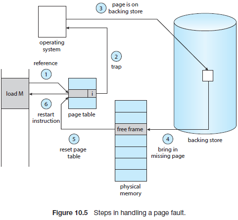

## Virtual Memory

在第9章中，我们讨论了计算机系统中内存管理的各种策略。所有这些策略的目的都相同：通过允许内存中的多个进程同时运行来允许多程序编程。然而，程序在运行前倾向于要求整个进程都在内存中。

虚拟内存运行的进程必须被全部载入到内存。该方案的一个主要好处是程序可以大于物理内存。虚拟内存将物理内存抽象位一个无限大的统一的存储列表，将程序员所看到的逻辑内存与物理内存分开。这种技术将编程人员从内存存储限制的担忧中解脱。虚拟内存也允许进程共享文件和库，以及实现共享内存。此外，它还提供了进程创建的高效机制。虚拟内存不容易被实现，且如果使用不当，可能会大大降低性能。本章中，我们会详细讲解虚拟内存，它是怎么实现的，以及实现的复杂性和价值。

### 10.1 Background

第9章提出的内存管理算法是必要的，因为被执行的指令必须存在于内存中。第一种实现该需求的方法是将整个逻辑地址放到物理内存中。动态链接可以帮助放宽这一限制，但通常需要特殊的预防措施并需要程序员进行额外的工作。

将需要执行的指令放在物理内存中看起来既必要又合理，但也很不幸，它按照物理内存的大小限制了程序的大小。实际上，对真实程序的测验表明，在大多数场景下，并不需要运行整个程序。例如，考虑如下几点：

- 程序经常需要使用代码来处理不常见的错误场景。由于这种错误很少，因此在实际中这种代码几乎不会被执行
- 经常会为数组，列表和表分配大于其实际需要的内存。一个数组可能声明了100*100个元素，即使它很少会大于10\*10个元素
- 程序很少使用到的特定选项或特性。例如，美国政府计算机上平衡预算的例行程序已经很多年没有使用过了。

即使需要运行整个程序，也可能不会同一时间全部运行。

能够执行仅一部分在内存中的程序将带来很多好处：

- 一个程序不再受可用的理内存的限制。用户可以使用无限大的虚拟地址空间来编写程序，简化编码任务
- 由于每个程序仅会使用少量物理内存，这样可以同时运行更多的程序员，相应地增加了CPU利用率和吞吐量，但没有增加响应时间或周转时间。
- 只需较少的I/O就可将部分程序加载或交换到内存中，这样每个程序会运行地更快。

这样，当一个程序不需要完全载入内存时，对系统和用户都有利。

虚拟内存涉及将开发者感知的逻辑内存与物理内存的分割。这种分割允许在仅有少量物理地址可用的情况下给编程人员提供无限大的虚拟地址(图10.1)。虚拟地址使得编程更加容易，因此编程人员不用再担心是否有足够的物理内存，而更关注编程中需要解决的问题。

一个进程的虚拟地址空间指进程如何存储在内存中的逻辑（或虚拟）视图。通常该视图中，一个进程从特定的逻辑地址开始，即，地址0，并以连续内存的形式存在，见图10.2。回想第9章，实际物理内存由页帧构成，且分配给进程的物理页帧可能不是连续的，其具体形式取决于内存管理单元(MMU)如何将逻辑地址与物理页帧进行映射。

注意，在图10.2中，我们允许堆随着动态内存分配向上增长。类似地，我们允许栈随着函数调用向下增长。堆和栈之间的空白属于虚拟地址空间的一部分，当堆或栈增长时会请求实际的物理页。虚拟地址空间中的空白称为稀疏地址空间。使用稀疏地址空间是有利的，该空白可以在(程序执行期间)堆或栈增长或期望动态地链接库(或其他共享对象)时被填充。

除了将逻辑内存与物理内存进行分割，虚拟内存允许两个或多个进程间通过内存分页共享文件和内存，这种方式有如下优点：

- 系统库，如标准C库可以被多个进程通过将共享对象映射到虚拟地址空间的方式共享。虽然每个进程会将该库认为是其虚拟地址空间的一部分，但该库实际的物理分页是在多个进程间共享的(见图10.3)。通常，一个库会以只读方式映射到每个链接该库的进程的空间中。
- 类似地，进程可以共享内存。回想第3章节中，两个或多个进程可以使用共享内存通信。虚拟内存允许一个进程创建一段与其他进程共享的内存。共享该内存的进程会将该内存视为其虚拟空间的一部分，但实际上使用的是共享的物理内存页，见图10.3
- 使用`fork()`系统调用创建的进程间可以共享分页，因此加速了进程的创建。

后面我们会探讨这些或其他虚拟内存的优势。首先需要讨论如何使用分页实现虚拟内存。

### 10.2 Demand Paging

考虑一个执行的程序人员和从辅助存储器中加载到内存中。一种方式是在程序执行时将整个程序加载到物理内存中。然而这种方式的问题是我们可能不需要在内存中初始化整个程序。假设一个程序使用用户选择的一系列选项启动时，将整个程序加载到内存中会导致加载所有选项对应的代码，而不考虑用户是否会最终使用某个选项。

一种替代策略时仅载入需要的分页。这种技术称为按需分页，通常用在虚拟内存系统中。通过虚拟内存的按需分页，仅在程序运行需要时才会加载分页，永远不会访问的分页将永远不会加载到物理内存中。一个按需分页系统类似使用交换的分页系统(9.5.2章节)，即进程放在辅助内存中(通常时HDD或NVM设备)。按需分配解释了使用虚拟内存的主要好处之一，通过仅加载需要的部分程序使得内存使用更加高效。

#### 10.2.1 Basic Concepts

按需分页背后的一般概念是仅在内存中加载需要的分页。因而，当一个进程执行时，一些分页会加载到内存中，而一些则会保留在辅助存储中。因此，我们需要某种形式的硬件支持来区分这两种存储。9.3.3章节中描述的有效-无效位可以实现这种目标。当该位设置为"有效"时，相关的分页是有效的且会被加载到内存中；如果该位设置为"无效"，则该页要么无效(不在进程的逻辑地址空间中)或虽然有效但是当前处于辅助存储中。一个加载到内存中的分页的页表项会设置为"有效"，而一个当前不在内存中的分页的页表项会设置为"无效"。图10.4展示了这种场景。(注意如果进程永远不会访问该分页，则将一个分页设置为无效时不会产生任何影响。)

但一个进程尝试访问一个不在内存中的分页时会发生什么?访问一个标记为无效的分页会导致分页错误。负责在页表中转换地址的分页硬件会注意到该分页设置了无效，并触发一个trap给操作系统。该trap在操作系统无法将期望的分页加载到内存时产生。处理这种分页错误的过程很简单(见图10.5)。

1. 首先通过该进程的内部表(通常保存在进程控制块中)来确定该引用是有效的还是无效的内存访问
2. 如果引用是无效的，则终止该进程。如果是有效的，但还没有加载该分页，则现在加载
3. 找到一个空闲的帧(例如，通过空闲帧列表)
4. 通过操作辅助存储来将需要的分页加载到新分配的帧中
5. 当读取存储结束后，修改进程保存的内部表，以指示该页现在位于内存中
6. 重启由trap中断的指令，此时进程可以访问该分页，就像它一直在内存中一样

在极端场景下，可能需要在内存中没有任何分页的情况下启动执行一个进程。当操作系统将指令指针设置位进程的第一个指令时(在非内存驻留页上)，进程会立即出现分页错误，在分页加载到内存中后，该进程可以继续执行，分页错误一直会持续到所需要的所有分页加载到内存中为止，此时不再有任何分页错误。这种方案称为纯按需分页。除非需要，否则不要加载任何分页到内存中。

理论上，一些程序可以在执行一个指令时可以访问内存中多个新的分页(指令占一个分页，数据占多个分页)，这种情况可能在一个执行产生多个分页错误时产生。这种情况会导致不可接受的系统性能。幸运的是，对运行进程的分析表明，这种行为几乎不可能发生。如10.6.1章节描述，程序中往往具有参考位置，这使得需求分页的性能比较合理。

支持按需分页的硬件和支持分页和交换的硬件系统：

- 页表。这种表可以使用有效-无效位或特殊的防护位来将一个表项设置为无效
- 辅助内存。这种内存保存了当前不在主存中的分页。辅助内存通常使用告诉硬盘或NVM设备，称为交换设备，这种需求下的存储部分称为交换空间。第11章介绍了交换空间的分配

按需分页的一种重要需求是能够在分页错误后重启任何指令。由于保存了中断进程的状态(寄存器，条件代码，指令计数器等)，当发生分页错误是，必须在相同的位置和状态下重启进程(除非需要的分页不在内存中，且无法访问)。大多数场景下，很容易满足这种需求。任何内存引用都可能发生分页错误，如果在获取指令时发生了分页错误，可以重启获取指令的操作。如果在获取操作数时发生了分页错误，必须重新获取并解码指令，然后再获取操作数。

最坏的场景下，例如，使用内存A和B的三目操作数ADD，结果为C。这种执行步骤为：

1. 获取并解码指令ADD
2. 获取A
3. 获取B
4. A和B相加
5. 保存和C

如果在保存C时发生页错误(由于C的分页不在内存中)，后续会加载需要的页，修正页表并重启指令。为了获取结果会要求重新获取指令并解码，获取两个操作数并相加。然而，并没有很多重复工作(少于一个完整的指令)，且制造分页错误时才需要重复这些操作。

当一个指令需要修改不同位置时可能会出现困难。例如，考虑IBM System 360/370 MVC指令，该系统最大可以将256字节的数据从一个位置移动到另一个位置(可能会重叠)。如果块(源或目的)跨分页边界，在完成部分移动后可能发生分页错误。此外，如果源或目的块重叠，源块可能已经被修改，这种情况下就不能简单重启指令。

可以使用两种不同的办法解决这种问题。一种方案是微码计算并尝试访问两个块的两端。如果将产生分页错误，那么会在这一步发生(在任何内容被修改前)。如果已经知道不会产生分页错误，由于所有相关的分页已经被加载到内存中，此时可以执行移动指令。另一种方案是使用临时寄存器来保存被覆盖的位置。如果产生了分页错误，所有的旧值会在产生trap前写回内存。该动作在指令开始前还原了内存状态，这杨就可以继续重复执行指令。

这绝不是将分页添加到现有架构以允许按需分页所导致的唯一的架构问题，但也说明了涉及到的一些问题。分页位于计算机系统的CPU和内存之间。它对进程来说应该是完全透明的。因此，人们认为分页可以添加到任何系统中。虽然这种假设对非按需分页环境(分页错误为致命错误)来说是正确的，但对于将分页错误仅仅认为是需要将其他分页加载到内存中并重启进程的系统来说并不正确。

#### 10.2.2 Free-Frame List

当发生分页错误时，操作系统必须将需要的分页从辅助存储中加载到主存中。为了解决分页错误，大多数操作系统维护了一个空闲帧列表，用于满足这种请求的空闲帧池(图10.6)(当堆或栈段需要扩展时也需要分配帧)。操作系统通常会使用一种称为按需零填充的技术分配(zero-fill-on-deman)空闲帧。按需零填充帧在分配前会归零，通过这种方法擦除之前的内容(可以考虑下在重新分配前没有擦出分页中的信息造成的潜在的安全问题)。

当一个系统启动时，所有可用放入内存都会放到空闲帧列表中。在请求空闲帧后(例如，通过按需分页)，空闲帧列表的长度会缩短。一些情况下，该列表长度会变为0或低于特定阈值，此时必须重新填充。我们将在10.4章节涵盖这些情况下的策略。