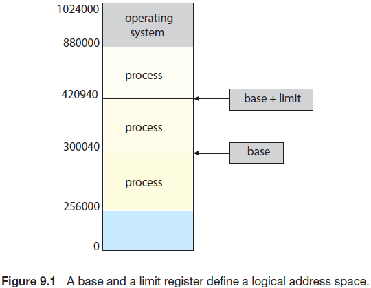
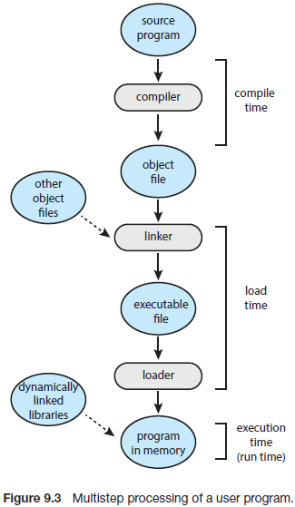

[TOC]

## Main Memory

在第5章中展示了一个进程集如何共享CPU。使用CPU调度，可以同时提升CPU利用率和计算机的响应速度。为了提升性能，必须在内存中保存很多进程，即必须使用共享内存。

本章中将会讨论管理内存的几种方式，(内存管理算法)从原始的裸机方法到使用分页策略不等。每种方式都有其各自的优势和劣势。为一个特定系统选择内存管理需要基于多种因素，特别是系统的硬件设计。大多数算法需要硬件支持，导致很多系统具有相似的硬件以及操作系统内存管理。

### 9.1 Background

正如在第1章中看到的，内存在现代操作系统的操作中至关重要。内存由一个大字节数组组成，每个字节拥有各自的地址。CPU根据程序计数器从内存中获取指令，这些指令可能会触发载入额外的数据，并存储到特定内存地址中。

典型的指令执行周期，例如，首先从内存中拉取指令，然后解码指令，解码时可能会触发从内存中拉取操作数。在在操作数上执行指令后，可能会将结果保存到内存中。内存单元仅看到内存地址流，它不知道这些地址是怎么生成的(由指令计数器，索引，间接寻址，文字地址等)或如何使用(指令或数据)。因此，我们可以忽略一个进程如何生成内存地址，主要关注正在运行的程序生成的内存地址顺序。

后面会讨论域内存管理相关的几个问题：基本的硬件，内存地址到实际物理地址的符号绑定，以及逻辑和物理地址之间的区别。在本节的最后，我们讨论了动态链接和共享库

#### 9.1.1 Basic Hardware

内置在每个处理核心中的主存和寄存器是CPU可以直接访问的唯一通用存储。机器指令使用内存地址而非硬盘地址作为参数，因此，任何执行的指令以及指令使用的任何数据，都必须位于某一种可以直接访问的存储设备中。如果数据不在内存中，则必须在CPU操作前移动这些数据。

在一个CPU时钟周期内，通常可以访问每个CPU核中内置的寄存器。一些CPU核可以解码指令并以每时钟周期一次或多次的速率对寄存器中的内容执行一些简单的操作。主存唯一的缺点是需要通过内存总线来传输数据。一个完整的内存访问可能需要花费多个CPU时钟周期。这种情况下，由于没有请求的数据来完成正在执行的指令，因此处理器通常会暂停。由于内存访问的频率过大，这种情况是无法容忍的。通常会在CPU和主存之间添加高速内存，该告诉内存位于CPU芯片上。1.5.5章节描述了这种缓存。为了管理CPU内置的缓存，硬件会自动在没有操作系统控制的前提下提高内存访问(回想5.5.2章节中，当内存访问暂替时，多线程核会从一个暂停的硬件线程切换到另一个硬件线程。)

我们不仅要关注访问物理内存的相对速度，也要保证操作的正确性。为了正确操作系统，必须防止操作系统被用户进程访问，以及防止一个用户进程被其他用户进程访问。由于操作系统不会经常干预CPU以及CPU内存访问(这样会影响性能)，因此必须由硬件提供这种防护。正如我们将在本章中看到的，硬件通常多种方式实现这种防护。这里给出一种可能的实现。

首先我们要确认每个进程都有一个独立的内存空间。每个进程特有的内存空间可以防止其他进程访问，且这种实现是内存加载多进程并发的基础。为了隔离内存空间，需要确定内存可能访问的合法地址范围以及确保进程只能够访问这些合法地址。我们可以使用两个寄存器实现这种防护功能，通常为如图9.1中所示的base和limit。base寄存器保存最小的合法的物理内存地址；Linux寄存器保存了合法的地址空间大小。例如，如果base寄存器保存的值为300040，Linux寄存器为120900，那么程序可以合法访问的地址为从300040到420939(不包含)。

CPU硬件可以通过将生成的用户空间地址与寄存器中的值进程比较来保护内存空间。当一个程序在用户模式尝试访问操作系统内存或其他用户内存是会被操作系统捕获，将其视为fatal错误(如图9.2)。这种方案防止用户程序的代码或数据结构被操作系统或其他用户修改。

base和limit寄存器尽可以被操作系统使用特权指令加载。由于特权只能只能运行在内核模式，且操作系统只能运行在内核模式，因此只有操作系统才能加载base和limit寄存器。这种方案允许操作系统修改寄存器值，但防止用户程序修改寄存器内容。

操作系统运行在内核模式，能够无限制访问操作系统内存和用户内存。这种规定允许操作系统将用户程序加载到用户内存中，在出错误时转存这些程序，访问和修改系统调用的参数，从/到用户内存进程的I/O，以及提供其他功能。例如多处理系统的操作系统必须执行上下文切换，在将下一个进程的上下文从主存加载到寄存器之前将当前进程的状态从寄存器保保存到主存中。

#### 9.1.2 Address Binding

通常，一个程序在硬盘上体现为一个可执行文件。为了运行该程序，必须将程序放入内存并放在进程的上下文中，这样才能在CPU上运行。进程执行时会从访问内存中的指令和数据。最终，当进程结束后，进程的内存会被其他进程回收利用。

大部分系统允许一个用户进程驻留在物理内存的任意部分。因此，虽然计算机的起始地址空间可能为00000，但用户进程的起始地址可能不是00000。后面会看到操作系统如何将一个进程放置到物理内存中。

大多数场景下，用户程序在执行前会经历一些阶段(其中一部分是可选的)。在些阶段中可能以不同的形式呈现地址。源程序中的地址通常是符号链接。一个编译器通常会将这些符号地址绑定到可重定位地址(如"模块开始的14个字节")。链接器和加载器(见2.5章节)则会将可重定位地址转变为绝对地址(如74014)。每个绑定就是一个地址到另一个地址的映射。

传统上，指令和数据与内存地址的绑定可以在过程的任意阶段完成：

- 编译时间。如果在编译时间内知道进程将会保存到哪段内存，则会生产绝对代码。例如，如果一个用户进程安置的起始位置为R，那么生成的编译代码会从该位置开始并从该位置延伸。如果后面起始位置发生了变化，那么需要重新编译这段代码。

- 加载时间。如果在编译时间内无法获知进程会安置的内存，那么编译器必须生成可重用代码。这种情况下，最终的绑定会推迟到加载时间。如果起始地址发生了变化，此时只需要重新加载用户代码来合并此更改的值
- 执行时间。如果进程能够在执行时间内从一个内存端转移到另外一个，那么绑定需要推迟到运行时间。可能需要特殊的硬件支持这种运行方案(见9.13章节)。大多数操作系统会采用这种方法。

本章最重要的部分是展示计算机系统如何实现各种绑定，并适当讨论了硬件支持。

#### 9.1.3 Logical Versus Physical Address Space

CPU生成的地址通常称为逻辑地址(logical address)。内存单元中看到的地址，即内存中的内存地址寄存器加载的地址通常关联到一个物理地址。

无论是编译时间还是加载时间的绑定地址都会生成逻辑和物理地址。然而，执行时间时的地址绑定方案会导致逻辑和物理地址的不同。这种情况下，通常将逻辑地址称为虚拟地址。下面逻辑地址和虚拟地址的概念可互换。一个程序生成的所有逻辑地址称为逻辑地址空间，与逻辑地址对于的所有物理地址称为物理地址空间。因此，执行时的地址绑定方案下，逻辑和物理地址空间是不同的。

运行时虚拟到物理地址的映射由称为内存管理单元(MMU)的硬件设备完成(图9.4)。我么可以选择多种方法来完成这种映射，如9.2章节到9.3章节中所讲到的。我们暂且使用9.1.1章节中描述的一般base寄存器方案作为简单的MMU来描述地址映射。

此时base寄存器称为可重定位寄存器(relocation register)。可重定位寄存器中的值会在用户进程生成的每个地址发送到内存时进行相加(图9.5)。例如，如果base是14000，当一个位于0位置的地址尝试发送到内存时会动态重定位到位置14000，346位置会映射到14346。

用户程序永远不会访问真实的物理地址。程序可以创建指向346位置的指针，将其保存在内存中，操作该指针，并与其他地址进行比较，这种情况下，指针的值都为346。值由在它作为一个基于base寄存器重定位的内存地址(可能是间接载入或存储)时，用户程序需要与逻辑地址打交道。内存映射硬件会将逻辑地址转化为物理地址，9.1.2章节中讨论了这种类型的执行时地址绑定。在被引用之前，无法确定被引用的内存的最终地址。

现在我们由两种类型的地址：逻辑地址(0到max)和物理地址(对于base=R，范围为R+0到R+max)。用户程序仅会生成逻辑地址，并认为内存中运行的地址的位置为0到max。然而，这些逻辑地址在使用前必须要映射到物理地址。逻辑地址空间绑定到独立的物理地址空间的概念对正确的内存管理至关重要。

#### 9.1.4 Dynamic Loading

到目前为止的讨论中，进程在执行前需要将整个程序以及进程的数据加载到物理内存中。程序的大小受限于物理内存的大小。为了更好地使用内存空间，引入了动态加载的概念。使用动态加载时，一个例程在调用前不会被加载。所有的例程均以可重载的格式保存在硬盘上。主程序在运行时会被加载到内存中，当一个例程调用两一个例程时，调用的例程首先会检查另外一个例程是都已经被加载，如果没有，会调用可重定位链接加载器将需要的例程加载到内存中，并更新程序的地址表，然后新加载的例程会控制调用过程。

动态加载的好处是只在需要的时候才会加载例程。这种方式在有大量代码需要处理，且这些代码不经常调用时非常有用，例如错误例程。这种情况下，虽然总的程序可能会很大，但可能只会使用到一小部分。

动态加载不需要操作系统的特定支持，应该在用户设计程序的时候考虑这种方法。但操作系统也可能会通过提供实现了动态加载的例程库帮助到编程人员。

#### 9.1.5 Dynamic Linking and Shared Libraries

动态链接库(DLLs)为在程序运行时连接到用户程序的系统库(见图9.3)。一些操作系统仅支持静态链接，在这种系统中，系统库与其他目标模块一样会被加载器组合为二进制程序镜像。动态链接类似动态加载，这里使用了链接，而非加载，表示操作推迟到了执行时间。这种特性通常与系统库一起使用，如标准C语言库。如果没有这种方式，系统中的每个程序必须在可执行的镜像中包含一个符合该程序语言的库(或至少程序引用的例程)副本。这种需求不仅增加了可执行镜像的大小，也可能会浪费主存。DLLs的第二个优势是这些库可以在多个进程间共享，因此内存中只会有一份DLL的实例，此时DLLs也被称为共享库，已经被广泛应用到Windows和Linux系统中。

当程序引用动态库中的例程时，加载器会在需要时定位该DLL并加载到内存中，然后将动态库中的引用函数地址调节为DLL保存的内存位置。

动态链接库可以扩展到库更新(如bug修复)。此外，一个库可能被新的版本覆盖，所有使用该库的程序会自动使用新版本的库。如果没有动态链接，这些程序都需要通过重新链接来访问新库。这样重新就不会意外执行到新的，版本不兼容的库(版本信息保存在重新和库中)。一个程序可能会载入多个版本的库，且每个程序使用它定义的版本信息来决定使用哪个库副本。minor版本的修改会保持相同的版本号，而major版本的修改则会增加版本号。因此，只有使用新版本库编译的程序才会受该库中包含的不兼容修改的影响。其他链接到老库的则会继续使用老库运行。

与动态加载不同，动态链接和共享库通常需要操作系统的支持。如果内存中的进程受到保护，那么操作系统是唯一可以可以校验所需要的例程是否处理其他进程的内存空间中，或多进程来访问相同的内存地址。在9.3.4章节会详细描述该概念，DLL可以被多进程共享使用。

### 9.2 Contiguous Memory Allocation

主存必须能够同时适应操作系统和各种用户进程。因此我们需要使用尽可能有效的方式来分配主存。本章会介绍一种早期的方式，连续内存分配。

内存通常分为两部分：一部分给操作系统，另一部分给用户进程。我们可以将操作系统放在地内存地址或高内存地址，其位置取决于多种因素，例如中断的位置。大多数操作系统(包括Linu和Windows)将操作系统放在了高内存。

通常，在相同的时间，我们需要一些用户进程驻留在内存中，因此需要考虑如何为这些等待加载到内存中的进程分配有效的内存。在连续内存分配中，每个进程都会包含在一个内存部分中，且该部分与包含下一个进程的内存部分是连续的。在讨论内存分配方案前，必须解决内存防护中的问题。

#### 9.2.1 Memory Protection 

