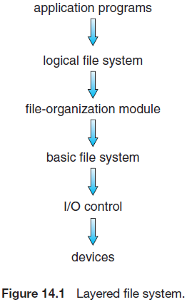
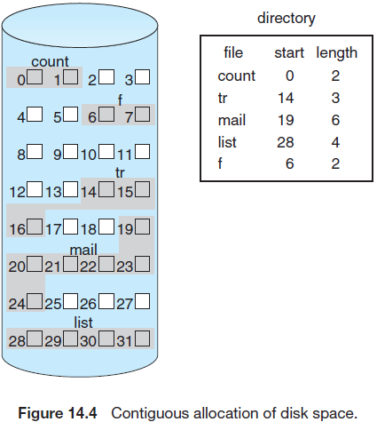

## File -System Implementation

在13章节中可以看到，文件系统提供了在线存储和访问文件内容(包括数据和程序)的机制。文件系统通常永久驻留在辅助存储上，辅助存储用于保存大量数据。本章节主要关注在最通用的辅助存储媒体，硬盘驱动和非易失性存储设备上的问题。我们会介绍接种方法来构建使用的文件，分配存储空间，回收空闲空间，追踪数据位置，以及其他操作系统提供给辅助存储的接口。本章中会涵盖性能相关的内容。

一个给定的通用操作系统提供了多种文件系统。此外，很多操作系统允许管理员或用户添加文件系统。为什么会有这么多文件系统？不同的文件系统在很多方面都不相同，包括特性，性能，可靠性，设计目标，不同的文件系统用于不同的场景。例如，一个临时文件系统用于快速存储和检索非持久性文件，而默认的辅助存储文件系统(如Linux ext4)会为了可靠性和其他特性而牺牲性能。正如我们在整个操作系统研究中看到的，有很多选择和变化，使的全面涵盖这些内容称为一个挑战。本章中，我们关注共同点。

### 14.1 File-System Structure

文件系统维护的大多数辅助存储是磁盘，主要有两方面的原因：

1. 磁盘可以重写，可以从磁盘中读取块，修改该块并写回到相同的块
2. 磁盘可以直接访问它包含的任何块中的信息。因此，可以简单地使用顺序或随机方式访问文件，将一个文件切换到另一个文件会导致驱动移动读-写头，并等待媒体旋转。

非易失性内存（NVM）设备越来越多地用于文件存储，并作为文件系统的存储位置。它们与硬盘的不同之处在于它们无法重写且具有不同的性能特征。我们在11章节中讨论了磁盘和NVM设备结构的细节。

为了提升I/O效率，内存和大存储间的传输以块为单位。硬盘上的每个块都有一个或多个扇区。根据磁盘驱动，扇区大小通常是512字节或4096字节。NVM设备的块通常是4096字节，传输方式类似于磁盘驱动使用的传输方式。

文件系统通过允许存储，定位，检索数据的方式可以高效便捷地访问存储设备。第一个问题定义了文件系统如何面向用户。该任务涉及定义一个文件和文件属性，文件允许的操作以及组织文件的目录结构。第二个问题是创建算法和数据结构来将逻辑文件系统映射到物理辅助存储设备。

文件系统本身包含多个不同的层级，图14.1展示了一个层级设计，该设计中的每一层都会使用第一层的特性来创建高一层的特性。

I/O控制层使用设备驱动和中断处理器在主存和磁盘程序间传输信息。一个设备驱动可以看做是一个翻译。它的输入包括高级别命令，如"检索块123"。输出为低级别的，硬件处理器使用的特定硬件指令，用于将I/O设备连接到系统的其他部分。设备驱动通常会通过写入I/O控制器内存中的特定比特位来告诉控制器需要处理设备的哪个位置，以及处理动作。第12章节描述了设备驱动和I/O基础设施的细节。

基本文件系统(在Linux中称为"块I/O子系统")仅需要向相应的设备驱动程序发出通用命令，以读取和写入存储设备上的块。它会基于逻辑块地址向驱动发送命令，也会涉及I/O请求的调度。本层也需要管理内存缓冲和缓存来保存各种文件系统，目录和数据块。会在传输一个大存储块前给缓冲分配一个块。当缓冲满后，缓冲管理器必须找到更多的缓冲内存或释放缓冲空间来完成一个请求的I/O。缓存用于保存文件系统经常使用的元数据来提升性能，因此，管理它们的内容对于优化系统性能至关重要。

文件组织模块知道文件和文件的逻辑块，每个文件的逻辑块标记为从0到N。文件组织模块也包含空闲空间管理器，用于跟踪未定位的块，并在请求时将这些块提供给文件管理模块。

最后，逻辑文件系统管理元数据信息。元数据包含所有文件系统结构(除实际数据外)。逻辑文件系统通过管理目录结构来提供文件组织模块，文件组织模块会提供后者需要的信息，并给出一个符号文件名。逻辑文件系统会通过文件控制块维护文件结构。一个文件控制块(FCB)(UNIX文件系统中为inode)包含关于文件的信息，包含所有者，权限和文件内容位置。逻辑文件系统也负责防护，见13到17章节。

当文件系统使用层级结构实现时，代码的重复被最小化。多文件系统可以使用I/O控制和基本文件系统代码。每个文件系统可以有自己的逻辑文件系统和文件组织模块。不幸的是，层级也会引入更多的操作系统开销，导致性能下降。使用层级，包括确定使用多少层级和每个层级需要做什么，是新系统设计时面临的主要挑战之一。

当今使用了很多文件系统，大多数操作系统支持多个文件系统。例如，大多数CD-ROM使用IOS 9660格式编写，该格式是CD-ROM厂商所支持的标准格式。除可移动媒体文件系统外，每个操作系统会有一个或多个基于磁盘的文件系统。UNIX使用UNIX文件系统(UFS)，该系统基于Berkeley Fast File System(FFS)。Windows支持FAT, FAT32, 和NTFS (orWindows NT File System)的磁盘文件格式，以及CD-ROM和DVD的文件系统格式。虽然Linux支持超过130中不同的文件系统，标准的Linux文件系统被认为是可扩展的文件系统，大多数版本使用ext3和ext4。此外还有分布式文件系统，可以被一个或多个客户端计算机通过网络进行挂载。

文件系统的研究会继续作为操作系统设计和实现的热门领域。Google创建了自己的文件系统来满足公司的特定存储和检索需求，并在有很多客户请求接入大量磁盘时保持高性能。另外一个有趣的项目是FUSE文件系统，该文件系统提供了文件系统开发上的灵活性，并用于在用户层(非内核层)实现和执行文件系统。使用FUSE时，用户可以给给中操作系统添加新的文件系统，并使用添加的文件系统来管理文件。

### 14.2 File-System Operations

正如13.12章节中描述的，操作系统使用`open()`和`close()`系统调用来处理文件内容的访问请求。本章中，我们会深入文件系统的结构和操作。

#### 14.2.1 Overview

实现一个文件系统会用到一些存储和内存结构。这些结构根据操作系统和文件系统的不同而不同，但会遵循一些通用的原则。

文件系统的存储会包含如何启动操作系统的信息，总的块数，空闲的块数和位置，目录结构和个别文件。本章中剩余部分会详细讲解这些结构的细节。这里先简单介绍一下：

- 启动控制块(单个卷)包含启动操作系统所需要的信息。如果磁盘不包含一个操作系统，则该块可以为空。该控制块通常是卷中的第一个块。在UFS中称为启动块，在NTFS中名称为分区引导扇区。
- 卷控制块(单个卷)包含卷的详细信息，如卷中的块数，块大小，空闲块数和空闲块指针以及空闲的FCB数和FCB指针。在UFS中称为超级块，在NTF中保存在主文件表中。
- 目录结构(单文件系统)用于识别文件。在UFS中，它包含文件名称和相关的inode数，在NTFS中，保存在主文件表中。
- 单文件FCB包含文件的很多详细信息。它包含与目录表项相关的唯一标识符。在NTFS中，该信息实际上保存在主文件表中，它使用关系数据库结构，每个文件一行。

内存信息用于文件系统管理和性能提升(使用缓存)。这些数据会在挂载时加载到内存中，并在文件系统操作期间进行更新，在卸载时丢弃。可能会包含几种结构类型:

- 内存的挂载表包含每个挂载卷的信息
- 内存目录结构缓存中包含最近访问的目录信息。(对于挂载卷的目录，它包含指向卷表的指针。)
- 系统级打开文件表包含每个打开文件的FCB副本，以及其他信息
- 单进程打开文件表包含指向特定的系统级打开文件表项的指针，以及该进程打开的所有文件的信息。
- 当从文件系统中读取或写入文件系统时保存文件系统块的缓冲

为了创建一个新文件，进程会调用逻辑文件系统。逻辑文件系统知道目录结构的格式。为了创建一个新的文件，需要分配一个新的FCB。(或者，如果文件系统实现了在文件系统创建时创建所有FCB，则会用空闲的FCB中分配一个FCB。)系统会将特定的目录读取内存，使用新文件名和FCB更新该目录，并将其写回到文件系统。图14.2展示了一个典型的FCB。

一些操作系统，包括UNIX，除了"类型"字段标识为目录外，会将一个目录视为一个文件，其他操作系统，包括Windows，为文件和目录实现了独立的系统调用，将目录与文件区分开来。  无论更大的结构性问题是什么，逻辑文件系统都可以调用文件组织模块将目录I/O映射到存储块位置，然后将其传递到基本文件系统和I/O控制系统。

#### 14.2.2 Usage

创建完文件后，就可以用于I/O。首先通过调用`open()`将文件名传递给逻辑文件系统来打开该文件。`open()`系统调用首先会从系统级打开文件表中查找是否该文件已经被其他进程使用。如果是，则会创建一个单进程打开文件表，并指向现有的系统级打开文件表。这种算法可以节省后续的开销。如果文件没有被打开，会使用给定的文件名来查找目录结构。目录结构的一部分通常会缓存在内存中来加快目录操作。一旦找到文件，会将FCB拷贝到内存中的系统级打开文件表中。该表不仅会保存FCB，也会跟踪打开该文件的进程数。

然后，会在单进程打开文件表中创建一个表项，包含一个指向系统级打开文件表项的指针，以及其他字段。这些字段可能包含指向文件当前位置的指针(用于`read()`或`write()`操作)以及打开文件的访问模式。`open()`调用会返回一个指向单进程文件系统表项的指针。所有的文件操作都会通过该指针执行。由于一旦磁盘中存在对应的FCB，系统就不会用到文件名，因此文件名可能不是打开文件表的一部分(虽然可以通过缓存该字段来节省后续打开该文件的时间)。表项中的名字可能会变化。UNIX系统指文件描述符；Windows指文件句柄。

当一个进程关闭文件时会移除单进程表项，并降低系统级表项的打开数。当所有打开该文件的用户关闭该文件后，所有更新的元数据会拷贝回基于磁盘的目录结构，并移除文件系统级的打开文件表项。

不能忽视文件系统结构的缓存。大多数系统将有关打开文件的所有信息（实际数据块除外）保留在内存中。BSD UNIX系统通常在保存磁盘I/O的地方使用高速缓存。85%的平均缓存命中率表明这些技术还是很有价值的。附录C描述了BSD UNIX系统。

图14.3描述了一个文件系统实现的操作结构。

### 14.3 Directory Implementation

目录分配和目录管理算法会严重影响到文件系统的效率，性能和可靠性。本章中，我们会讨论如何权衡这些算法。

#### 14.3.1 Linear List

实现一个目录最简单的方式是使用线性文件列表和指向数据块的指针，可以简单地编程实现该方式，但在执行时比较耗时。为了创建一个新的文件，首先必须搜索目录来保证不存在系统名字的文件。然后，在目录尾添加一个新的表项。为了删除一个文件，需要搜索目录来找到该文件，然后释放分配给该文件的内存。为了重用目录表项，我们可以做一些处理。我们可以将该表项标记为不可用(通过分配一个特定的名字，如空名字，分配一个无效的inode号(如0)，或在表项中包含一个使用-未使用比特位)，或将其附加到空闲目录表项中。第三中选择时将目录中的最后一个表项拷贝到空闲的位置，并降低目录长度。连接列表可以降低删除文件的时间。

线性目录表项的缺点是，当查找一个文件时需要执行线性查找。由于会经常使用到目录信息，且如果访问过慢，用户会注意到这种情况。实际上，很多操作系实现了一个软件来保存最近使用的目录信息。一个缓存命中可以避免从辅助存储中重新读取信息。有序列表可以使用二分查找来降低平均查找时间。然而，由于不得不移动大量的目录信息来维护一个有序的目录，因此对列表进行排序会使得文件的创建和删除复杂化。使用比较复杂的树数据结构，如平衡树，可能会有所帮助。有序列表的优势是对目录进行列表排行不会产生其他排序过程。

#### 14.3.2 Hash Table

另一种文件目录使用的数据结构是哈希表。这里使用线性列表保存目录表项，也会使用哈希数据结构。哈希表会使用一个从文件名计算出的数值来返回指向线性列表中的文件名指针。因此，可以大大降低目录查找时间。插入和删除也比较直接(尽管必须预防哈希碰撞)。

使用哈希表的最大困难是哈希表的长度通常是固定的，且哈希函数依赖表长度。例如，假设线性探测的哈希表有64个表项。哈希函数会将文件名转换为从0到63的整数(例如，用除以64的余数)。如果后续尝试创建第65个文件，我们必须扩大目录哈希表，例如扩大为128，导致我们需要一个新的哈希函数来将文件名映射到0到127，且需要识别现有的目录表项来反映新的哈希函数值。

或者，我们可以使用链式溢出哈希表。每个哈希表项包含一个链接的列表，而非独立的值，我们可以通过将新的表项添加到链接列表的方式解决碰撞。由于查找一个文件困难需要处理冲突表项的链接列表，因此困难会降低查找速度。尽管如此，该方法也比线性查找整个目录快得多。

### 14.4 Allocation Methods

辅助存储的直接访问方式提供了文件实现上的灵活性。几乎在所有场景中，很多文件会保存在相同的设备中。主要的问题是如何为这些文件分配空间来保证存储空间的高利用率，以及文件的快速访问。最常用的三种主要的辅助存储分配方式为：连续，链接和索引。每个方法都有优势和劣势。虽然一些系统会使用这三种方式，但通常一个系统只会为一种文件类型使用一种方式。

#### 14.4.1 Contiguous Allocation

连续分配需要每个文件占用设备上的连续块。设备地址定义为一个线性的顺序。使用这种顺序，假设只有一个任务访问设备，在块b之后访问块b+1通常不会需要头部移动。当需要头部移动时(从一个柱面的最后一个扇区移动到下一个柱面的第一个扇区)，只需要头部从一个轨道移动到下一个。因此，对于HDDs，需要访问连续分配的文件的磁盘的查找数是最少的(假设相邻的逻辑地址的块在物理上也是相邻的)。

文件的连续分配由第一个块的地址和文件的长度(单位为块)定义。如果文件为n个块大小，且起始位置为b，那么它占用的块为b, b + 1, b + 2, ..., b + n − 1。每个文件的目录表项标识起始块的地址和为此文件分配的区域的长度(图14.4)。很容易实现连续分配，但也有限制。现代操作系统中没有采纳这种方式。

访问一个连续分配的文件是很简单的。对于顺序访问，文件系统会记录最后一个块地址，并在需要时读取下一个块。对于直接访问一个起始于块b的文件的块i，我们可以理解访问块b+i。这样连续分配可以同时支持顺序和直接访问。

然而，连续分配存在一些问题。一个困难是如何找到新文件需要的空间。会选择系统来管理空闲空间来决定该任务是如何完成的。14.5章节中讨论了这些管理系统。可以使用任何一种管理系统，但一些系统要比其他慢。

连续分配问题可以看作是第9.2节中讨论的存在一般动态存储分配问题的特殊应用，涉及如何使用空闲列表来满足一个大小为n的请求。首次配合和最佳配合是最常用的策略，用于从可用存储中选择一个空闲存储。