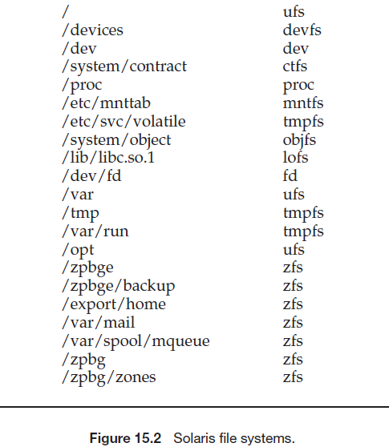

正如在13章中看到的，文件系统提供了在线存储和访问文件内容(包括数据和程序)的机制。本章主要关注文件系统的内存结构和操作。我们会讨论几种使用的文件结构，分配存储，回收空闲空间，跟踪数据位置的方式，以及操作系统与辅助存储的接口。

### 15.1 File Systems

确实，没有任何一个通用计算机会仅仅使用一个文件。通常一个计算机有几千，几百万甚至几十亿个文件。文件存储在随机访问的存储设备上，包括硬盘驱动，光盘和非易失性存储设备。

正如在前面章节中看到的，一个通用计算机系统会有多个存储设备，且这些设备被分割成几个部分，其中包含卷，而卷又包含文件系统。取决于卷管理器，一个卷也可以跨越多个分区。图15.1展示了典型的文件系统组织。

计算机系统也可能包含多个文件系统，且文件系统的类型可能不同。例如，一个典型的Solaris系统可能有数十个文件系统，以及数十个类型，参见图15.2展示的文件系统。

本书中，我们仅会考虑通用的文件系统(虽然还有很多用于特殊场景的文件系统，但没有必要一一讲解)。考虑上面提到的Solaris的文件系统类型：

- tmpfs--一个"临时"文件系统，用于在易失的主存中创建文件，在系统重启或崩溃后会丢失内容。
- objfs--一个虚拟文件系统(本质上是一个内核接口，看起来像一个文件系统)，用于调试访问内核符号。
- ctfs--一个虚拟文件系统，维护“合同”信息以管理系统启动时应该启动哪些进程，且在执行期间必须持续运行。
- lofs--一个回环文件系统，允许一个文件系统代替另一个文件系统来进行访问。
- procfs--一个虚拟文件系统，以文件系统的方式呈现所有进程的信息
- ufs，zfs--通用文件系统。

计算机的文件系统可以被扩展。即使在一个文件系统中，也可以将文件分成多个组，并对这些组进行管理和操作。这种组织会涉及到目录的使用。

### 15.2 File-System Mounting

正如文件系统在使用前必须打开一样，一个文件系统在使用前也必须挂载到系统中。更具体的，目录结构可能由多个包含文件系统的卷组成，这些卷必须挂载后才能在文件系统命名空间中使用。

挂载的流程很直接。给操作系统提供设备名称和挂载点(文件系统可以附加到文件结构中的位置)即可。一些操作系统需要提供一个文件系统类型，而其他会通过检查设备的机构来确定文件系统的类型。通常，一个挂载点是一个空目录。例如，在UNIX系统上，一个包含用户的home目录的文件系统可能被挂载为/home，然后为了访问该文件系统的目录结构，我们可以在目录名称前加上/home，如/home/jane。将该文件系统挂载到/users会使得路径名为/users/jane，通过该路径也会到达相同的目录。

下面，操作系统会校验设备是否包含一个有效的文件系统，请求设备驱动读取设备目录并校验目录是否有期望的格式。最后，操作系统会注意到其目录结构是一个文件系统，且挂载到一个特定的挂载点。这种方案使得操作系统按照预期遍历其目录结构，切换文件系统甚至文件系统的类型。

为了描述文件挂载，考虑图15.3描述的文件系统，其中三角形代表感兴趣的目录的子树。图15.3(a)展示了一个现有的文件系统，图15.3(b)展示了一个位于/device/dsk的未挂载的卷。此时，只能访问存在的文件系统中的文件。图15.4展示了挂载到/users的卷/device/dsk。如果未挂载卷，文件系统会恢复到15.3展示的情况。

系统会强制使用语义来阐明功能。例如，一个系统可能不允许挂载包含文件的目录，否则可能会导致挂载的文件系统可用的同时(在卸载文件系统前)忽略目录中现存的文件，终止文件系统的使用会允许访问该目录中的原始文件。另一个例子，一个系统可能允许重复挂载系统的文件系统到不同的挂载点，会每个文件系统仅允许挂载一次。

考虑macOS操作系统的行为。每当系统第一次遇到磁盘时(无论是启动时间或系统运行时)，macOS操作系统会在设备上查找一个文件系统。如果找到一个，则会自动将文件系统挂载到/Volumes目录下，并添加一个与文件系统人名称相同的文件夹图标。然后用户就可以点击图标来展示新挂载的文件系统。

Microsoft Windows族操作系统会维护一个扩展的两级目录结构，为设备和卷分配驱动器号。每个卷都有一个与设备器号有关的通用图目录结构。特定文件的路径格式为`启动器号:∖path∖to∖file`。最新版本的Windows允许文件系统挂载到目录树的任意位置，与UNIX相同。Windows操作系统会在启动期间自动发现设备并挂载所有的文件系统。一些系统，如UNIX上，挂载命令是显示的。一个系统配置文件包含设备和挂载点的列表，用于在启动时自动挂载，但其他挂载则需要手动执行。

15.3和C.7.5章节会讨论文件系统挂载的问题。

### 15.3 Partitions and Mounting

磁盘的布局可以有很多变化，具体取决于操作系统和卷管理软件。一个磁盘可以分为多个分区，或一个卷可以跨越多个磁盘的多个分区。这里讨论第一个布局，后者更适用于RAID，11.8章节中有所涵盖。

每个分区可以是“raw”，不包含文件系统，也可以是“cooked”，包含文件系统。当没有文件系统时会使用裸磁盘。例如，UNIX交换空间可以使用一个裸分区，它会使用自身的磁盘格式，却不会用到文件系统。同样，一些数据库会使用裸磁盘并将数据格式化为需要的格式。裸磁盘也可以包含磁盘RAID系统需要的信息，如标识哪个块被镜像，以及哪个块已更改且需要镜像的位图。类似地，裸磁盘可以包含RAID配置信息的微型数据库，如哪些磁盘时每个RAID集的成员。11.5.1章节会讨论裸磁盘。

如果一个分区包含可以启动的文件系统，即正确安装和配置的操作系统，那么该分区会需要如11.5.2章节中描述的启动信息。由于启动时系统没有加载的文件系统代码，且无法解析文件系统的格式，因此这种信息有其自身的格式。启动信息通常是作为镜像加载到内存中的顺序的块。镜像从一个预定义的位置启动执行，如第一个字节。这种镜像称为bootstrap加载器，该程序可以识别文件系统的结构，可以查找，加载并执行内核。

引导加载程序可以包含出启动特定操作系统外的指令。例如，很多系统可以双启动，允许在一个系统上安装多个操作系统。系统如何知道应该启动哪个？了解多个文件系统和多个操作系统的引导加载程序会占用引导空间。一旦被加载，它就可以启动设备上的一个可用的操作系统。启动可以有多个分区，每个包含不同类型的文件系统以及不同的操作系统。注意，如果引导加载程序无法理解一个特定的文件系统格式，那么不会启动位于该文件系统上的操作系统。这就是为什么对于任何给定的操作系统，只有一些文件系统可以支持根文件系统的原因之一。

引导加载器选择的根分区包含操作系统内核，有时会包含其他系统文件，在启动时挂载。取决于操作系统，其他卷可以在启动时自动挂载或后续手动挂载。在成功挂载后，操作系统会通过请求设备驱动读取设备命令，并校验目录是否具有期望的格式的方式来校验设备是否包含有效的文件系统。如果格式无效，必须对分区进行一致性校验，有可能会在有或没有人为介入的情况下被修复。最后，操作系统会注意到在内存中的挂载表中，该类型的文件系统已经挂载成功。这些功能取决于操作系统。

Microsoft Windows上，每个卷都会挂载到一个独立的使用字符和冒号表示的命名空间中。例如，为了记录一个挂载到`F:`的文件系统，操作系统会在与`F：`对应的设备结构的字段中放置一个指向文件系统的指针。当一个进程指定驱动字符时，操作系统会查找何时的文件系统指针并遍历该设备上的目录结构来找出指定的文件或目录。后续版本的Windows可以将一个文件系统挂载到现有的任意目录结构。

UNIX上的文件系统可以挂载到任意目录，通过在该目录的inode的内存副本中设置标志来实现挂载，该表示表示该目录是一个挂载点。然后会有一个字段执行挂载表中的一个表项，表示挂载的是哪个设备。挂载表表项包含一个指向该设备上的文件系统的超级块的指针。这种方案使得操作系统能够遍历目录结构，在不同类型的文件系统之间无缝切换。

### 15.4 File Sharing

对于希望进行协作并减少实现计算目标所需的工作量的用户来说，共享文件的能力是非常理想的。因此，面向用户的操作系统尽管存在固有的困难，但必须满足共享文件的需求。

本章中，我们将研究文件共享的更多方面。我们会讨论多用户共享文件下通常会遇到的问题。一旦允许多用户共享文件，会遇到将共享文件扩展到多文件系统，包括远程文件系统的挑战。我们也会讨论这类挑战。最后，我们会考虑如何处理共享文件上发生的冲突操作。例如，如果多用户写入一个文件，是否允许同时写入？或者，操作系统会保护用户彼此之间的操作。

#### 15.4.1 Multiple Users

当一个操作系统可以容纳多个用户时，文件共享，文件命名和文件保护的问题会日益突出。给定一个允许用户共享文件的目录结构时，系统必须调解文件共享。系统要么允许一个用户默认可以访问其他用户的文件，要么需要特定的授权才能访问。这些问题涉及访问控制和防护，见13.4章节。

为了实现共享和防护，相比单用户系统，系统必须维护更多文件和目录属性。虽然很多可以采用多种方式来实现这种需求，但大多数系统演化为使用文件(或目录)，所有者(或用户)和组的概念。所有者就是可以改变文件属性和授权访问的拥有大多数文件控制权限的用户。组属性定义了一个用户子集，可以共享访问该文件。例如，UNIX系统上一个文件的拥有者可以多一个文件执行所有操作，而文件组的成员可以执行这些操作的一部分，而其他用户可以执行这些操作的另一部分。文件的所有者需要明确组成员和其他用户可以执行的操作。

文件(或目录)的所有者和组ID保存在其他文件属性中。当一个用户请求操作一个文件时，可以使用用户ID和文件所有者的属性进行比对，来判断请求的用户是否时文件的所有者。组ID也会使用类似的方式进行比对。比对结果给出了可以执行的权限。然后系统将权限应用于请求操作，允许或拒绝这些请求。

很多系统由多个本地文件系统，包括一个单磁盘卷，或多磁盘上的多个卷。这些场景下，一旦挂载了文件系统，就可以直接使用ID校验和权限匹配。如果系统上的ID不同会发生什么？必须要谨慎处理设备在不同系统间的移动，确保ID能够匹配，或者重置文件的所有权。(例如，我们可以创建一个新用户ID，并将移植的磁盘上的所有文件设置为该ID来保证现有的用户无法意外地访问这些文件。)

### 15.5 Virtual File Systems

正如我们看到的，现代操作必须能够同时支持多类型的文件系统。但一个操作系统如何允许将多类型的文件系统集成到一个目录结构中？用户如何在浏览文件系统空间时在文件系统类型之间无缝移动？我们将讨论这些实现的细节。

一种实现多类型文件系统的次优方法是为每个类型编写目录和文件例程。然而，大多数操作系统，包括UNIX，使用面向对象技术来简化，组织和模块化这种实现。使用这些方法允许不同文件系统使用相同的结构来实现，包括网络文件系统，如NFS。用户可以包含多个文件系统的本地驱动上的文件，甚至跨网络的文件系统。

使用数据结构和程序将基本的系统调用功能与实现细节隔离开。这样，文件系统实现包含三个主要的层，见图15.5。第一层为文件系统接口，基于`open()`, `read()`,`write()`, 和`close()`以及文件描述符。

第二层称为虚拟文件系统层(VFS)。VFS层提供两个主要的功能：

1. 通过定义一个干净的VFS接口将通用的文件系统操作和实现隔离开来。一些VFS接口的实现可能共存于同一台机器上，允许透明访问不同本地挂载的不同类型的文件系统。
2. 提供了一种机制来唯一地表示整个网络中的文件。VFS基于文件表达结构，称为vnode，包含网络范围内的唯一文件的数字标识符。(UNIX inode仅在一个文件系统中是唯一的。)这种网络范围的唯一性用于支持网络文件系统。内核为每个活动的节点(文件或目录)维护一个vnode结构。

VFS通过这种方式来区分本地文件和远端文件，且根据文件所属的文件系统类型来区分本地文件。

VFS根据文件系统类型来激活特定的文件系统操作(本地)请求，以及为远端请求调用NFS协议程序(或其他用于网络文件系统的协议程序)。通过相关的vnode构造文件句柄，并作为参数传递给这些处理程序。实现了文件系统类型或远端文件系统协议的层，即架构中的第三层。

简单看一下Linux中的VFS架构。Linux VFS定义的四个主要对象的类型为：

- inode对象，表示一个单独的文件
- 文件对象，表示一个打开的文件
- 超级块对象，表示整个文件系统
- 目录对象，表示单独的目录表项

对于这四种中的每一种类型，VFS定义了可能实现的操作集。这些类型的每个对象都包含一个指向函数表的指针。函数表列出了为特定对象实现的操作的实际函数的地址。例如，文件对象的一些操作的API缩写包括：

- int open(. . .)—打开一个文件
- int close(. . .)—关闭一个已经打开的文件
- ssize t read(. . .)—读取一个文件
- ssize t write(. . .)—写入一个文件
- int mmap(. . .)—内存映射一个文件

要实现文件对象定义中指定的每个功能，需要实现特定文件类型的文件对象。(完整的文件对象定义在文件结构file_operations中，位于文件/usr/include/linux/fs.h。)

这样，VFS软件层可以通过从对象的函数表中调用合适的函数来对某个对象执行某个操作，而无需提前知道需要处理的对象的类型。VFS不知道也不关注一个inode表示的是一个磁盘文件，目录文件还是远端文件。文件的`read()`操作总会位于函数表的相同位置，VFS软件层只要调用该函数即可，无需关注实际数据是如何被读取的。

### 15.6 Remote File Systems

随着网络的出现(19章)，与远端计算机的通信称为可能。网络允许跨校园甚至在世界范围内共享资源。一种明显的资源是共享文件中的数据。

