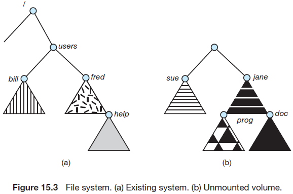

正如在13章中看到的，文件系统提供了在线存储和访问文件内容(包括数据和程序)的机制。本章主要关注文件系统的内存结构和操作。我们会讨论几种使用的文件结构，分配存储，回收空闲空间，跟踪数据位置的方式，以及操作系统与辅助存储的接口。

### 15.1 File Systems

确实，没有任何一个通用计算机会仅仅使用一个文件。通常一个计算机有几千，几百万甚至几十亿个文件。文件存储在随机访问的存储设备上，包括硬盘驱动，光盘和非易失性存储设备。

正如在前面章节中看到的，一个通用计算机系统会有多个存储设备，且这些设备被分割成几个部分，其中包含卷，而卷又包含文件系统。取决于卷管理器，一个卷也可以跨越多个分区。图15.1展示了典型的文件系统组织。

计算机系统也可能包含多个文件系统，且文件系统的类型可能不同。例如，一个典型的Solaris系统可能有数十个文件系统，以及数十个类型，参见图15.2展示的文件系统。

本书中，我们仅会考虑通用的文件系统(虽然还有很多用于特殊场景的文件系统，但没有必要一一讲解)。考虑上面提到的Solaris的文件系统类型：

- tmpfs--一个"临时"文件系统，用于在易失的主存中创建文件，在系统重启或崩溃后会丢失内容。
- objfs--一个虚拟文件系统(本质上是一个内核接口，看起来像一个文件系统)，用于调试访问内核符号。
- ctfs--一个虚拟文件系统，维护“合同”信息以管理系统启动时应该启动哪些进程，且在执行期间必须持续运行。
- lofs--一个回环文件系统，允许一个文件系统代替另一个文件系统来进行访问。
- procfs--一个虚拟文件系统，以文件系统的方式呈现所有进程的信息
- ufs，zfs--通用文件系统。

计算机的文件系统可以被扩展。即使在一个文件系统中，也可以将文件分成多个组，并对这些组进行管理和操作。这种组织会涉及到目录的使用。

### 15.2 File-System Mounting

正如文件系统在使用前必须打开一样，一个文件系统在使用前也必须挂载到系统中。更具体的，目录结构可能由多个包含文件系统的卷组成，这些卷必须挂载后才能在文件系统命名空间中使用。

挂载的流程很直接。给操作系统提供设备名称和挂载点(文件系统可以附加到文件结构中的位置)即可。一些操作系统需要提供一个文件系统类型，而其他会通过检查设备的机构来确定文件系统的类型。通常，一个挂载点是一个空目录。例如，在UNIX系统上，一个包含用户的home目录的文件系统可能被挂载为/home，然后为了访问该文件系统的目录结构，我们可以在目录名称前加上/home，如/home/jane。将该文件系统挂载到/users会使得路径名为/users/jane，通过该路径也会到达相同的目录。

下面，操作系统会校验设备是否包含一个有效的文件系统，请求设备驱动读取设备目录并校验目录是否有期望的格式。最后，操作系统会注意到其目录结构是一个文件系统，且挂载到一个特定的挂载点。这种方案使得操作系统按照预期遍历其目录结构，切换文件系统甚至文件系统的类型。

为了描述文件挂载，考虑图15.3描述的文件系统，其中三角形代表感兴趣的目录的子树。图15.3(a)展示了一个现有的文件系统，图15.3(b)展示了一个位于/device/dsk的未挂载的卷。此时，只能访问存在的文件系统中的文件。图15.4展示了挂载到/users的卷/device/dsk。如果未挂载卷，文件系统会恢复到15.3展示的情况。

系统会强制使用语义来阐明功能。例如，一个系统可能不允许挂载包含文件的目录，否则可能会导致挂载的文件系统可用的同时(在卸载文件系统前)忽略目录中现存的文件，终止文件系统的使用会允许访问该目录中的原始文件。另一个例子，一个系统可能允许重复挂载系统的文件系统到不同的挂载点，会每个文件系统仅允许挂载一次。

考虑macOS操作系统的行为。每当系统第一次遇到磁盘时(无论是启动时间或系统运行时)，macOS操作系统会在设备上查找一个文件系统。如果找到一个，则会自动将文件系统挂载到/Volumes目录下，并添加一个与文件系统人名称相同的文件夹图标。然后用户就可以点击图标来展示新挂载的文件系统。

Microsoft Windows族操作系统会维护一个扩展的两级目录结构，为设备和卷分配驱动器号。每个卷都有一个与设备器号有关的通用图目录结构。特定文件的路径格式为`启动器号:∖path∖to∖file`。最新版本的Windows允许文件系统挂载到目录树的任意位置，与UNIX相同。Windows操作系统会在启动期间自动发现设备并挂载所有的文件系统。一些系统，如UNIX上，挂载命令是显示的。一个系统配置文件包含设备和挂载点的列表，用于在启动时自动挂载，但其他挂载则需要手动执行。

15.3和C.7.5章节会讨论文件系统挂载的问题。

### 15.3 Partitions and Mounting

磁盘的布局可以有很多变化，具体取决于操作系统和卷管理软件。一个磁盘可以分为多个分区，或一个卷可以跨越多个磁盘的多个分区。这里讨论第一个布局，后者更适用于RAID，11.8章节中有所涵盖。

每个分区可以是“raw”，不包含文件系统，也可以是“cooked”，包含文件系统。当没有文件系统时会使用裸磁盘。例如，UNIX交换空间可以使用一个裸分区，它会使用自身的磁盘格式，却不会用到文件系统。同样，一些数据库会使用裸磁盘并将数据格式化为需要的格式。裸磁盘也可以包含磁盘RAID系统需要的信息，如标识哪个块被镜像，以及哪个块已更改且需要镜像的位图。类似地，裸磁盘可以包含RAID配置信息的微型数据库，如哪些磁盘时每个RAID集的成员。11.5.1章节会讨论裸磁盘。

如果一个分区包含可以启动的文件系统，即正确安装和配置的操作系统，那么该分区会需要如11.5.2章节中描述的启动信息。由于启动时系统没有加载的文件系统代码，且无法解析文件系统的格式，因此这种信息有其自身的格式。启动信息通常是作为镜像加载到内存中的顺序的块。镜像从一个预定义的位置启动执行，如第一个字节。这种镜像称为bootstrap加载器，该程序可以识别文件系统的结构，可以查找，加载并执行内核。

引导加载程序可以包含出启动特定操作系统外的指令。例如，很多系统可以双启动，允许在一个系统上安装多个操作系统。系统如何知道应该启动哪个？了解多个文件系统和多个操作系统的引导加载程序会占用引导空间。一旦被加载，它就可以启动设备上的一个可用的操作系统。启动可以有多个分区，每个包含不同类型的文件系统以及不同的操作系统。注意，如果引导加载程序无法理解一个特定的文件系统格式，那么不会启动位于该文件系统上的操作系统。这就是为什么对于任何给定的操作系统，只有一些文件系统可以支持根文件系统的原因之一。

引导加载器选择的根分区包含操作系统内核，有时会包含其他系统文件，在启动时挂载。取决于操作系统，其他卷可以在启动时自动挂载或后续手动挂载。在成功挂载后，操作系统会通过请求设备驱动读取设备命令，并校验目录是否具有期望的格式的方式来校验设备是否包含有效的文件系统。如果格式无效，必须对分区进行一致性校验，有可能会在有或没有人为介入的情况下被修复。最后，操作系统会注意到在内存中的挂载表中，该类型的文件系统已经挂载成功。这些功能取决于操作系统。

Microsoft Windows上，每个卷都会挂载到一个独立的使用字符和冒号表示的命名空间中。例如，为了记录一个挂载到`F:`的文件系统，操作系统会在与`F：`对应的设备结构的字段中放置一个指向文件系统的指针。当一个进程指定驱动字符时，操作系统会查找何时的文件系统指针并遍历该设备上的目录结构来找出指定的文件或目录。后续版本的Windows可以将一个文件系统挂载到现有的任意目录结构。

UNIX上的文件系统可以挂载到任意目录，通过在该目录的inode的内存副本中设置标志来实现挂载，该表示表示该目录是一个挂载点。然后会有一个字段执行挂载表中的一个表项，表示挂载的是哪个设备。挂载表表项包含一个指向该设备上的文件系统的超级块的指针。这种方案使得操作系统能够遍历目录结构，在不同类型的文件系统之间无缝切换。

### 15.4 File Sharing