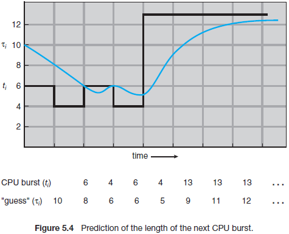
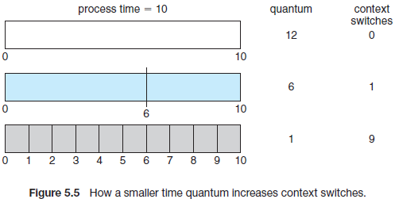
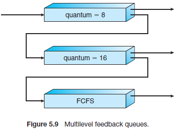

## Chapter 5 CPU Scheduling

CPU调度是多程序操作系统的基础。通过进程间CPU的切换，操作系统可以更好地利用计算机。本章节中，将会介绍基本的CPU调度概念以及目前的几种CPU调度算法，包含实时系统，同时也会考虑到特定系统选择算法时遇到的问题。

第4章中介绍了线程和进程模型。在现代操作系统中，操作系统会对内核级别的线程(非进程)进行调度。然而，"进程调度"和"线程调度"可以等同使用。本章中，当涉及通用的调度概念时会用到进程调度，当涉及线程概念时会用到线程调度。

类似的，在第1章中介绍了核是基本的CPU计算单元，一个进程运行在一个核上。然而，本章的大多数场景中，当使用通用术语"将一个进程调度到一个CPU上"意味着该进程运行在CPU的一个核上.

### 5.1 Basic Concepts

在单CPU核系统上，仅允许同时运行一个进程。其他进程必须等待该CPU核释放后才能被调度。多程序编程中需要同时运行多个进程来最大化利用CPU资源。这种想法非常简单，即一个进程在其必须等待(通常是等待I/O请求结束)前会一直运行。在简单的计算机系统中，CPU会保持空闲状态，此时不会进行任何工作。通过多程序编程，可以尝试将这些空闲时间充分利用起来。同一时间会将一些进程载入到内存中，当一个进程等待时，操作系统会释放该进程的CPU并将这些CPU资源分配给其他进程，这种模式会持续进行。当一个进程等待时，其他进程可以接管CPU。在一个多核系统中，保持CPU繁忙的概念扩展到了系统上的多个处理核。

CPU调度是操作系统的基本功能，几乎所有的计算机资源在使用前都会被调度分配。CPU是主要的计算机资源之一，CPU的调度是操作系统设计中最重要的一环。


#### 5.1.1 CPU–I/O Burst Cycle

CPU的成功调度依赖于观察到的进程特性：进程执行包含CPU的周期性执行以及I/O等待。进程会在这两种状态之间进行转换。进程开始执行时会导致CPU突发(CPU burst)，然后是I/O突发(I/O burst)，然后再接一个CPU突发，I/O突发等等。最终，当系统请求结束运行时会触发最后一个CPU突发(图5.1)。

CPU突发的持续时间已经被广泛地测量。虽然不同进程，不同计算机上CPU突发时间有所差异，但都趋向于如图5.2所示的频率曲线。

曲线的特征通常是指数或超指数的，即在很短时间的高CPU突发之后，会有很长时间的低CPU突发。一个I/O密集型程序通常由很多低CPU突发，而一个CPU密集型程序可能会有一段高CPU突发。在实现CPU调度算法时需要关注这种分配方式。

#### 5.1.2 CPU Scheduler

当CPU空闲时，操作系统必须在ready队列中选择一个进程执行。选择的进程由CPU调度器调度执行，CPU调度器会从内存中的进程中挑选一个进程来执行，并将CPU分配给该进程。

注意FIFO队列中不需要ready队列，正如后面会看到的多种调度算法，ready队列可以使用FIFO队列，优先级队列，树或无序链表实现。从概念上讲，ready队列中的所有进程都会排队等待CPU(来运行)。队列中记录的内容通常是进程的进程控制块(PCB)。


#### 5.1.3 Preemptive and Nonpreemptive Scheduling

以下四种场景会产生CPU调度：

1. 当一个进程从running状态切换到wait状态时(例如，由于I/O请求或调用了`wait()`来中断子进程)
2. 当一个进程从running状态切换到ready状态(例如，当发生中断时)
3. 当一个进程从waiting状态切换到ready状态(例如，I/O结束)
4. 当一个进程结束

对于1到4的场景，在调度时没有选择的余地，在发生CPU调度时必须从ready队列中选择一个进程运行。

当在1到4场景下发生CPU调度时，该调度方案被称为非抢占或合作，否则称为抢占。在非抢占调度下，一旦一个进程分配到了CPU，该进程会在释放或(切换到waitting状态)终止前持有CPU。实际上所有的操作系统，包括Windows，macOS和UNIX都是用了抢占调度算法。

不幸的是，抢占调度会导致多个进程共享数据时发生竞争。考虑两个共享数据的进程，当一个进程在更新数据时，第二个进程抢占运行，如果第二个进程尝试读取该数据，此时会导致状态不一致。第6章会详细讲解这种问题。

抢占机制也会影响到操作系统内核的设计。在处理系统调用时，内核可能正在代表进程忙于处理某种事务，该事务可能涉及修改重要的内核数据(如I/O队列)，如果该进程在修改途中被抢占，且内核(或设备驱动)需要读或修改相同的数据结构时会发生什么？--混乱。6.2章节会讨论这种情况。操作系统内核可以被设计为非抢占或抢占的。一个非抢占内核在进行上下文切换前会等待当前系统调用结束或I/O请求结束。由于在内核数据结构不一致时，内核不会抢占一个进程，这种处理方式保证内核结构足够简单。不幸的是，这种内核执行模型仅用于支持实时运算(任务必须在给定的时间内结束运行)。5.6章节中将会介绍实时系统的调度。一个抢占内核需要互斥锁在访问共享的内核数据结构时防止竞争。大多数现代操作系统的内核运行模式是完全抢占式的。


因为在任何时间都可能发生中断，且不能总是被内核忽略，因此必须保护不受中断影响的代码段的运行。操作系统几乎在任何时间都可能接收到中断，因此可能会发生输入丢失或输出被覆盖的情况。因此这段代码不能被多个进程同时访问，且在进入这段代码时取消中断，并在退出时恢复中断。需要注意的是，取消中断的代码并不会被经常触发，且通常仅包含很少的说明。*这段描述的应该是使用如local_bh_disable/enable函数保证操作的原子性*。

#### 5.1.4 Dispatcher

另外一个于CPU调度功能有关的组件是分配器(dispatcher)。分配器会将对CPU核的控制分配到CPU调度器选择的进程上。该功能涉及以下内容：

- 将一个进程切换到其他进程
- 切换到用户模式
- 通过将用户程序跳转到合适的(代码)位置来恢复该程序

由于分配器涉及到每个进程的上下文切换，因此分配器应该尽可能快的工作。分配器停止一个进程并启动另外一个进程花费的时间被称为分配延时，如图5.3所示。

需要考虑的一个有趣的问题是，多长时间会进行一次上下文切换？在系统层面，可以通过Linux系统上的`vmstat`命令查看上下文切换的次数。下面是命令的输出(被截断)

```
vmstat 1 3
```

该命令每秒会输出1行内容，总计3行

```
------cpu-----
24
225
339
```

第一行为从系统启动后平均每秒的上下文切换次数。下面两行为每2个1秒期间的上下文切换次数。在上面例子中，从机器启动后，每秒的上下文切换次数为24，在上秒内发生了255次上下文切换，在上上秒内发生了339次上下文切换。

可以使用`/proc`文件系统来查看给定进程的上下文切换次数。例如，`/proc/2166/status`文件中给出了`pid=2166`的进程的各种信息:

```
cat /proc/2166/status
```

给如如下已截断的输出：

```
voluntary ctxt switches    150
nonvoluntary ctxt switches 8
```

该输出显示了进程生命期间的上下文切换的次数。注意`voluntary`和`nonvoluntary`上下文切换的区别。当一个线程因为请求当前无法获得的资源(如，I/O阻塞)时会放弃CPU控制，该上下文切换被称为自发上下文切换。当CPU被其他进程抢占(如CPU时间片超时或被更高优先级的进程抢占)时的上下文切换被称为非自发上下文切换。

### 5.2 Scheduling Criteria

不同的CPU调度算法有不同的特征，特定算法选择的进程也可能不同于另外一个算法。在特定场景下选择算法时，必须考虑到不同算法的特点。

有很多用于比较不同CPU调度算法的准则。使用不同特征(进行比较来)选择的最优算法可能存在巨大差异。这些准则包括：

- CPU利用率。我们期望CPU保持繁忙。从概念上讲，CPU利用率范围可以从0%到100%，但在真实的系统上CPU利用率的范围为40%(低负载系统)到90%(高负载系统)。(Linux，macOS和UNIX系统上可以使用`top`命令查看CPU利用率)。
- 吞吐量。如果CPU忙于执行进程，则说明正在完成工作。吞吐量是一种衡量在单位时间内完成多少进程的方法。对于长时间运行的进程，该速率可能是每秒处理一个进程；对于短时间的进程，可能每秒能够处理10个进程。
- 周转时间(turnaround time)。从特定进程的角度看，最重要的准则是该进程需要花多少时间运行。从提交进程的时间到进程结束的时间称为周转时间。周转时间为进程在ready队列中等待的时间，CPU执行时间和I/O时间之和。
- 等待时间。CPU调度算法不会影响一个进程执行或进行I/O的时间，仅影响到进程在ready队列中等待的时间。等待时间是进程在ready队列中花费的时间周期之和。
- 响应时间。在一个交互式系统中，使用周转时间并不是一个好的准则。通常一个进程早期可以产生一些输出，并且在前一个结果显示给用户期间继续计算新的结果。因此应该策略从提交请求到生成第一个响应的时间，这种测量方法称为响应时间，该时间点为开始响应的时间，而非显示响应的时间。

应该最大化CPU利用率和吞吐量以及最小化周转时间，等待时间和响应时间，在大多数场景下会优化衡量的平均值。然而在一些场景下更倾向于优化最小或最大值，而非平均值。例如，为了保证所有用户都能等到优质的服务，应该减小最大响应时间。

研究人员建议，对于交互式系统(如PC桌面或台式机系统)，减小响应时间方差比减小平均响应更重要。具有合理且可预测响应时间的系统可能比平均速度更快但变化很大的系统更优。然而，在最小化方差的CPU调度算法方面，所做的工作很少。

下面章节会讨论各种CPU调度算法并描述其操作。一个精确的描述可能会涉及很多进程，每个进程都包含上百个CPU突发和I/O突发。为了简化，下面例子中仅考虑了一个CPU突发(单位毫秒)，通过平均等待时间比较。5.8章节中给出了更详尽的评估机制。

### 5.3 Scheduling Algorithms

CPU调度需要处理如何确定ready队列中的哪些进程应该被分配CPU核的问题。有多种不同的CPU调度算法，本章中描述了部分算法。虽然大多数现代CPU架构采用了多处理核，但此处描述了仅使用一个处理核的调度算法，即一个CPU只有一个处理核，因此在同一时间，该系统只能运行一个进程。在5.5章节中会讨论多处理器系统下的CPU调度。

#### 5.3.1 First-Come, First-Served Scheduling

目前为止，最简单的CPU调度算法是先进先出(FCFS)调度算法。在该方案下，首先请求CPU的进程会首先获得CPU。可以使用FIFO队列来简单实现FCFS策略。当一个进程进入ready队列后，会将该进程的PCB连接到该队列的尾部。当CPU空闲时，会将CPU分配给位于队列头的进程，然后将该进程从ready队列中移除。很容易编写并理解FCFS调度代码。

FCFS的负面效果是，该调度算法的平均等待时间通常会很长。加入一些进程加入队列的时间为0，CPU突发的长度(毫秒)如下:

```
Process Burst Time
   P1       24
   P2       3
   P3       3
```

如果进程加入FCFS队列的顺序为P1, P2, P3，使用如下甘特图展示结果，该条形图描述了特定的调度，包括每个特定进程的开始和结束时间。


P1进程的等待时间为0毫秒。P2进程的等待时间为24毫秒，P3进程的等待时间为27毫秒。因此平均等待时间为(0+24+27)/3=17毫秒。如果进程加入队列的顺序为P2, P3, P1，如下面甘特图所示：


则平均等待时间为(6+0+3)/3=3毫秒，这种减小是非常客观的。因此FCFS策略下的平均等待时间通常不会很小，且当CPU进程的突发时间很大时可能会导致该值非常大。

此外，需要考虑动态场景下FCFS调度的性能。假设有一个CPU密集型进程和很多I/O密集型进程，随着进程在系统上的运行，可能会导致如下场景：CPU密集型程序会在运行期间获取并持有CPU，而其他进程在结束I/O后会转移到ready队列中等待CPU，由于此时这些进程处于ready队列中，I/O设备为空闲状态。最后，CPU密集型进程会结束CPU突发并开始处理I/O设备。此时所有的I/O密集型进程会短暂触发CPU突发，快速执行并返回I/O队列中。此时，CPU保持空闲状态。随后CPU密集型进程会转移到ready队列并获得CPU。此时所有的I/O密集型进程会在ready队列中等待，直到CPU密集型进程结束。当所有其他进程都在等待一个进程释放CPU时会造成车队效应。如果低运行时间的进程没有首先执行，此时会影响到CPU和设备的利用率。

应该注意到FCFS调度算法是非抢占的。一旦一个进程分配到CPU，该进程会在释放前(终止或请求I/O)持有该CPU。由于交互式系统中要求在固定时间每个进程都能获得CPU，因此FCFS算法在交互式系统会存在问题。允许一个进程长时间持有CPU将会是灾难性的。

#### 5.3.2 Shortest-Job-First Scheduling

一种实现CPU调度的算法为最短作业优先(SJF)调度算法。该算法与每个进程的下一个CPU突发长度有关。当CPU可用时，该算法会将CPU分配给下一个CPU突发最短的进程。如果两个进程的下一个CPU突发相同，则使用FCFS调度来解决。由于调度基于进程的下一个CPU突发长度，因此更适合该算法的术语为最短时间优先(shortest-next-CPU-burst)算法。因为多数人和教科书将该调度算法称之为SJF，因此沿用了该术语。

考虑下面四个使用SJF调度的进程，CPU突发单位为毫秒

```
Process Burst Time
   P1       6
   P2       8
   P3       7
   P4       3
```

使用SJF调度的结果如下：


进程P1的等待时间为3毫秒，进程P2的等待时间为16毫秒，进程P3为9毫秒，进程P4为0毫秒。因此，平均等待时间为(3 + 16 + 9 + 0)/4 = 7毫秒。作为对比，如果使用FCFS调度方案，则平均等待时间为10.25毫秒。

由于SJF算法减小了给定进程集的平均等待时间，由此证明该调度算法是最优的。将耗时短的进程移动到耗时长的进程前，通过这种方式减小了耗时短的进程的等待时间，最终减小了平均等待时间。

虽然SJF算法是最优的，但由于无法事先知道下一个CPU突发的长度，因此无法事先CPU层面的调度。一种解决方式是尝试近似的SJF调度。虽然无法知道下一个CPU突发的长度，但可以预测到该值，将下一个CPU突发近似等同于上一个CPU突发长度。通过计算下一个CPU突发的近似长度，来选择具有最短CPU突发的进程。

通常使用上一个CPU突发测量出来的指数平均数来预测下一个CPU突发。公式如下。设置tn等于第n个CPU突发的长度，τn+1为下一个CPU突发的预测值，那么对于α, 0 ≤ α ≤1，定义：


tn的值包含最新的信息，而τn保存了历史信息。参数α控制最新和历史信息的比重。如果α = 0, 那么τn+1 = τn,此时最新信息没有影响(假设当前状态为瞬态)。如果α = 1, 那么τn+1 = tn,此时仅与最新CPU突发有关(历史信息被认为是旧的且无关紧要的)。通常α = 1/2，此时最新信息和历史信息同等重要。τ0定义为一个常数或总的系统平均值。图5.4显示了当α = 1/2且τ0 = 10时的指数平均数



为了理解指数平均数的行为，将公式中的τn+1替换为τn：


通常，α小于1，因此(1 − α) 也小于1，每个连续项均小于前一项。

SJF算法可以是抢占的或非抢占的，取决于一个新进程加入ready队列时，是否有进程正在执行。当新加入的进程的下一个CPU突发小于正在执行的进程剩余的CPU突发时，如果SJF算法是抢占的，新进程会抢占当前正在执行的进程，而非抢占式SJF算法会允许当前正在允许的进程继续执行，直到其CPU突发结束。抢占式SJF调度有时也被称为最短剩余时间优先调度(shortest-remainingtime-firs)。

例如下面四个进程，其CPU突发单位为毫秒：

```
Process Arrival Time Burst Time
   P1         0           8
   P2         1           4
   P3         2           9
   P4         3           5
```

如果进程加入ready队列的时间和突发时间如上表所示，那么抢占式SJF调度的结果如下：


由于队列为空，P1进程的开始时间为0。进程P2的开始世间为1，此时进程P1剩余时间(7毫秒)大于进程P2所需要的时间(4毫秒)，进程P1会被P2抢占。计算得出的平均等待时间为[(10 − 1) + (1 − 1) + (17 − 2) + (5 − 3)]/4 = 26/4 = 6.5毫秒。非抢占式SJF调度得出的平均等待时间为7.75毫秒。

#### 5.3.3 Round-Robin Scheduling

轮询(RR)调度于FCFS调度类似，但增加了抢占功能，允许系统在多个线程间切换。该算法定义了一个短的时间单位，称为时间量(time quantum)或时间片(time slice)。一个时间量通常为10到100毫秒。轮询算法下，ready队列为环形队列，CPU调度器会遍历ready队列并将为每个进程分配1一个时间量。

为了实现RR调度，我们将ready队列视作FIFO进程队列。新的进程会添加到ready队列末尾。

CPU调度器会从ready队列中挑选第一个进程，并分配1时间量的定时器，然后分发该进程。

然后会发生两种事情之一：进程的CPU突发小于1时间量。在这种场景下，进程会主动释放CPU，此时调度器继续处理ready队列中的下一个进程；如果当前运行的进程的CPU突发大于1个时间量，则定时器会超时并给操作系统发出中断，此时会发生上下文切换，并将该进程放到ready队列的末尾。然后CPU调度器会从ready队列中选择下一个进程。

RR策略的平均等待时间通常会比较长。如下面进程到达ready队列的时间为0，CPU突发的单位为毫秒：

```
Process Burst Time
   P1       24
   P2       3
   P3       3
```

如果一个时间量为4毫秒，P1进程会获得第一个4毫秒。由于该进程会请求额外的20毫秒，它会在第一个时间量后被抢占，然后CPU会释放给队列中的下一个进程，即进程P2。进程P2不需要4毫秒。因此它会在时间量超时前结束。然后CPU会释放给下一个进程，即进程P3。一旦每个进程都接收到1个时间量后，CPU会返回给进程P1。RR调度结果如下：


计算以下该调度的平均等待时间。P1等待6毫秒(10-4)，P2等待4毫秒，P3等待7毫秒。因此平均等待时间为17/3=5.66毫秒。

在RR调度算法中，没有进程会连续分配到大于1个时间量的CPU(除非该进程是唯一可运行的进程)。如果一个进程的CPU突发超过1个时间量，该进程会被抢占，并放回ready队列。因此RR调度算法是抢占式的。

如果ready队列中有n个进程，且时间量为q，那么每个进程最多会以q为时间单位获得1/n个CPU。每个进程在下一个时间量前不能等待超过(n-1)*q个时间单位。例如，有5个进程，且时间量为20毫秒，每100毫秒中，每个进程会获得20毫秒的CPU运行时间。

RR算法的性能依赖时间量的长度。极端情况下，如果时间量非常大，RR策略等同于FCFS策略。相反，如果时间量非常小(如1毫秒)，RR会导致大量上下文切换。假设只有一个进程，且有10个时间单位的CPU。如果时间量为12个时间单位，则该进程会在1时间量内结束而不会溢出。如果时间量为6个时间单位，此时该进程需要2个时间量，这样会导致上下文切换。假设时间量为1个时间单位，那么将会发生9次上下文切换，这样减缓了进程的运行(图5.5)



因此，为了减少上下文切换，时间量应该设置的足够大。假如上下文切换时间为时间量的10%，那么将会有10%的时间花费在上下文切换中。实际中，大部分现代系统的时间量从10到100毫秒。上下文切换的时间通常小于10毫秒，因此上下文切换时间属于时间量的一部分。

周转时间也与时间量长度有关。正如图5.6中所示，进程集的平均周转时间并不会随着时间量的增加而提升。通常情况下，如果大部分进程能够在一个时间量中完成下一个CPU突发，此时平均周转时间会得到提升。例如，假定有3个进程，每个进程分配10个时间单位，且时间量为1个时间单位，则平均周转时间为29。如果时间量为10，此时平均周转时间下降到20。如果考虑到上下文切换时间，小时间量下的平均周转时间会更大。

由于上下文切换需要花费时间，因此时间量映射设置足够大，但不能太大。正如之前所指出的，如果时间量过大，RR调度会蜕化为FCFS策略。经验上，应该将时间量设置为大于80%的进程的CPU突发。


#### 5.3.4 Priority Scheduling

SJF算法属于优先级调度算法的特殊使用场景。每个进程都有一个优先级，CPU会分配给具有最高优先级的进程。相同优先级的进程使用FCFS顺序处理。SJF算法也是一个简单的优先级算法，其优先级与进程的(预测的)下一个CPU突发成反比。CPU突发越大，优先级越低，反之亦然。

在讨论该调度时使用了术语高优先级和低优先级。通常会将优先级固定在一个范围内，如0到7或0到4095。然而，并没有公认的协议来规定0是最高还是最低优先级。一些系统将小数值作为低优先级，而其他系统则会将小数值作为高优先级。这样可能会导致困惑。下面我们假设低数值代表高优先级。

假设有如下进程集，到达ready队列的时间为0，顺序为P1，P2，...，P5，CPU突发长度单位为毫秒。

```
Process Burst Time Priority
   P1       10      3
   P2       1       1
   P3       2       4
   P4       1       5
   P5       5       2
```

使用优先级调度时得出如下调度结果，平均等待时间为8.2毫秒。


优先级可以时内部或外部定义的。内部定义的优先级使用一些可测量量来计算进程的优先级。例如，时间限制，内存需求，打开文件的数量或计算优先级时的平均I/O突发数与平均CPU突发数的比率。外部优先级由操作系统外部的标准设定，如进程的重要性，类型，计算机使用的资金，资助工作的部门以及其他因素(大部分是政策因素)。

优先级调度可以是抢占或非抢占的。当一个进程到达ready队列时，会将该进程的优先级与当前运行的进程的优先级进行比较。抢占优先级调度算法下，如果新到达的进程的优先级高于当前运行的进程的优先级，则会抢占现有进程的CPU。非抢占优先级调度算法下，则会将新进行放置在ready队列的首部。

优先级调度算法的主要问题是无限期阻塞和饥饿。当一个正常准备运行，但必须等待CPU时的状态被认为是阻塞的。一个优先级调度算法可能会导致一些低优先级的进程处于无限等待状态。在一个高负载计算机系统中，源源不断的高优先级进程可能会导致低优先级进程永远无法获得CPU。通常会发生这两种情况之一：该进程最终会运行(r如周日下午2点，系统负载下降)，或计算机系统最终崩溃并丢失所有的低优先级进程(传言MIT在1973年关闭了IBM 7094，原因就是在1967年提交的低优先级进程没有运行)。

解决低优先级进程无限阻塞问题的一种解决方式是使用老化。老化方案下，会逐渐增加系统中处于等待状态的进程的优先级。例如，如果优先级范围为127(低)到0(高)，我们可以周期性(如每2秒)将等待进程的优先级加1。最终优先级为127的进程会拥有系统中最高的优先级，此时该进程会被执行。实际上总共需要花费2分钟时间将一个优先级为-127的进程老化为优先级为0的进程。

另一种选择是将轮询和优先级调度进行结合，这样系统可以执行最高优先级的进程并对相同优先级的进程进行轮询调度。假设有如下进程，其突发时间单位为毫秒：

```
Process Burst Time Priority
   P1       4         3
   P2       5         2
   P3       8         2
   P4       7         1
   P5       3         3
```

使用高优先级调度并对相同优先级的进程轮询，得出如下进程调度结果，时间量为2毫秒：


本例中，P4进程具有最高优先级，因此它会一直运行，直到结束。进程P2和P3为下一个最高优先级的进程，它们会使用轮询方式执行。注意当进程P2执行到时间16时，进程P3为最高优先级的进程，因此它会运行，直到结束。现在剩下进程P1和P，由于它们有相同的优先级，会使用轮询顺序执行，直到结束。*这种方式仅解决了阻塞，并没有解决饥饿问题。*

#### 5.3.5 Multilevel Queue Scheduling

使用优先级和轮询调度时，所有的进程都放在一个队列中，调度器从中选择具有最高优先级的进程运行。调度器会执行O(n)搜索来选出具有最高优先级的进程，n取决于队列的长度。实践中，不同优先级会对于不同的队列，且优先级调度仅会从最高优先级队列中调度进程，见图5.7。这种方式称为多级队列(multilevel queue)，同时也会结合优先级调度和轮询：如果最高优先级队列中有多个进程，会以轮询方式执行。这种方法最普遍的形式是给每个进程分配一个静态的优先级，并在运行期间保存在相同的队列中。


多级队列调度算法也会按照进程类型(如图5.8)将进程划分到不同的队列中。例如，一个典型的划分方法是将后台进程和前台进程进行划分。这两种类型的进程有不同响应时间要求，且可能会包含不同的调度需求。此外，前台进程的优先级(外部定义的)可能会高于后台进程。前台和后台进程使用不同的队列，且每个队列可能会有各自的调度算法。例如，前台队列可能使用RR算法，而后台队列使用FCFS算法。

此外，必须存在队列中之间进行调度，通常的实现为固定优先级抢占调度。例如实时队列的调度必须绝对优先于交互式队列。

下面看一个包含四个队列的多级队列调度算法，按照优先级排序：

- 实时进程
- 系统进程
- 交互式进程
- 批处理进程

每个队列都拥有高于低优先级队列的绝对优先级。例如，在实时进程，系统进程和交互式进程非空的情况下，不能运行批处理队列中的任何进程。如果在一个交互式进程进入ready队列时，有一个正在运行的批处理进程，此时批处理进程可能会被抢占。

另外一种可能是队列之间分配的时间片。这里，每个队列获取特定一部分CPU时间，后续会调度到队列中的各个进程。以前后台队列为例，前台队列可以在RR调度中获取80％的CPU时间，而基于FCFS的后台队列会获得20%的CPU时间。

#### 5.3.6 Multilevel Feedback Queue Scheduling

一般情况下，使用多级队列调度算法时，进程在进入系统时会永久分配到一个队列中。例如，如果前后台进程使用不同的队列，由于进程不会改变其前后台属性，则进程不会从一个队列转移到其他队列。这种处理在调度开销低时有利，但不够灵活。

相比之下，多级反馈队列(multilevel feedback queue)调度算法允许进程在不同队列间移动。主要通过进程的CPU突发特点来划分进程。如果一个进程花费了太多的CPU时间，则它会被转移到低优先级队列。这种方案将I/O密集型进程和交互式进程(这两类进程的CPU突发通常都比较短)放置到了高优先级队列中。此外，如果一个进程在一个低优先级中等待时间过长，可能会将该进程转移到高优先级队列。通过这种方式来放置饥饿。

例如，一个多级反馈队列调度器包含3个队列(如图5.9)，序号为0到2。调度器会首先执行队列0中的所有进程。当队列0为空时会执行队列1中的进程。类似的，在队列0和1都为空时会执行队列2中的进程。当一个进程进入队列1时会抢占队列2中的进程，而队列1中的进程会被进入队列0的进程抢占。

进入队列0的进程会分配一个时间量(8毫秒)。如果在这段时间内进程没有结束，则会将该进程转移到队列1的末尾。如果队列0为空，会分配队列1一个时间量(16毫秒)。如果在一个时间量内，队列1中的进程没有执行结束，则会将该进程转移到队列2中。队列2使用FCFS运行进程，并且仅在队列0和队列1为空时才能运行。为了防止接，在低优先级队列中等待足够长时间的进程会被转移到高优先级队列中。



这种调度算法能够处理高优先级队列中CPU突发等于或小于8毫秒的所有进程。这类进程会快速获得CPU，并完成CPU突发，并转到下一个I/O突发。CPU突发大于8毫秒但小于24毫秒的进程虽然比执行时间短的进程拥有更低的优先级，也会被快速执行。长时间运行的进程会自动下沉到队列2，并在队列0和队列1处理完后按照FCFS顺序运行。

通常多级反馈队列调度器由如下参数定义：

- 队列数目
- 每个队列的调度算法
- 何时将一个进程升级到高优先级队列的方法
- 何时将一个进程降级到低优先级队列的方法
- 当一个进程出现时如何决定将该进程放到哪个队列的方法

多级反馈队列的定义使其成为了最通用的CPU调度算法，可以通过配置以适应正在设计中的特定的系统。不幸的是，为了定义最好的调度器，需要一些方法来从所有的参数中选择一些数值，因此该算法也是最复杂的算法。

### 5.4 Thread Scheduling

在第四章中在进程模型中加入了线程，并区份了用户级别(user-level)和内核级别(kernal-level)线程。大多数现在操作系统调度的时内核级别的线程，而非进程。用于线程由线程库管理，内核对其并不知晓。为了在CPU上运行，用户级别的线程必须最终映射到一个内核线程上，这种映射可能不是直接的，有可能通过轻量级进程(LWP)进行映射。本章节中会介绍与用户级别和内核级别的线程有关的问题，并提供一些例子来调度Pthreads。

#### 5.4.1 Contention Scope

用户级别和内核级别线程的区别之一是它们的调度方式。系统实现了多对一(4.3.1章节)和多对多(4.3.3章节)模式，线程库会将用户级别线程调度到一个可用的LWP上。由于相同进程中的线程会竞争CPU，这种方案称为进程竞争范围(PCS)。(当讲到线程库调度将线程到可用的LWP上时，并不意味着线程实际正在CPU上运行，还需要操作系统将LWP内核线程调度到物理CPU核)为了确定应该将哪个内核线程调度到CPU上，内核使用了系统竞争范围(SCS)。系统上所有的线程都会使用到SCS调度。使用一对一模型(4.3.2)的系统，如Windows和Linux的线程调度仅使用SCS。

通常PCS根据优先级处理，即调度器会选择具有最高优先级的线程运行。用户级别线程的优先级由编程人员设置并且不能线程库进行调节(虽然一些线程库允许编程人员修改线程的优先级)。需要注意的是，PCS通常会抢占当前运行的线程以支持高优先级的线程，但不能保证相同优先级的线程之间分配的时间片。

*PCS就是在进程内部范围内竞争CPU，SCS就是在系统范围内竞争CPU*

#### 5.4.2 Pthread Scheduling

在4.4.1章节中提供了一个简单的POSIX Pthread程序，并介绍了如何使用Pthreads创建线程。现在我们重点讲述允许在线程创建时指定PCS或SCS的POSIX Pthread API。Pthreads标识了如下竞争范围数值：

- PTHREAD_SCOPE_PROCESS：使用PCS调度线程
- PTHREAD_SCOPE_SYSTEM：使用SCS调度线程

在实现了多对多模型的系统上，`PTHREAD_SCOPE_PROCESS`策略会将用户级别线程调度到空闲的LWP上。线程库可能会使用调度激活机制(4.6.5)管理LWP的数目。`PTHREAD_SCOPE_SYSTEM`调度策略会将每个用户级别线程对应的LWP使用一对一策略绑定到多对多系统上。

```
• pthread_attr_setscope(pthread_attr_t *attr, int scope)
• pthread_attr_getscope(pthread_attr_t *attr, int *scope)
```

两个函数的第一个参数都包含一个指向线程的属性集的指针。`pthread_attr_setscope`函数的第二个参数为`PTHREAD_SCOPE_SYSTEM`或`PTHREAD_SCOPE_PROCESS`，指定了设置的竞争范围。而`pthread_attr_getscope`的第二个参数包含了一个指向当前竞争范围的`Int`型数值的指针。如果发生了错误，这两个函数都会返回非0值。

在图5.10中描述了一个Pthread调度API。该程序首先确定当前的竞争范围，然后设置为`PTHREAD_SCOPE_SYSTEM`。然后会创建5个使用SCS调度策略的的线程。注意，在一些系统上，仅允许包含特定的竞争范围。例如，Linux和macOS系统仅允许`PTHREAD_SCOPE_SYSTEM`。

```
#include <pthread.h>
#include <stdio.h>
#define NUM THREADS 5

int main(int argc, char *argv[])
{
    int i, scope;
    pthread t tid[NUM THREADS];
    pthread attr t attr;
	
    /* get the default attributes */
    pthread attr init(&attr);
	
    /* first inquire on the current scope */
    if (pthread attr getscope(&attr, &scope) != 0)
        fprintf(stderr, "Unable to get scheduling scope∖n");
    else {
    if (scope == PTHREAD SCOPE PROCESS)
        printf("PTHREAD SCOPE PROCESS");
    else if (scope == PTHREAD SCOPE SYSTEM)
        printf("PTHREAD SCOPE SYSTEM");
    else
        fprintf(stderr, "Illegal scope value.∖n");
    }
    /* set the scheduling algorithm to PCS or SCS */
    pthread attr setscope(&attr, PTHREAD SCOPE SYSTEM);

    /* create the threads */
    for (i = 0; i < NUM THREADS; i++)
        pthread create(&tid[i],&attr,runner,NULL);

    /* now join on each thread */
    for (i = 0; i < NUM THREADS; i++)
        pthread join(tid[i], NULL);
    }
    /* Each thread will begin control in this function */
    void *runner(void *param)
    {
    /* do some work ... */
	
    pthread exit(0);
}
```

### 5.5 Multi-Processor Schedulingd

到目前为止